# Can Muon train embedding models better than AdamW?

> A controlled comparison on DenseOn and LateOn, with identical data, five-point training dynamics,
> and decontaminated BEIR evaluation.

**Experiment status:** complete — 24/24 training runs and 1,680/1,680 checkpoint/task evaluations.

## Why this comparison

Most modern embedding models are still fine-tuned with AdamW. [Muon](https://kellerjordan.github.io/posts/muon/)
instead orthogonalizes updates for hidden weight matrices and often tolerates much larger learning
rates. NorMuon adds a row-wise second
moment normalizer to Muon's orthogonalized update while preserving its overall update norm. Language
model results are promising, but they do not answer whether the optimizers behave well under retrieval
losses, where temperatures are low and representation geometry matters directly.

There is also a genuine competing hypothesis. Recent work on
[fine-tuning Adam-pretrained models with Muon](https://arxiv.org/abs/2605.10468) reports that an
optimizer switch can hurt downstream performance as update strength grows, while
[optimizer--model consistency](https://arxiv.org/abs/2605.06654) can improve the balance between
learning a new task and preserving pretrained behavior. Retrieval makes that tension unusually
visible: the model must learn new query--document distinctions without damaging broad zero-shot
rankings. We therefore test both acquisition and preservation rather than treating a lower training
loss or a larger weight-space change as sufficient evidence for a better retriever.

Several concurrent results make the mechanism test sharper rather than predetermining its answer.
[HTMuon](https://aclanthology.org/2026.findings-acl.1819/) argues that flattening update spectra can
overemphasize noise directions; [Newton--Muon](https://arxiv.org/abs/2604.01472) interprets Muon as
omitting right preconditioning by the layer-input covariance; and
[adaptive Schatten geometry](https://arxiv.org/abs/2605.19781) suggests that no fixed matrix rule
need be best for every layer. Conversely,
[Muon-pretrained feature analyses](https://arxiv.org/abs/2606.09658) report larger margins,
effective rank, robustness, and transfer. These are competing predictions for our frozen spectra,
activation, margin, and representation probes—not post-hoc explanations selected after seeing the
final retrieval matrix.

This study asks four questions:

1. Do Muon or NorMuon reach useful retrieval quality earlier in training?
2. Are they competitive with a well-tuned AdamW after one epoch?
3. Is the conclusion stable across dense and late-interaction architectures and across learning rates?
4. Do matrix-aware updates improve retrieval without excessive drift from the pretrained ranking
   function, or does optimizer mismatch dominate as update strength grows?

## Frozen protocol

We start from
[DenseOn-unsupervised](https://huggingface.co/lightonai/DenseOn-unsupervised) and
[LateOn-unsupervised](https://huggingface.co/lightonai/LateOn-unsupervised), the pretrained but not
supervised-fine-tuned checkpoints from the
[DenseOn/LateOn work](https://arxiv.org/abs/2607.27178). Every run sees the same ordered 500,000 query
groups for one epoch at global batch 128.

The DenseOn revision is `0edbd55684eb782bce55ee74c95b25c97cbe7f43`; the LateOn revision is
`1047071849a708b9b3ee4dccdc60186c185224a7`.

Each group contains one positive and seven hard negatives. We scan the source model's ranked candidates,
retain candidates whose score is below `0.95 × positive_score`, take the first ten qualifying candidates,
and sample seven without replacement. All query sampling and negative choices derive their RNG seeds
from seed 42 and stable BLAKE2 hashes. We intentionally disable in-batch and cross-device negatives;
the logit tensor is exactly `[batch, 8]` for both architectures.

DenseOn uses cosine InfoNCE at temperature 0.02. LateOn uses L2-normalized token vectors,
MeanMaxSim, and temperature 0.001 with query expansion disabled. Both query and document truncation
limits are 8,192 tokens, matching the paper's supervised fine-tuning context setting. Dynamic padding
means short batches do not pay the full 8,192-token cost.

This is deliberately an optimizer-isolation objective rather than a full reproduction of the paper's
supervised stage. In addition to removing in-batch negatives as specified for this study, we do not use
the paper's cross-encoder knowledge distillation or DenseOn Matryoshka auxiliary loss. Both families
therefore optimize only their explicit eight-document group contrastive loss.

### Dataset allocation

The public source contains 1.22M query rows, but not every row has a mined score record. We allocate
proportionally over the 1,046,024 query IDs present in both tables:

| Source | Scorable queries | Selected |
| --- | ---: | ---: |
| FiQA | 5,500 | 2,629 |
| HotpotQA | 85,000 | 40,630 |
| MS MARCO | 502,939 | 240,405 |
| NQ | 152,145 | 72,725 |
| FEVER | 109,810 | 52,489 |
| SQuADv2 | 130,217 | 62,244 |
| TriviaQA | 60,413 | 28,878 |
| **Total** | **1,046,024** | **500,000** |

The materialized dataset records source revisions, quotas, every selected document ID, the Hugging Face
Dataset fingerprint, and a canonical row-manifest SHA-256. The dataset used for this study has on-disk
fingerprint `8a489098f9729d86` and row-manifest SHA-256
`735ef35b7195f3dae3172496b5bc534d39f2b7594d216c685eaebb37134fc347`. Loading that artifact and
selecting the fixed nine text fields plus the length field produces training-view fingerprint
`cc0598ffd4f5454f`; every run records this second fingerprint so the final audit can prove that both
model families saw the identical view.

### Optimizer sweep

| Optimizer | Hidden-matrix learning rates | Auxiliary learning rate | Other settings |
| --- | --- | ---: | --- |
| AdamW | 1e-6, 3e-6, 1e-5, 3e-5 | same as hidden | β=(0.9, 0.999), wd=0.01 |
| Muon | 1e-4, 3e-4, 1e-3, 3e-3 | 3e-6 AdamW | momentum=0.95, 5 NS steps, wd=0.01 |
| NorMuon | 1e-4, 3e-4, 1e-3, 3e-3 | 3e-6 AdamW | momentum=0.95, β₂=0.95, 5 NS steps, wd=0.01 |

For Muon-family runs, only 2-D transformer hidden matrices use the matrix optimizer. Embeddings,
LateOn projection layers, norms, and biases use AdamW. This avoids applying orthogonalized updates to
parameters for which Muon is not designed. The auxiliary AdamW uses β=(0.9, 0.999), ε=1e-8, and the
same decay/no-decay routing as the all-AdamW baseline. NorMuon is pinned to official implementation
commit `c6989a8354730695d9f5a9faa6c55eeb24865209`; a numerical regression test checks the update,
momentum buffer, and row-wise second moment against that reference.

The routing was enumerated from the instantiated checkpoints before training:

| Family | Muon/NorMuon hidden matrices | AdamW, decayed auxiliary | AdamW, no decay |
| --- | ---: | ---: | ---: |
| DenseOn | 110,297,088 params / 88 tensors | 38,682,624 / 1 | 34,560 / 45 |
| LateOn | 110,297,088 params / 88 tensors | 43,501,056 / 6 | 34,560 / 45 |

For the AdamW baselines, the hidden and decayed-auxiliary columns instead form one swept-LR AdamW
group; the no-decay column uses that same learning rate with zero weight decay. Muon uses Nesterov
momentum, five bfloat16 Newton–Schulz steps, coefficients `(3.4445, -4.7750, 2.0315)`, ε=1e-7, and
`adjust_lr_fn="original"`. The implementation preserves PyTorch Muon's polynomial but expresses the
two fused `addmm` operations as matrix multiplications and elementwise combinations; every optimizer
checkpoint records implementation ID `unfused-bfloat16-v1`. The failure investigation below explains
and validates this runtime-specific choice. NorMuon uses the same orthogonalization, then applies the
official β₂=0.95 row-wise second-moment normalization, restores the pre-normalization Frobenius norm,
and applies the matrix-aspect-ratio correction.

### What is structural—and what is empirical

The core distinction is easiest to see from an idealized momentum matrix
`M = U diag(σ) Vᵀ`. Muon replaces it with an approximation to the polar factor `UVᵀ`, so flattening
the nonzero singular values is part of Muon's definition. Our implementation uses the standard
five-step bfloat16 Newton–Schulz polynomial, which deliberately approximates rather than exactly
computes that factor. The measured condition numbers therefore need not equal one.

Muon does **not** mathematically require non-uniform neuron updates in every layer. For an exactly
orthogonalized full-row-rank matrix with at most as many rows as columns, every row has the same
norm. Tall matrices can have unequal row leverage scores, and finite Newton–Schulz iterations can
leave row variation in either shape. The large Muon row-CV observed below is therefore a repeatable
property of these models and this practical operator—not a theorem that defines Muon.

NorMuon's defining addition is neuron-wise adaptation: it tracks one exponential second moment per
row, divides the Muon direction by its square root, and restores the matrix-level update norm. This
is designed to reduce persistent row-energy imbalance, but it does not force exact equality at each
step because the statistic contains history. Row-wise diagonal scaling can also perturb Muon's
singular spectrum and chooses a particular output-neuron coordinate system. Accordingly, the
following are treated as empirical questions rather than algorithmic guarantees: how much spectral
flattening NorMuon retains, how it behaves under a given function-preserving basis change, whether
either optimizer tolerates a larger learning rate, and whether either improves BEIR retrieval.

We use linear decay with a 10% warmup, bfloat16 autocast, TF32, FlashAttention-2, non-reentrant
gradient checkpointing, and gradient clipping at 1.0. Each run uses four GPUs, a per-GPU micro-batch
of 8, and four gradient-accumulation steps, yielding the shared global batch of 128. Each run saves
complete checkpoints at 20%, 40%, 60%, 80%, and 100% of its realized optimizer steps.
The 500,000 examples form 15,625 four-GPU microbatches, so steps 1–3,906 contain 128 examples and the
final partial accumulation contains 32; no training examples are duplicated or dropped.

## Evaluation

Every checkpoint is evaluated on the 14 decontaminated [BEIR](https://arxiv.org/abs/2104.08663)
datasets released with the
[DenseOn/LateOn blog](https://huggingface.co/blog/lightonai/denseon-lateon): ArguAna,
ClimateFEVER, DBPedia, FEVER, FiQA, HotpotQA, MS MARCO, NFCorpus, NQ, Quora, SCIDOCS, SciFact,
TREC-COVID, and Touche2020. Dataset commits are pinned in source. The primary aggregate is the
unweighted mean of each task's main nDCG@10 score. Final reporting also includes the normalized
trapezoidal area under the five-checkpoint quality curve over the observed 20%–100% window,
four-learning-rate dispersion, best-configuration paired task wins, and measured training throughput
relative to AdamW. For each best-config Muon/AdamW and NorMuon/AdamW comparison, we report the mean
task delta with a deterministic seed-42, 20,000-resample paired task bootstrap 95% interval and an
exact two-sided sign-test p-value after excluding ties. These are descriptive summaries: the optimizer LR
is selected on the same suite, and the 14 heterogeneous BEIR tasks are not independent draws. We
report both the raw sign-test p-value and its Holm correction across the four family-by-optimizer
comparisons.

The separate confirmation stage uses three validation-frozen seeds and evaluates only task-level
aggregate MTEB outputs. Its deterministic 20,000-resample hierarchical bootstrap independently
resamples seeds and tasks. For each of the six prespecified family-by-optimizer contrasts, the final
table reports a nominal 95% interval and a Bonferroni familywise 95% interval across all six
comparisons. Only the familywise interval determines whether the headline calls a contrast positive,
negative, or inconclusive. Because the retained MTEB JSON does not contain per-query rankings, no
query-level significance claim is made.

The exact evaluation inputs are frozen below. MTEB's standard `default` subset is used for every
task. MS MARCO is scored on `dev`; the other thirteen tasks are scored on `test`. Corpus counts were
read from the pinned Hub snapshots and are also used for longest-processing-time-first scheduling.

| Task | Hugging Face dataset | Revision | Split | Corpus rows |
| --- | --- | --- | --- | ---: |
| ArguAna | `lightonai/arguana-decontaminated` | `c19c66cb43fb9b090cc55e81c10d9b5dc70b47a7` | test | 8,546 |
| ClimateFEVER | `lightonai/climate-fever-decontaminated` | `1e73a88ba467a00e22ae814873edc3a9bb63b441` | test | 5,117,453 |
| DBPedia | `lightonai/dbpedia-entity-decontaminated` | `7689f39462841132f3345798c946481418a8b77c` | test | 1,678,309 |
| FEVER | `lightonai/fever-decontaminated` | `c39d8922d4bd04bc690a4331800018c1c44d41bd` | test | 5,117,452 |
| FiQA2018 | `lightonai/fiqa-decontaminated` | `6d053f042b0a58763f0463d4591521725c8eb1b9` | test | 47,617 |
| HotpotQA | `lightonai/hotpotqa-decontaminated` | `2a3899c49545c56f84d5e884a1723c34ed96ae61` | test | 2,314,813 |
| MSMARCO | `lightonai/msmarco-decontaminated` | `7e98709a5db3f95bbd50a7b9b53f3a2c5d69f837` | dev | 4,036,967 |
| NFCorpus | `lightonai/nfcorpus-decontaminated` | `de914702862784c9d5c937cf4736bf37bc7bbac9` | test | 912 |
| NQ | `lightonai/nq-decontaminated` | `8d4418d0bab92c5887e0f330fe9bea1e692e173f` | test | 305,674 |
| QuoraRetrieval | `lightonai/quora-decontaminated` | `a303966cc5dc0dcfb77761202d10e02c2fc67be2` | test | 413,157 |
| SCIDOCS | `lightonai/scidocs-decontaminated` | `a5f62cf5006386ed1f069b79c56fbbe18e4e778a` | test | 5,833 |
| SciFact | `lightonai/scifact-decontaminated` | `0729fa34af49875724d18ace64ce07f3e1dc0587` | test | 858 |
| TRECCOVID | `lightonai/trec-covid-decontaminated` | `9e28c1e95c3e04a8f12ea2053822d80312f15794` | test | 99,522 |
| Touche2020 | `lightonai/webis-touche2020-decontaminated` | `84c6c1ff39a87ee1e1d4356fc6f43df6d49431b3` | test | 378,223 |
| **Total** |  |  |  | **19,525,336** |

Dense retrieval is evaluated with [MTEB](https://arxiv.org/abs/2210.07316) exact retrieval. Late
interaction is encoded with [PyLate](https://arxiv.org/abs/2508.03555) and searched with
[FastPLAID](https://github.com/lightonai/fast-plaid) using 4-bit residuals, 8 IVF probes, 8,192 full
scores, and index seed 42.
The training scorer uses the fused Late Interaction Kernels implementation. The pinned corpus counts
sum to 19,525,336 documents; evaluation schedules larger corpora first across the available workers
and resumes only the missing split/subset pairs from validated MTEB result files. A launch preflight
first reconstructs the exact shared training-data view and deep-validates every selected model,
optimizer, scheduler, and per-rank RNG payload before any formal evaluation GPU work. For the
accepted LateOn execution, the remaining checkpoint queue was spread over four isolated two-GPU
pools (`0,1`, `2,3`, `4,5`, and `6,7`) after DenseOn released the first four devices. Each pool ran
one checkpoint at a time on a distinct distributed port (`29810`, `29820`, `29830`, or `29840`) with
a 6,000,000-character encoding budget. This runtime-only partition increases checkpoint concurrency;
it does not change task inputs, PyLate/FastPLAID settings, or result acceptance. Every pool used the
same `late_interaction.py` worker whose SHA-256 is recorded in the immutable evaluation manifest,
and final aggregation ignores scheduler state and revalidates each result against that manifest.
The preflight then uses one Python runtime for both model families and requires its core
model-library versions to match those recorded during training. A runtime manifest also records
PyLate, FastPLAID, Late Interaction
Kernels, MTEB, and FlashAttention. It additionally records SHA-256 identities for all eight
evaluation/aggregation source files and verifies that the worker interpreter imports those same
package sources. A family-scoped evaluator correction is allowed only before that family has any
accepted result and must leave an explicit old/new manifest migration record; the manifest is
immutable within each accepted result epoch. Final aggregation recomputes the hashes and rejects
results with a different checkpoint identity, dataset revision, split/subset, scoring field, MTEB
version, or runtime provenance.
Each task result and its model metadata are atomically replaced, concurrent DenseOn workers merge the
shared MTEB run-settings sidecar under a cross-process lock, and only the main LateOn rank writes cache
metadata. The final audit also checks the run-settings field layout against the recorded MTEB version,
covering the singular 2.18 and plural 2.19+ schemas without accepting a hybrid artifact.
After FastPLAID consumes a task's corpus multivectors, the shared caller-visible embedding list is
cleared before search and the temporary on-disk index is removed after the task (also on failure).
This prevents host-memory and disk usage from accumulating across the 840 LateOn evaluations.
For the training side, the strict gate parses every safetensors tensor extent, loads each optimizer and
scheduler state with PyTorch's restricted weights-only loader, and verifies the CRC of every rank RNG
archive; a merely non-empty or partially written checkpoint is not counted as complete.

## Results

### Audited training-only dynamics

The figures below use all four learning-rate sweep points and all five retained training stages.
The loss bands are the standard deviation over the ten trailing logged observations at each stage,
not uncertainty across random seeds. Retrieval time-to-quality is computed only from the strict
1,680-unit evaluation matrix and is never inferred from training loss.

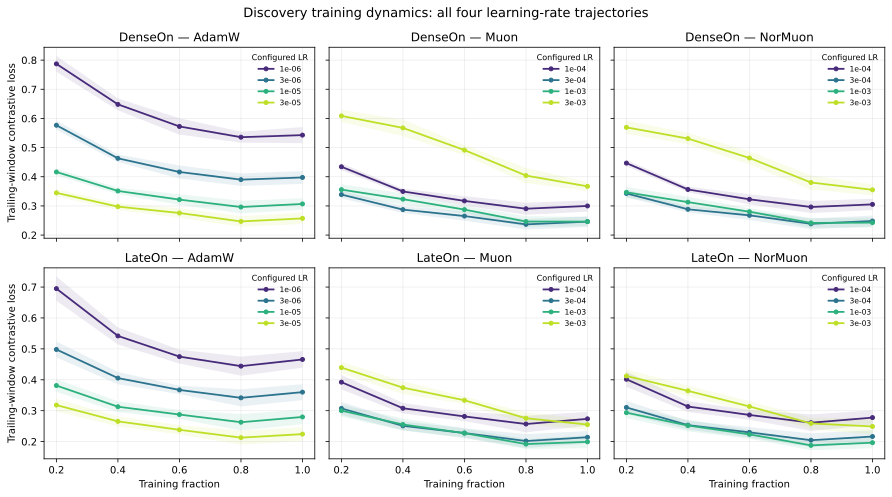

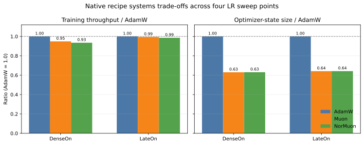

<!-- RESULTS:BEGIN -->

All 1,680 planned task/checkpoint evaluations completed. Scores below are the unweighted mean nDCG@10 across the 14 tasks.

### Final quality and learning-rate robustness

| Family | Optimizer | Best LR | Best final | 4-LR mean | SD | Range | 4-LR trajectory AUC |
| --- | --- | ---: | ---: | ---: | ---: | ---: | ---: |
| dense | adamw | 3e-5 | 0.5899 | 0.5816 | 0.0099 | 0.5650–0.5899 | 0.5779 |
| dense | muon | 3e-4 | 0.5923 | 0.5833 | 0.0131 | 0.5608–0.5923 | 0.5776 |
| dense | normuon | 3e-4 | 0.5934 | 0.5847 | 0.0123 | 0.5634–0.5934 | 0.5800 |
| late | adamw | 3e-5 | 0.5958 | 0.5864 | 0.0105 | 0.5701–0.5958 | 0.5829 |
| late | muon | 3e-4 | 0.5972 | 0.5910 | 0.0082 | 0.5770–0.5972 | 0.5858 |
| late | normuon | 3e-4 | 0.5963 | 0.5906 | 0.0082 | 0.5765–0.5963 | 0.5872 |

- **Dense:** best tuned final score is normuon at 3e-4 (0.5934); the highest four-LR mean is normuon (0.5847); the highest mean observed-window AUC is normuon (0.5800). Best-config paired muon beats AdamW on 10/14 tasks, mean Δ=+0.0024 (95% CI [+0.0006, +0.0047]); normuon beats AdamW on 11/14 tasks, mean Δ=+0.0036 (95% CI [+0.0015, +0.0059]).
- **Late:** best tuned final score is muon at 3e-4 (0.5972); the highest four-LR mean is muon (0.5910); the highest mean observed-window AUC is normuon (0.5872). Best-config paired muon beats AdamW on 9/14 tasks (2 ties), mean Δ=+0.0014 (95% CI [-0.0008, +0.0035]); normuon beats AdamW on 7/14 tasks (1 ties), mean Δ=+0.0005 (95% CI [-0.0025, +0.0034]).

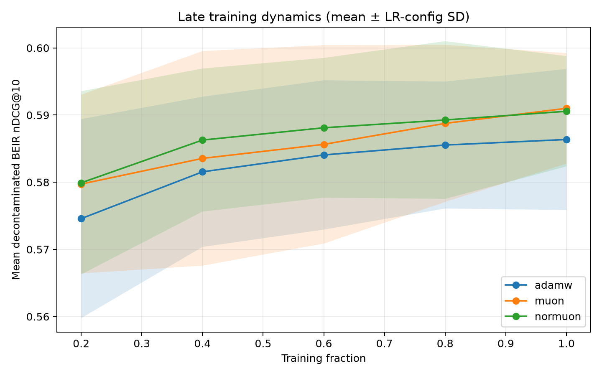

### Five-checkpoint dynamics for every learning-rate run

Each panel below shows all four LR configurations rather than an optimizer-level average; every curve contains the formal 20%, 40%, 60%, 80%, and 100% checkpoints.

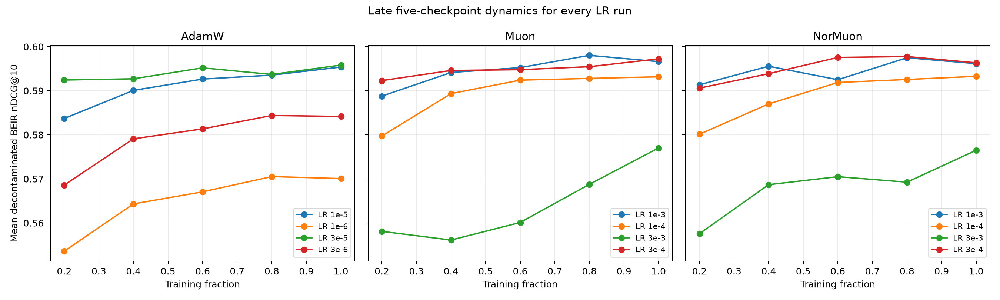

### Dynamics of each optimizer's best final configuration

| Family | Optimizer | 20% | 40% | 60% | 80% | 100% | AUC |
| --- | --- | ---: | ---: | ---: | ---: | ---: | ---: |
| dense | adamw | 0.5850 | 0.5892 | 0.5881 | 0.5880 | 0.5899 | 0.5882 |
| dense | muon | 0.5882 | 0.5921 | 0.5912 | 0.5913 | 0.5923 | 0.5912 |
| dense | normuon | 0.5881 | 0.5922 | 0.5925 | 0.5929 | 0.5934 | 0.5921 |
| late | adamw | 0.5924 | 0.5927 | 0.5952 | 0.5937 | 0.5958 | 0.5939 |
| late | muon | 0.5923 | 0.5946 | 0.5948 | 0.5955 | 0.5972 | 0.5949 |
| late | normuon | 0.5906 | 0.5939 | 0.5976 | 0.5978 | 0.5963 | 0.5957 |

### Paired best-config task effects

| Family | Comparison | W/T/L | Mean Δ | Paired bootstrap 95% CI | Sign p | Holm p |
| --- | --- | ---: | ---: | ---: | ---: | ---: |
| dense | muon − AdamW | 10/0/4 | +0.0024 | [+0.0006, +0.0047] | 0.1796 | 0.438 |
| dense | normuon − AdamW | 11/0/3 | +0.0036 | [+0.0015, +0.0059] | 0.05737 | 0.2295 |
| late | muon − AdamW | 9/2/3 | +0.0014 | [-0.0008, +0.0035] | 0.146 | 0.438 |
| late | normuon − AdamW | 7/1/6 | +0.0005 | [-0.0025, +0.0034] | 1 | 1 |

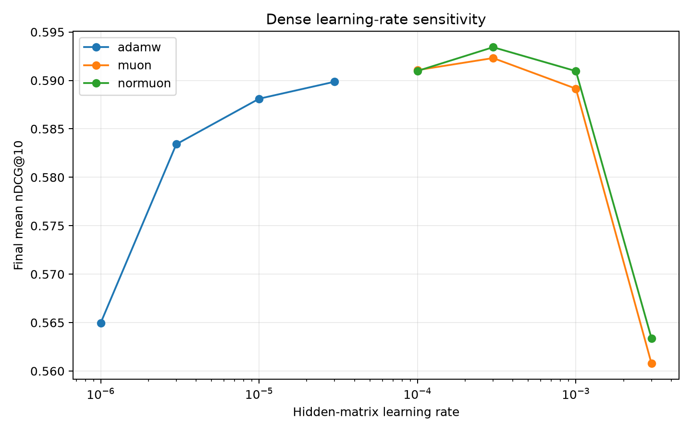

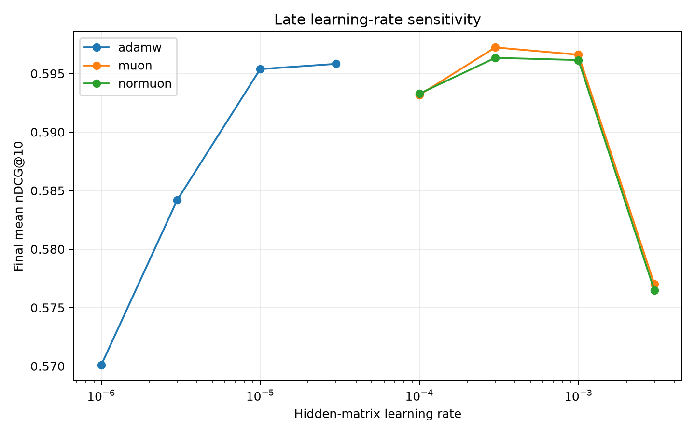

### Per-task final scores for the best configuration of each optimizer

#### Dense best-config task scores

| Task | AdamW | Muon | NorMuon | Muon − AdamW | NorMuon − AdamW |
| --- | --- | ---: | ---: | ---: | ---: |
| ArguAna | 0.5600 | 0.5620 | 0.5617 | +0.0020 | +0.0017 |
| ClimateFEVER | 0.4059 | 0.4104 | 0.4140 | +0.0045 | +0.0082 |
| DBPedia | 0.2776 | 0.2790 | 0.2811 | +0.0015 | +0.0035 |
| FEVER | 0.9205 | 0.9225 | 0.9235 | +0.0020 | +0.0030 |
| FiQA2018 | 0.5421 | 0.5447 | 0.5490 | +0.0026 | +0.0069 |
| HotpotQA | 0.6750 | 0.6787 | 0.6777 | +0.0037 | +0.0027 |
| MSMARCO | 0.5680 | 0.5712 | 0.5707 | +0.0032 | +0.0028 |
| NFCorpus | 0.2874 | 0.2840 | 0.2862 | -0.0034 | -0.0012 |
| NQ | 0.9254 | 0.9396 | 0.9396 | +0.0142 | +0.0142 |
| QuoraRetrieval | 0.9118 | 0.9131 | 0.9132 | +0.0013 | +0.0014 |
| SCIDOCS | 0.1477 | 0.1470 | 0.1484 | -0.0008 | +0.0006 |
| SciFact | 0.8804 | 0.8792 | 0.8792 | -0.0012 | -0.0012 |
| TRECCOVID | 0.8304 | 0.8301 | 0.8297 | -0.0004 | -0.0008 |
| Touche2020 | 0.3259 | 0.3309 | 0.3342 | +0.0050 | +0.0083 |

#### Late best-config task scores

| Task | AdamW | Muon | NorMuon | Muon − AdamW | NorMuon − AdamW |
| --- | --- | ---: | ---: | ---: | ---: |
| ArguAna | 0.4345 | 0.4278 | 0.4273 | -0.0067 | -0.0073 |
| ClimateFEVER | 0.4088 | 0.4141 | 0.4154 | +0.0053 | +0.0066 |
| DBPedia | 0.3037 | 0.3089 | 0.3073 | +0.0052 | +0.0036 |
| FEVER | 0.9388 | 0.9392 | 0.9395 | +0.0004 | +0.0007 |
| FiQA2018 | 0.5584 | 0.5641 | 0.5662 | +0.0057 | +0.0078 |
| HotpotQA | 0.7508 | 0.7489 | 0.7508 | -0.0019 | -0.0000 |
| MSMARCO | 0.5928 | 0.5946 | 0.5919 | +0.0018 | -0.0009 |
| NFCorpus | 0.2776 | 0.2802 | 0.2733 | +0.0026 | -0.0043 |
| NQ | 0.9639 | 0.9639 | 0.9639 | +0.0000 | +0.0000 |
| QuoraRetrieval | 0.9153 | 0.9162 | 0.9165 | +0.0009 | +0.0012 |
| SCIDOCS | 0.1478 | 0.1511 | 0.1478 | +0.0033 | -0.0000 |
| SciFact | 0.8965 | 0.8965 | 0.9074 | +0.0000 | +0.0110 |
| TRECCOVID | 0.8065 | 0.8009 | 0.7952 | -0.0056 | -0.0113 |
| Touche2020 | 0.3462 | 0.3548 | 0.3463 | +0.0086 | +0.0001 |

The best-LR comparisons are selected on this same benchmark suite and should therefore be read as controlled exploratory results, not as an unbiased model-selection estimate. Paired intervals use 20,000 deterministic task-level bootstrap resamples; the sign-test p-value is exact after excluding ties, and Holm p controls the family of four reported sign tests. BEIR tasks are heterogeneous and not independent draws, so these are descriptive uncertainty summaries rather than population inference. The four-LR mean, spread, and complete per-task rows are included to expose sensitivity rather than reporting only the winning point. Trajectory AUC is the normalized trapezoidal mean nDCG@10 over the observed 20%–100% checkpoint window; it measures early-to-late quality, not time before the first checkpoint.

<!-- RESULTS:END -->

<!-- TASK-DELTA-STABILITY:BEGIN -->

### Exploratory task-effect stability across checkpoints

| Family | Comparison | Stages | Same direction | Pearson r | Spearman rho |
| --- | --- | --- | ---: | ---: | ---: |
| DenseOn | Muon − AdamW | 20%→40% | 10/14 | 0.645 | 0.543 |
| DenseOn | Muon − AdamW | 40%→60% | 10/14 | 0.709 | 0.640 |
| DenseOn | Muon − AdamW | 60%→80% | 11/14 | 0.651 | 0.648 |
| DenseOn | Muon − AdamW | 80%→100% | 12/14 | 0.811 | 0.855 |
| DenseOn | NorMuon − AdamW | 20%→40% | 6/14 | 0.324 | 0.345 |
| DenseOn | NorMuon − AdamW | 40%→60% | 8/14 | 0.463 | 0.451 |
| DenseOn | NorMuon − AdamW | 60%→80% | 11/14 | 0.753 | 0.662 |
| DenseOn | NorMuon − AdamW | 80%→100% | 9/14 | 0.743 | 0.714 |
| LateOn | Muon − AdamW | 20%→40% | 10/14 | 0.585 | 0.393 |
| LateOn | Muon − AdamW | 40%→60% | 10/14 | 0.295 | 0.341 |
| LateOn | Muon − AdamW | 60%→80% | 13/14 | 0.607 | 0.642 |
| LateOn | Muon − AdamW | 80%→100% | 11/14 | 0.532 | 0.515 |
| LateOn | NorMuon − AdamW | 20%→40% | 9/14 | 0.532 | 0.310 |
| LateOn | NorMuon − AdamW | 40%→60% | 10/14 | 0.266 | 0.398 |
| LateOn | NorMuon − AdamW | 60%→80% | 11/14 | 0.797 | 0.798 |
| LateOn | NorMuon − AdamW | 80%→100% | 11/14 | 0.771 | 0.824 |

This post-hoc diagnostic applies each optimizer's final-score-selected learning-rate run at every checkpoint and correlates its 14 paired task deltas against AdamW across adjacent stages. It was added after heterogeneous LateOn task directions became visible. It does not alter run selection, the primary aggregate, or the frozen confirmatory family, and it carries no causal interpretation.

<!-- TASK-DELTA-STABILITY:END -->

## Systems observations

<!-- SYSTEMS:BEGIN -->

Every run used 4 × NVIDIA L20Z. Values are medians over the four learning-rate configurations for that optimizer and family; CUDA memory is the maximum per rank, not the sum across ranks.

| Family | Optimizer | Median hours | Samples/s | Throughput vs AdamW | Peak allocated GiB | Optimizer state GiB | Checkpoint GiB |
| --- | --- | ---: | ---: | ---: | ---: | ---: | ---: |
| dense | adamw | 3.52 | 39.43 | 1.00× | 7.41 | 1.11 | 1.67 |
| dense | muon | 3.71 | 37.41 | 0.95× | 6.98 | 0.70 | 1.26 |
| dense | normuon | 3.77 | 36.86 | 0.93× | 6.97 | 0.70 | 1.26 |
| late | adamw | 8.34 | 16.66 | 1.00× | 37.46 | 1.15 | 1.72 |
| late | muon | 8.38 | 16.57 | 0.99× | 37.05 | 0.74 | 1.31 |
| late | normuon | 8.46 | 16.42 | 0.99× | 37.05 | 0.74 | 1.31 |

The recorded wall time includes training and five full checkpoint writes. Peak CUDA memory comes from PyTorch allocator counters inside each training process, so the independent utilization guard process is excluded. For checkpoint-resumed runs, throughput is recomputed from the sum of non-overlapping useful training segments rather than Trainer's resume-local runtime; the segment adjustment and original Trainer fields remain in the audit table. Exact per-run measurements are in `reports/system_metrics.csv`.

<!-- SYSTEMS:END -->

Evaluation-recovery note: the first two LateOn ClimateFEVER evaluations both reached 74% of corpus
encoding and then exhausted an 80 GiB device on rank 1. The original one-shot fallback halved an
oversized packed batch but retained the first half's device embeddings while encoding the second;
the retained outputs left only 2.40 GiB free when the second half requested another 2.53 GiB. Neither
attempt wrote a task result, and the strict collector still reported zero accepted LateOn units. The
evaluator now repeatedly bisects only the failing microbatch and copies every successful microbatch
to host fp16 before starting the next. Two focused regressions cover order-preserving multi-level
splits and the irreducible one-text OOM case, and the full test suite passed. Because the changed
source is LateOn-specific and no LateOn result existed, the evaluator manifest was migrated with an
explicit old/new hash record; all twelve pre-existing DenseOn units passed the strict collector after
the migration. LateOn evaluation then restarted from the beginning, so no partial pre-fix encoding
is used in the reported scores. During the repaired replay, both independent two-GPU workers emitted
exactly one adaptive-split warning at local document 1,892,742 (74%) for a packed batch of 2,048
texts. Both then completed the next distributed gather and advanced beyond the original failure
point without an OOM or worker failure. They subsequently encoded all 5,117,453 ClimateFEVER
documents, built their approximately 45 GiB-per-worker searchable PLAID indexes (about 90 GiB
combined after construction) in 1,656.8 and 1,645.2 seconds. Because FastPLAID materializes the
merged residual arrays before deleting their input shards, each worker's temporary directory
briefly approached 92 GiB during the merge; that transient scratch peak is distinct from the final
index size. The two workers then searched all 969 queries in 50.9 and 49.3 seconds. Both task files
and model metadata were
atomically published, both temporary indexes were removed, and the strict collector accepted the
two results as the first formal LateOn units. This validates the intended recovery across the full
encoding, indexing, search, publication, cleanup, and provenance-checking path.

Infrastructure note: the first DenseOn Muon run encountered two pre-checkpoint
`CUBLAS_STATUS_EXECUTION_FAILED` errors in PyTorch's native bfloat16 Newton–Schulz `addmm`, both on
physical GPU 3 (at optimizer steps 52 and 388). ECC counters remained zero, but moving that device
from the DenseOn pool to the concurrent AdamW LateOn pool let the replacement run pass both observed
positions without changing the Muon implementation, precision, hyperparameters, model state, or data
order. Those failed attempts occurred before checkpoint 782 and were discarded; the accepted run
starts from the original base model and seed.

The replacement run later encountered a third transient failure at step 2,354, nine steps after its
validated checkpoint at step 2,345. This time rank 2 (physical GPU 2 in the swapped pool) reported an
asynchronous CUDA launch failure through the NCCL watchdog, without an application traceback that
identified the originating kernel. The recovery supervisor resumed DenseOn from checkpoint 2,345 and
the concurrent LateOn run from checkpoint 3,126; both passed their interruption points.

After DenseOn produced and passed a deep audit of checkpoint 3,126, a fourth transient asynchronous
launch failure occurred at step 3,336 on rank 0 (physical GPU 0). It surfaced from the native Muon
momentum-buffer `lerp_` call, although CUDA's asynchronous reporting means that frame does not prove
which earlier kernel originated the fault. The next retry encountered a fifth asynchronous launch
failure at step 3,180 on rank 1 (physical GPU 1), reported by the NCCL watchdog. The five incidents
therefore span physical GPUs 3, 2, 0, and 1, so the evidence no longer supports a single-device
explanation and instead points to the native bfloat16 Muon/CUDA path under this runtime. A subsequent
resume passed both interruption points without changing optimizer semantics, but later encountered a
sixth asynchronous launch failure at step 3,829 on rank 2 (physical GPU 2), again reported by the
NCCL watchdog. The supervisor restarted both concurrent runs from their independently validated
checkpoint 3,126 states. That retry reached step 3,375 before a seventh failure on the same rank and
physical GPU. In this event the application traceback directly reported
`CUBLAS_STATUS_EXECUTION_FAILED` from the native bfloat16 Newton–Schulz `torch.addmm`, alongside the
NCCL watchdog and same-time Xid 13 followed by Xid 43. The supervisor again resumed the independently
validated checkpoint 3,126 states without changing the optimizer or runtime. The following resume
passed every prior interruption point and completed step 3,907. A full post-run audit loaded all five
model/optimizer/scheduler checkpoints, checked all four rank RNG states at each stage, validated the
final model and Trainer state, and reported five of five checkpoints with zero errors.

The kernel log independently correlates every interruption with an NVIDIA driver Xid on the same
physical device and at the same wall-clock time:

| Incident | Optimizer step | Physical GPU (PCI bus) | User-space reporting point | Driver Xid |
| ---: | ---: | --- | --- | --- |
| 1 | 52 | 3 (`c6:00`) | Newton–Schulz `addmm` / cuBLAS | 43 |
| 2 | 388 | 3 (`c6:00`) | Newton–Schulz `addmm` / cuBLAS | 13, then 43 |
| 3 | 2,354 | 2 (`a2:00`) | NCCL watchdog | 43 |
| 4 | 3,336 | 0 (`08:00`) | Muon momentum-buffer `lerp_` | 43 |
| 5 | 3,180 | 1 (`7e:00`) | NCCL watchdog | 13, then 43 |
| 6 | 3,829 | 2 (`a2:00`) | NCCL watchdog | 13, then 43 |
| 7 | 3,375 | 2 (`a2:00`) | Newton–Schulz `addmm` / cuBLAS and NCCL watchdog | 13, then 43 |
| 8 | 2,717 | 2 (`a2:00`) | NCCL watchdog | 43 |
| 9 | 303 | 4 (`0001:09:00`) | NCCL watchdog | 13, then 43 |
| 10 | 3,345 | 1 (`7e:00`) | Newton–Schulz `addmm` / cuBLAS | 43 |
| 11 | 1,899 | 7 (`0001:c7:00`) | Muon momentum-buffer `lerp_` and NCCL watchdog | 43 |
| 12 | 1,666 | 7 (`0001:c7:00`) | Muon momentum-buffer `lerp_` | 43 |
| 13 | 633 | 4 (`0001:09:00`) | NCCL watchdog | 43 |

NVIDIA classifies [Xid 13](https://docs.nvidia.com/deploy/xid-errors/analyzing-xid-catalog.html)
as a graphics-engine exception: typically an application/CUDA fault such as an out-of-bounds access
or illegal instruction, while rare driver or hardware causes remain possible. Xid 43 records the
resulting software-induced channel termination and says the GPU remains healthy. The repeated pattern
across six physical GPUs, identical Xid-13 exception registers on four devices, stable concurrent
AdamW execution before fail-fast termination, and zero volatile corrected or uncorrected ECC counts
therefore favor an application/kernel-path explanation over a single-card hardware fault. They still
do not identify which asynchronously executed operation originated the exception.

The supervisor resumes both concurrent runs only from their last deep-validated checkpoints.
DenseOn's reported throughput sums its non-overlapping accepted segments through step 3,126 and the
final segment after that checkpoint; LateOn applies the same rule. Repeated post-checkpoint steps,
failed pre-checkpoint attempts, restart initialization, and downtime are retained as infrastructure
evidence but excluded from optimizer-throughput comparisons. After retaining the Python/CUDA stacks,
the active matrix and all of its training descendants have their core-file limits set to zero for
subsequent failures; this changes neither training nor optimizer execution. This accounting gives
the completed DenseOn Muon
`1e-4` run 3.512 hours of useful wall time; its content-addressed canonical W&B history contains 392
strictly ordered rows through step 3,907. The completed LateOn AdamW `3e-6` run likewise has 8.291
hours of useful wall time and 16.751 examples/s after excluding duplicated recovery work; its deep
audit verified all five checkpoints, and its content-addressed canonical W&B history also contains
392 rows through step 3,907. After a deep audit of DenseOn Muon `3e-4` checkpoint 1,563, a
user-directed priority handoff moved Muon ahead of the remaining AdamW runs without changing any run
configuration or the 24-run contract. The handoff also replaced the old cross-pool fail-fast process
with failure-isolated GPU pools, resumed DenseOn from the audited checkpoint, and started the formal
LateOn Muon `1e-4` run. That LateOn run passed optimizer steps 52 and 388—the two early locations at
which DenseOn had previously reported direct cuBLAS failures—and continued through step 500 without
a CUDA, NCCL, or Xid event. Meanwhile, DenseOn Muon `3e-4` deep-validated checkpoints 782, 1,563,
and 2,345 before an eighth transient failure at step 2,717. Rank 2 (physical GPU 2) reported an
asynchronous launch failure through the NCCL watchdog, and the driver recorded a same-device Xid 43;
there was no direct originating-kernel traceback and all volatile ECC counters remained zero. The
independent LateOn process continued training, demonstrating that the pool isolation works as
intended. This event also exposed a scheduler recovery bug: a failed configuration advanced to the
next configuration instead of immediately resuming its latest checkpoint. The matrix runner now
requeues a failed configuration at the front of its family queue, with an integration test that
verifies the retry occurs before later queued work.

Before that patched scheduler could be activated at a safe LateOn checkpoint boundary, the old
process advanced DenseOn to Muon `1e-3`; it failed at step 303 on rank 3 (physical GPU 4) with another
asynchronous NCCL-watchdog report. The driver logged Xid 13 and 43 on the same device, including the
same exception-register values previously observed on physical GPU 2, while ECC remained zero and
LateOn continued independently.

At LateOn step 782, the first formal checkpoint passed a deep payload audit: the model, mixed
Muon/AdamW optimizer state, scheduler, Trainer state, and all four rank RNG states loaded without an
error. The optimizer payload assigns 88 hidden matrices to Muon and 51 embedding, projection, norm,
and bias tensors to auxiliary AdamW; all state tensors are finite. A tensor-by-tensor comparison
against the pinned unsupervised base revision found that all 139 trainable tensors changed by this
checkpoint, including every backbone tensor and all three projection modules. A controlled restart
then activated the patched scheduler. It selected the two intended
unfinished runs, resumed DenseOn Muon `3e-4` from checkpoint 2,345 and LateOn Muon `1e-4` from
checkpoint 782, and the latter continued through step 789. This is an end-to-end PyLate checkpoint
recovery test rather than only a file-presence check. The same LateOn process subsequently reached
checkpoint 1,563 without a CUDA, NCCL, or Xid event; its model, optimizer, scheduler, runtime
arguments, and four RNG states passed the stricter deep audit, all 139 trainable tensors changed
again relative to checkpoint 782, and training continued beyond that checkpoint. The 88 Muon
momentum buffers and all 51 auxiliary AdamW states were finite; every auxiliary AdamW step counter
equaled 1,563, and the three saved group learning rates matched the linear scheduler exactly. The
relative L2 change from checkpoint 782 to 1,563 was 0.00383 for Muon-routed hidden matrices,
0.000566 for decayed auxiliary tensors, and 0.000136 for no-decay tensors. The stricter audit now
also verifies group algorithms, hyperparameters, scheduled learning rates, state fields and shapes,
AdamW step counters, scheduler base/last learning rates, scheduler step count, finite model tensors,
and a distinct model payload at each checkpoint. At that stage, all 40 checkpoints from the eight
runs then considered complete passed this expanded audit; six were AdamW runs and two were native
Muon runs. The two native-Muon histories were subsequently quarantined after the cross-device
failure was reproduced and the operator implementation changed, so those ten checkpoints do not
enter the final optimizer comparison. Through the validated LateOn checkpoint 1,563, the only
traceback in its log was the expected `SIGTERM` record from the controlled restart at checkpoint
782, not a PyLate, CUDA, or Muon failure. The resumed DenseOn run
subsequently reached checkpoint 3,126, whose model, optimizer, scheduler, and four rank RNG payloads
also passed the deep audit. Timing accounting retains the non-overlapping segment through step 782
and excludes duplicated post-checkpoint steps and restart initialization. That DenseOn attempt later
failed at step 3,345:
rank 1 (physical GPU 1) directly reported `CUBLAS_STATUS_EXECUTION_FAILED` from the native
bfloat16 Newton–Schulz `torch.addmm`, and the driver recorded a same-device Xid 43. The patched
scheduler immediately selected the same configuration and resumed checkpoint 3,126, while the
isolated LateOn Muon process continued uninterrupted. The accepted-time adjustment retains only the
completed 2,346–3,126 interval from the failed attempt; duplicated steps after 3,126 are excluded.
That retry completed step 3,907. All five checkpoints passed the full protocol and payload audit;
the non-overlapping useful wall time is 3.525 hours, and the canonical 392-row W&B history is stored
under content hash `5fe30f45c960`. Canonical histories exclude Trainer's resume-local terminal
runtime/loss summaries and instead publish useful wall time and throughput reconstructed from the
audited non-overlapping timing ledger.

To prioritize the higher-risk LateOn/Muon path, a subsequent controlled handoff occurred only after
LateOn Muon `1e-4` checkpoint 1,563 and DenseOn Muon `1e-3` checkpoint 782 had passed the expanded
deep audit. Work performed after those durable boundaries was deliberately discarded. The two
accepted LateOn segments through step 1,563 total 11,877.64 seconds; restart gaps and repeated steps
are excluded. Both four-GPU pools then switched to LateOn: `1e-4` resumed from step 1,563 on its
original pool while `3e-4` started from the pinned base on the other pool. The DenseOn `1e-3`
checkpoint remains resumable, and its atomic timing ledger retains the accepted `0–782` segment.
The discarded post-1,563 branch also provides a controlled replay probe. Across the first seven
repeated ten-step log windows, the linear-scheduler LR was identical; the mean absolute loss and
gradient-norm differences were 0.00243 and 0.00341, respectively, with a maximum loss difference of
0.0127. Checkpoint/RNG restoration therefore preserves the intended trajectory and data contract but,
as expected for the FlashAttention/TF32/bfloat16 path, does not provide bitwise replay. Only the new
post-resume branch contributes to checkpoints, timing, W&B canonical history, and evaluation.

That new LateOn Muon `1e-4` branch later encountered its first CUDA failure at optimizer step 1,899.
Rank 3 (physical GPU 7, PCI `0001:c7:00`) raised `CUDA error: unspecified launch failure` while the
Python stack was inside PyTorch's native `_single_tensor_muon` momentum-buffer `lerp_`; the NCCL
watchdog then terminated the distributed job, and the driver recorded a same-device Xid 43. Because
CUDA reports asynchronously, the `lerp_` frame may have observed a fault from the preceding
bfloat16 Newton–Schulz operation rather than originated it. GPU recovery status remained `None`, all
volatile and aggregate corrected/uncorrected ECC counters remained zero, and the isolated LateOn
Muon `3e-4` process continued. The scheduler requeued the same `1e-4` configuration and resumed the
deep-validated checkpoint 1,563; steps 1,564–1,899 from the failed attempt are retained as fault
evidence but excluded from accepted timing and final checkpoints. This extends the same native Muon
failure pattern to LateOn and a sixth physical GPU, while providing no evidence of a PyLate MaxSim
or late-interaction loss failure.

The first automatic retry failed again after 103 replayed steps, at optimizer step 1,666, on the same
local rank 3 and physical GPU 7. It produced the same asynchronous launch-failure stack at native
Muon's momentum-buffer `lerp_` and another same-device Xid 43; the core-file limit prevented a
second multi-gigabyte dump. The isolated `3e-4` run then failed before its first checkpoint, at step
633, on its own local rank 3 and physical GPU 4. Its Python process only observed the asynchronous
failure in the NCCL watchdog, while the driver recorded a same-device Xid 43. This third LateOn
event disproved the provisional single-device diagnosis: all three occurred on local rank 3 but
spanned two independent pools and two physical GPUs. The automatic retries were stopped without
writing another formal checkpoint. LateOn `1e-4` checkpoint 1,563 remains deep-valid and unchanged;
`3e-4` has no accepted checkpoint or timing segment.

The repeated cross-device pattern moved the investigation below PyLate and into the native CUDA
Muon path. The pinned PyTorch implementation converts every Newton–Schulz input to bfloat16 and
executes its polynomial through `torch.addmm`; the current
[upstream implementation](https://github.com/pytorch/pytorch/blob/main/torch/optim/_muon.py) uses the
same path. PyTorch's
[CUDA numerical-accuracy note](https://docs.pytorch.org/docs/stable/notes/cuda.html#reduced-precision-reduction-in-bf16-gemms)
documents a backend switch that disables reduced-precision reductions for bfloat16 GEMMs. A first,
tightly scoped prototype applied that switch only while Muon's GEMMs were dispatched. A synthetic
four-rank replay used the exact 88 LateOn hidden-matrix shapes, five Newton–Schulz iterations, NCCL
collectives, and per-step synchronization. Despite the switch, native `torch.addmm` directly failed
after approximately 126 optimizer steps on physical GPU 2, followed by a same-device Xid 43 at
00:05:05 UTC. The other four-GPU pool completed 200 steps. This controlled reproduction ruled out
reduced-precision reduction as a sufficient fix, so the prototype was removed before any formal
checkpoint used it.

We then compared two implementations that avoid the failing bfloat16 `addmm` path: FP32/TF32
Newton–Schulz with `addmm`, and the original bfloat16 polynomial decomposed into matrix
multiplications and elementwise combinations. Both candidates completed 1,000 synchronized steps
on each of two four-GPU pools, covering all eight physical GPUs without a CUDA, NCCL, or Xid event.
We selected the latter because it preserves Muon's bfloat16 internal representation, coefficients,
five iterations, normalization, momentum, learning-rate adjustment, and parameter update. Only the
operator decomposition differs from pinned PyTorch; it is also the already-pinned Newton–Schulz
path used by this repository's NorMuon implementation. The final repository implementation passed
a separate repetition of the same 1,000-step test on all eight GPUs, and the full suite reports 110
passing tests. An initial real-model replay was discarded after its shortened `max_steps=1905`
horizon correctly exposed a different LR schedule. We added a diagnostic stop callback and repeated
the replay while preserving the formal 3,907-step scheduler. It resumed the original LateOn `1e-4`
checkpoint 1,563, matched the original step-1,570 LR of `6.65e-5`, and stopped normally at step
1,905 after 2,670 seconds. This exact-scheduler replay crossed both failures at steps 1,666 and 1,899
without a CUDA, NCCL, or Xid event. Its step-1,905 model differed from step 1,563; model, optimizer,
scheduler, training-argument, four-rank RNG, and timing payloads loaded successfully, all optimizer
state was finite, and the 1,563–1,905 ledger passed its continuity audit. The only strict-audit
difference was expected: an optimizer state loaded from the old checkpoint cannot contain the new
implementation-label field; injecting the declared label in memory made the complete optimizer
contract pass. Since even an algebraically equivalent operation decomposition can change bfloat16
rounding, this replay remains diagnostic evidence. Every formal Muon configuration now restarts from
the common base rather than mixing native and unfused histories.

The restart creates an explicit methodological boundary. All DenseOn and LateOn Muon artifacts made
with native `addmm`—including checkpoint payloads, timing segments, and W&B histories—are retained in
a quarantine archive for fault analysis but are excluded from coverage, evaluation, aggregation, and
figures. At the boundary, the accepted formal ledger therefore contains only the six completed AdamW
runs: 6/24 runs and 30/120 checkpoints, with 0/1,680 checkpoint-task evaluations. New Muon and NorMuon
checkpoints must record `ns_implementation=unfused-bfloat16-v1` and pass the same deep audit before
they can increase those counts. The W&B source IDs for those optimizers use a separate `study-v3`
namespace, preventing canonical histories from silently combining pre- and post-mitigation rows.

The first two restarted formal LateOn Muon runs (`1e-4` and `3e-4`) both crossed step 633, the
earliest failure point in the quarantined native-`addmm` LateOn histories, without a CUDA, NCCL, or
new Xid event. Each then wrote checkpoint 782. Independent deep validation returned zero problems
for both payloads: model weights and every optimizer tensor were finite, the optimizer groups
recorded `ns_implementation=unfused-bfloat16-v1`, the scheduler and Trainer states ended at the
declared step, and all four rank-local RNG states were present and loadable. These two accepted
checkpoints raise formal coverage to 32/120 while the completed-run count remains 6/24 and evaluation
coverage remains 0/1,680. Training continues from these same audited histories.

Both restarted runs subsequently wrote checkpoint 1,563 without a CUDA, NCCL, or Xid event. The
sidecar, now itself running under the frozen Python 3.12 / PyTorch 2.9.1+cu129 runtime, fully loaded
both new payloads and returned zero problems. Their model digests (`f6c098f2737f` and
`a4bb260bf088`) differ from the corresponding checkpoint-782 digests; model and optimizer tensors
are finite, scheduler/Trainer steps match 1,563, and all four RNG archives remain loadable. These
checkpoints raise formal coverage to 34/120. Completed-run and evaluation coverage remain 6/24 and
0/1,680 while both training processes continue from the audited states. Both formal histories then
continued beyond step 1,905, independently crossing the quarantined native implementation's failure
points at 1,666 and 1,899 without an application-level CUDA/NCCL exception, out-of-memory event,
traceback, or process restart.

Both histories then wrote checkpoint 2,345 and resumed training beyond it. The formal sidecar loaded
each payload and again returned zero problems. Their new model digests (`ddcc05816abc` and
`795f19a73f30`) differ from the corresponding checkpoint-1,563 digests, while the optimizer,
scheduler, Trainer state, four rank-local RNG archives, and accepted-time ledgers all satisfy the
declared contract. Formal coverage is therefore 36/120 checkpoints; completed-run and evaluation
coverage remain 6/24 and 0/1,680 because neither active run has yet reached step 3,907.

Both runs subsequently passed the same audit at checkpoints 3,126 and 3,907, saved complete final
model directories, and wrote terminal Trainer and completion states at step 3,907. Their final model
digests are `ca036f97a177` and `9ff4eb6645c2`; all ten post-mitigation Muon checkpoints report zero
problems. This raises accepted coverage to 8/24 completed runs and 40/120 checkpoints, with
evaluation coverage still 0/1,680. At a user-directed pause boundary, the scheduler was frozen before
the two jobs exited, then the matrix, training supervisor, checkpoint watcher, and evaluation
supervisor were stopped after both final audits passed. No later configuration was launched. Normal
rank shutdown emitted PyTorch's warning that `destroy_process_group()` had not been called; it did
not invalidate either completion, but the runner now performs this cleanup explicitly on both normal
and exceptional exits.

After that pause was released, a later matrix pass completed ten more formal runs: all four DenseOn
Muon learning rates, DenseOn NorMuon at `1e-4`, `3e-4`, and `1e-3`, the remaining LateOn Muon rates
at `1e-3` and `3e-3`, and LateOn AdamW at `1e-5`. Every one ended at step 3,907 and all fifty new
checkpoints passed the same payload audit, bringing the matrix to 18/24 runs and 90/120 checkpoints.
A subsequent user stop arrived while DenseOn NorMuon `3e-3` and LateOn AdamW `3e-5` were still before
their first durable checkpoint. Those partial attempts contributed no accepted timing or formal
checkpoint. On resumption, both restarted from the common base and seed; canonical W&B reconstruction
uses the final local Trainer histories rather than concatenating the discarded raw prefixes. The
new DenseOn NorMuon `3e-3` run then wrote checkpoint 782. Its model digest is `c98490c78fa2`; the
model, NorMuon/AdamW optimizer, scheduler, Trainer, and four RNG payloads all deep-validated with zero
problems, raising coverage to 91/120 while training continued. The optimizer records the required
`unfused-bfloat16-v1` implementation, and its accepted ledger contains exactly steps 1–782 with
2,559.12 seconds of maximum-rank useful time. Checkpoint 1,563 then passed the same audit with a new
model digest (`6422282a4548`), raising coverage to 92/120. Its second 781-step timing segment took
2,559.00 seconds. The 78 logged losses in that segment remained finite, but their mean was 0.5539,
versus 0.3030 for NorMuon `3e-4` and 0.3219 for `1e-3` on the identical interval. Thus `3e-3` is not
divergent at this stage, but it is already an overshoot rather than evidence that still larger
learning rates improve optimization. Checkpoint 2,345 subsequently passed with another distinct model
digest (`f56518f3f150`), raising coverage to 94/120; its 782-step segment took 2,564.97 seconds. The
same comparison persisted in this third interval: mean loss was 0.4959 at `3e-3`, versus 0.2741 at
`3e-4` and 0.2947 at `1e-3`, with every recorded loss and gradient norm finite. Retrieval conclusions
remain gated on BEIR. Checkpoints 3,126 and 3,907 later passed the same audit, and the run wrote its
complete final model and terminal Trainer state. The final model digest is `bc4336982ebb`; the five
contiguous timing segments total 12,807.20 maximum-rank seconds. In the fifth interval, mean loss was
0.3657 at `3e-3`, versus 0.2502 at `3e-4` and 0.2491 at `1e-3`, so the high rate remained finite but
did not close the optimization gap. This completion raised the matrix to 19/24 runs and 97/120
checkpoints; the scheduler immediately reassigned its four-GPU pool to LateOn NorMuon `1e-4`.

The resumed LateOn AdamW `3e-5` run also wrote checkpoint 782 and raised formal coverage to 93/120.
Its new model digest is `ac28cf34627a`; all 139 parameter states contain finite AdamW first- and
second-moment buffers, and the model, scheduler, Trainer, and four rank-local RNG payloads passed the
deep audit with zero problems. The accepted first segment took 6,004.35 maximum-rank seconds. Its 79
logged losses were finite and averaged 0.4589, compared with 0.5605 for AdamW `1e-5` over the same
steps and data order. This is useful optimization-dynamics evidence, but not yet evidence that the
higher rate improves retrieval quality. Checkpoint 1,563 then passed with model digest
`734fbf789cc3`, raising coverage to 96/120 at that point. Its second timing segment took 6,003.24
seconds; mean loss was 0.2765 at `3e-5`, compared with 0.3295 at `1e-5`, and every recorded loss and
gradient norm remained finite. Checkpoint 2,345 also passed with a new model digest
(`a3aab9a26335`) and a 6,056.08-second third segment, raising coverage to 98/120. Mean loss in that
interval was 0.2508 at `3e-5` and 0.3002 at `1e-5`, again with finite gradients. Checkpoint 3,126
subsequently passed the same deep audit and raised coverage to 100/120. Its model digest is
`41197d64ff72`; all 139 AdamW states are finite and record optimizer step 3,126, and the scheduler,
Trainer state, and four rank-local RNG archives agree with that boundary. The fourth contiguous
timing segment took 6,016.75 maximum-rank seconds. Mean loss over its 78 new records was 0.2292 at
`3e-5`, compared with 0.2775 at `1e-5`, 0.3585 at `3e-6`, and 0.4662 at `1e-6`. The highest AdamW
rate therefore retains the lowest controlled training loss through 80% of the run, while retrieval
quality remains gated on the decontaminated BEIR evaluation.

The final checkpoint at step 3,907 then passed with model digest `e0a02c3d6908`, completing this run
and raising formal coverage to 20/24 runs and 102/120 checkpoints. All 139 AdamW states are finite at
step 3,907; the scheduler, Trainer, and four rank-local Python/NumPy/CPU/CUDA RNG archives agree with
the boundary. The fifth timing segment took 6,002.76 maximum-rank seconds, bringing accepted
end-to-end time to 30,083.17 seconds. Mean loss over its 78 records was 0.2258 at `3e-5`, versus
0.2773 at `1e-5`, 0.3585 at `3e-6`, and 0.4661 at `1e-6`; its final logged loss was 0.2249 and every
recorded gradient norm remained finite. The training-loss ordering therefore persisted through the
full run, but decontaminated BEIR remains the gate for retrieval-quality claims.

The first LateOn NorMuon run, at `1e-4`, then passed checkpoint 782 and raised coverage to 99/120.
Its model digest is `44c29a85ce62`; the optimizer payload contains momentum and row-wise
second-moment buffers for all 88 matrix tensors, AdamW first- and second-moment buffers for all 51
auxiliary tensors, and four valid rank-local RNG archives. The accepted segment took 6,057.91
maximum-rank seconds. Mean loss was 0.6347, close to Muon `1e-4` at 0.6237 over the same 79 records
and data order; both remained well above AdamW `3e-5` at 0.4589. NorMuon's 790,110,283-byte optimizer
state is only 565,952 bytes larger than Muon's, while remaining 35.80% smaller than the
1,230,780,939-byte all-AdamW state. Its first segment averages 7.7467 seconds per optimizer step,
0.89% slower than AdamW `3e-5` and 0.97% slower than Muon `1e-4` over the identical step range; this
does not show a steady-state throughput advantage. Checkpoint 1,563 subsequently passed with model
digest `07c7cb8a7e96`, raising formal coverage to 101/120. All 88 matrix states contain finite NorMuon
momentum and row-wise second-moment buffers, all 51 auxiliary states contain finite AdamW buffers at
step 1,563, and the scheduler, Trainer, and four rank-local RNG archives agree with the boundary. The
second segment took 6,013.85 maximum-rank seconds, or 7.7002 seconds per step: 0.18% slower than
AdamW `3e-5` and 1.22% slower than Muon `1e-4`. Its 78-record mean loss was 0.3356, compared with
0.3289 for Muon `1e-4` and 0.2765 for AdamW `3e-5`. Checkpoint 2,345 then passed with model digest
`513c6c054043`, raising coverage to 103/120. Its 88 matrix and 51 auxiliary states are finite, and
the scheduler, Trainer, and four rank-local RNG archives agree with the boundary. The third segment
took 6,042.60 seconds, or 7.7271 seconds per step: 0.22% faster than AdamW `3e-5` but 0.49% slower
than Muon `1e-4`. Mean loss was 0.3007, compared with 0.2954 for Muon `1e-4`, 0.3002 for AdamW
`1e-5`, and 0.2508 for AdamW `3e-5`. Checkpoint 3,126 then passed with model digest `966260de464f`,
raising coverage to 105/120. Its optimizer, scheduler, Trainer, and four rank-local RNG archives are
finite and agree with the step boundary. The fourth segment took 6,046.67 seconds, or 7.7422 seconds
per step: 0.97% slower than Muon `1e-4` and 0.50% slower than AdamW `3e-5`. Mean loss was 0.2777,
compared with 0.2729 for Muon `1e-4`, 0.2775 for AdamW `1e-5`, and 0.2292 for AdamW `3e-5`. These
are training-dynamics and systems observations, not retrieval-quality conclusions.
The final checkpoint at step 3,907 then passed with model digest `090d7d0c13dd`, completing the
`1e-4` NorMuon run and raising formal coverage to 21/24 runs and 107/120 checkpoints. All 88 matrix
states and 51 auxiliary states are finite; the scheduler, Trainer, and four rank-local RNG archives
agree with the terminal boundary. The fifth segment took 6,066.96 maximum-rank seconds, or 7.7682
seconds per step: 1.11% slower than Muon `1e-4` and 1.07% slower than AdamW `3e-5`. Accepted
end-to-end time was 30,227.99 seconds, 0.95% slower than Muon and 0.48% slower than AdamW `3e-5`.
Mean loss over the 78 final records was 0.2765, versus 0.2720 for Muon `1e-4`, 0.2773 for AdamW
`1e-5`, and 0.2258 for AdamW `3e-5`; every recorded loss and gradient norm remained finite. NorMuon
therefore closely tracks same-rate Muon in controlled training loss but does not show a throughput
advantage in this run. Retrieval quality remains gated on the decontaminated BEIR evaluation.

The `3e-4` NorMuon run subsequently passed checkpoint 782 with model digest `71c87da125c6`, raising
coverage to 104/120. Its 88 matrix and 51 auxiliary states are finite at the boundary, and the
scheduler, Trainer, and four rank-local RNG archives agree. The segment took 6,100.94 maximum-rank
seconds, or 7.8017 seconds per step: 0.95% slower than Muon `3e-4` and 1.61% slower than AdamW
`3e-5`. Mean loss across 79 records was 0.5071, close to Muon `3e-4` at 0.4984 and below NorMuon
`1e-4` at 0.6347, but still above AdamW `3e-5` at 0.4589. This extends the controlled dynamics
comparison to a second NorMuon rate without yet making a retrieval-quality claim.
Checkpoint 1,563 subsequently passed with model digest `6c75c2e00ea8`, raising formal coverage to
106/120 checkpoints. All 88 matrix states contain finite NorMuon momentum and row-wise
second-moment buffers, all 51 auxiliary states contain finite AdamW buffers at step 1,563, and the
scheduler, Trainer, and four rank-local RNG archives agree with the boundary. The second segment
took 6,076.99 maximum-rank seconds, or 7.7810 seconds per step: 1.64% slower than Muon `3e-4` and
1.23% slower than AdamW `3e-5`. Mean loss over its 78 new records was 0.2680, close to Muon `3e-4`
at 0.2657 and below AdamW `3e-5` at 0.2765. This is a training-loss and systems result; the
decontaminated BEIR evaluation remains the retrieval-quality gate.
Checkpoint 2,345 then passed with model digest `91d749e4042b`, raising formal coverage to 108/120
checkpoints. Its 88 NorMuon matrix states and 51 auxiliary AdamW states are finite, and the
scheduler, Trainer, and four rank-local RNG archives agree with the boundary. The third segment
took 6,112.23 maximum-rank seconds, or 7.8161 seconds per step: 0.86% slower than Muon `3e-4` and
0.93% slower than AdamW `3e-5`. Mean loss over its 78 new records was 0.2418, close to Muon `3e-4`
at 0.2397 and below AdamW `3e-5` at 0.2508; every recorded loss and gradient norm remained finite.
This continues the training-loss advantage of the higher rate through 60% of the run without
establishing a retrieval-quality advantage.
Checkpoint 3,126 then passed with model digest `810c16c7e698`, raising formal coverage to 110/120
checkpoints. An independent reload found zero deep-audit problems: all 88 NorMuon momentum and
row-wise second-moment pairs and all 51 auxiliary AdamW first- and second-moment pairs are finite,
the auxiliary steps equal 3,126, the scheduler reports epoch 3,126 and step count 3,127, the Trainer
reports step 3,126, and all four rank-local RNG archives are valid. The fourth contiguous segment
took 6,073.92 maximum-rank seconds, or 7.7771 seconds per step: 1.37% slower than Muon `3e-4` and
0.95% slower than AdamW `3e-5`. Its 78-record mean loss was 0.2218, close to Muon `3e-4` at 0.2195,
3.24% below AdamW `3e-5` at 0.2292, and 20.14% below NorMuon `1e-4` at 0.2777. The final logged
loss was 0.1743, and every recorded loss and gradient norm remained finite. This extends the
controlled higher-rate dynamics result through 80% of training; retrieval quality remains gated on
the decontaminated BEIR evaluation.
The final checkpoint at step 3,907 then passed with model digest `1ab87d88703b`, completing the
`3e-4` NorMuon run and raising formal coverage to 22/24 runs and 112/120 checkpoints. Independent
validation found zero problems: all 88 matrix-state pairs and 51 auxiliary AdamW state pairs are
finite, the auxiliary steps equal 3,907, the scheduler reports epoch 3,907 and step count 3,908,
the Trainer reports the terminal step, and all four RNG archives are valid. The fifth segment took
6,094.94 maximum-rank seconds, or 7.8040 seconds per step: 1.41% slower than Muon `3e-4` and 1.54%
slower than AdamW `3e-5`. Accepted end-to-end time was 30,459.02 seconds, 1.25% slower than both
comparators. Mean loss over the final 78 records was 0.2184, close to Muon `3e-4` at 0.2159, 3.26%
below AdamW `3e-5` at 0.2258, and 21.02% below NorMuon `1e-4` at 0.2765; all losses and gradient
norms remained finite. The freed four-GPU pool automatically launched the final queued `3e-3`
NorMuon run and entered optimizer steps without manual intervention. This closes the controlled
`3e-4` training trajectory, while retrieval quality remains gated on decontaminated BEIR.

The `1e-3` NorMuon run then passed checkpoint 782 with model digest `7676bb32a4a2`, raising formal
coverage to 109/120 checkpoints. Its 88 NorMuon matrix states and 51 auxiliary AdamW states are
finite, and the scheduler, Trainer, and four rank-local RNG archives agree with the boundary. The
first segment took 6,104.48 maximum-rank seconds, or 7.8062 seconds per step: 0.31% slower than Muon
`1e-3` and 1.67% slower than AdamW `3e-5`. Mean loss across 79 records was 0.4185, close to Muon
`1e-3` at 0.4169 and below both AdamW `3e-5` at 0.4589 and NorMuon `3e-4` at 0.5071. Every recorded
loss and gradient norm remained finite, including the passage through the `1e-3` peak learning
rate. This is evidence of numerical robustness and lower controlled training loss at the higher
rate, while retrieval quality remains unevaluated.
Checkpoint 1,563 subsequently passed with model digest `cc9a6a8c8f31`, raising formal coverage to
111/120 checkpoints. An independent reload again found zero deep-audit problems: all 88 NorMuon
matrix-state pairs and all 51 auxiliary AdamW state pairs are finite, every auxiliary step equals
1,563, the scheduler reports epoch 1,563 and step count 1,564, the Trainer reports step 1,563, and
all four rank-local RNG archives are valid. The second segment took 6,093.14 maximum-rank seconds,
or 7.8017 seconds per step: 0.10% slower than Muon `1e-3`, 0.27% slower than NorMuon `3e-4`, and
1.50% slower than AdamW `3e-5`. Mean loss over the 78 new records was 0.2624, 1.57% below Muon
`1e-3` at 0.2666, 2.07% below NorMuon `3e-4` at 0.2680, and 5.09% below AdamW `3e-5` at 0.2765.
The final logged loss was 0.2481 and every recorded gradient norm remained finite. This checkpoint
therefore adds a second stable post-peak interval at the maximum tested NorMuon rate, while the
decontaminated BEIR evaluation remains necessary to determine whether its loss advantage transfers
to retrieval.
Checkpoint 2,345 then passed with model digest `48793338f1a8`, raising formal coverage to 113/120
checkpoints. Independent reload found zero problems: all 88 NorMuon matrix-state pairs and all 51
auxiliary AdamW state pairs are finite, every auxiliary step equals 2,345, the scheduler reports
epoch 2,345 and step count 2,346, the Trainer reports step 2,345, and all four RNG archives are
valid. The third segment took 6,084.37 maximum-rank seconds, or 7.7805 seconds per step: 0.26%
faster than Muon `1e-3`, 0.46% faster than NorMuon `3e-4`, and 0.47% slower than AdamW `3e-5`.
Mean loss over its 78 records was 0.2366, 1.94% below Muon `1e-3` at 0.2413, 2.15% below NorMuon
`3e-4` at 0.2418, and 5.67% below AdamW `3e-5` at 0.2508. The final logged loss was 0.2567 and all
recorded gradient norms remained finite. The maximum tested NorMuon rate therefore remains stable
and retains the controlled loss advantage through 60% of training, without yet establishing a
retrieval-quality advantage.

The final queued `3e-3` NorMuon run then passed checkpoint 782 with model digest `bf5f0a2a0c5f`,
raising formal coverage to 114/120 checkpoints. Independent reload found zero problems: all 88
NorMuon matrix-state pairs and all 51 auxiliary AdamW state pairs are finite, every auxiliary step
equals 782, the scheduler reports epoch 782 and step count 783, the Trainer reports step 782, and
all four rank-local RNG archives are valid. The first segment took 6,103.82 maximum-rank seconds,
or 7.8054 seconds per step: 0.50% slower than Muon `3e-3`, effectively equal to NorMuon `1e-3`, and
1.66% slower than AdamW `3e-5`. Mean loss over its 79 records was 0.4403, 2.23% below Muon `3e-3`
at 0.4504 and 4.05% below AdamW `3e-5` at 0.4589, but 5.20% above NorMuon `1e-3` at 0.4185. The
final logged loss was 0.4468; every recorded loss and gradient norm remained finite through the
`3e-3` peak-learning-rate region. This establishes numerical stability at the maximum tested
NorMuon rate through 20% of training, while the decontaminated BEIR evaluation remains the gate for
retrieval-quality claims.

The `1e-3` run subsequently passed checkpoint 3,126 with model digest `a2cb4c59b638`, raising formal
coverage to 115/120 checkpoints. Independent reload found zero problems: its 88 NorMuon
matrix-state pairs and 51 auxiliary AdamW state pairs are finite, every auxiliary step equals
3,126, the scheduler reports epoch 3,126 and step count 3,127, the Trainer reports step 3,126, and
all four rank-local RNG archives are valid. The fourth segment took 6,068.15 maximum-rank seconds,
or 7.7697 seconds per step: 0.41% slower than Muon `1e-3`, 0.10% faster than NorMuon `3e-4`, and
0.85% slower than AdamW `3e-5`. Mean loss over its 78 records was 0.2130, 1.57% below Muon `1e-3`
at 0.2164, 3.95% below NorMuon `3e-4` at 0.2218, and 7.06% below AdamW `3e-5` at 0.2292. The final
logged loss was 0.1639 and every recorded loss and gradient norm remained finite. The `1e-3`
trajectory therefore retains its controlled loss advantage through 80% of training, while retrieval
quality remains gated on decontaminated BEIR.

The `3e-3` run subsequently passed checkpoint 1,563 with model digest `be05eb15bbf2`, raising formal
coverage to 116/120 checkpoints. Independent reload found zero problems: its 88 NorMuon
matrix-state pairs and 51 auxiliary AdamW state pairs are finite, every auxiliary step equals
1,563, the scheduler reports epoch 1,563 and step count 1,564, the Trainer reports step 1,563, and
all four rank-local RNG archives are valid. The second segment took 6,107.23 maximum-rank seconds,
or 7.8198 seconds per step: 0.94% slower than Muon `3e-3`, 0.23% slower than NorMuon `1e-3`, and
1.73% slower than AdamW `3e-5`. Mean loss over its 78 records was 0.3794, 5.29% below Muon `3e-3`
at 0.4006, but 44.59% above NorMuon `1e-3` at 0.2624 and 37.24% above AdamW `3e-5` at 0.2765. The
final logged loss was 0.3835 and every recorded loss and gradient norm remained finite. Thus the
maximum NorMuon rate remains numerically stable through 40% of training and improves on its
same-rate Muon control, but its slower loss reduction relative to the lower-rate controls is early
evidence that `3e-3` may be too aggressive. Retrieval quality remains gated on decontaminated BEIR.

The final `1e-3` checkpoint at step 3,907 then passed with model digest `c21704c6d8b9`, completing
the run and raising formal coverage to 23/24 runs and 117/120 checkpoints. Independent reload found
zero problems: all 88 NorMuon matrix-state pairs and 51 auxiliary AdamW state pairs are finite,
every auxiliary step equals 3,907, the scheduler reports epoch 3,907 and step count 3,908, the
Trainer reports the terminal step, and all four rank-local RNG archives are valid. The fifth segment
took 6,075.55 maximum-rank seconds, or 7.7792 seconds per step: 0.03% slower than Muon `1e-3`,
0.32% faster than NorMuon `3e-4`, and 1.21% slower than AdamW `3e-5`. Accepted end-to-end time was
30,425.69 seconds: 0.12% slower than Muon `1e-3`, 0.11% faster than NorMuon `3e-4`, and 1.14%
slower than AdamW `3e-5`. Mean loss over the final 78 records was 0.1998, 0.68% below Muon `1e-3`
at 0.2011, 8.53% below NorMuon `3e-4` at 0.2184, and 11.51% below AdamW `3e-5` at 0.2258. The
final logged loss was 0.2000 and every recorded loss and gradient norm remained finite. This closes
the controlled `1e-3` training trajectory with a consistent late-stage loss advantage; retrieval
quality remains gated on decontaminated BEIR.

The `3e-3` run then passed checkpoint 2,345 with model digest `96189cb19d17`, raising formal
coverage to 118/120 checkpoints. Independent reload found zero problems: all 88 NorMuon
matrix-state pairs and 51 auxiliary AdamW state pairs are finite, every auxiliary step equals
2,345, the scheduler reports epoch 2,345 and step count 2,346, the Trainer reports step 2,345, and
all four rank-local RNG archives are valid. The third segment took 6,159.83 maximum-rank seconds,
or 7.8770 seconds per step: 1.59% slower than Muon `3e-3`, 1.24% slower than NorMuon `1e-3`, and
1.71% slower than AdamW `3e-5`. Mean loss over its 78 records was 0.3366, 5.14% below Muon `3e-3`
at 0.3548, but 42.24% above NorMuon `1e-3` at 0.2366 and 34.17% above AdamW `3e-5` at 0.2508. The
final logged loss was 0.3085 and every recorded loss and gradient norm remained finite. The
same-rate advantage over Muon therefore persists through 60% of training, as does the evidence that
`3e-3` is over-aggressive relative to the lower-rate controls. Retrieval quality remains gated on
decontaminated BEIR.

At checkpoint 3,126, the `3e-3` run passed again with model digest `7213a954f1cb`, raising formal
coverage to 119/120 checkpoints. Independent reload found zero problems: all 88 NorMuon
matrix-state pairs and 51 auxiliary AdamW state pairs are finite, every auxiliary step equals
3,126, the scheduler reports epoch 3,126 and step count 3,127, the Trainer reports step 3,126, and
all four rank-local RNG archives are valid. The fourth segment took 6,153.42 maximum-rank seconds,
or 7.8789 seconds per step: 1.79% slower than Muon `3e-3`, 1.41% slower than NorMuon `1e-3`, and
2.27% slower than AdamW `3e-5`. Mean loss over its 78 records was 0.2909, 4.85% below Muon `3e-3`
at 0.3058, but 36.59% above NorMuon `1e-3` at 0.2130 and 26.95% above AdamW `3e-5` at 0.2292. The
final logged loss was 0.2133 and every recorded loss and gradient norm remained finite. The
same-rate advantage over Muon therefore persists through 80% of training, while the lower-rate
controls continue to show that `3e-3` is over-aggressive. Retrieval quality remains gated on
decontaminated BEIR.

The final checkpoint at step 3,907 then passed with model digest `aeac171fecc5`, completing all
24/24 training runs and all 120/120 formal checkpoint audits. Independent reload again found zero
problems: all 88 NorMuon matrix-state pairs and 51 auxiliary AdamW state pairs are finite, every
auxiliary step equals 3,907, the scheduler reports epoch 3,907 and step count 3,908, the Trainer
reports the terminal step, and all four rank-local RNG archives are valid. The completion marker
records 31,164.56 maximum-rank wall seconds, 31,159.27 accepted seconds, 39.79 GB peak allocated,
50.03 GB peak reserved, and a 790.11 MB optimizer payload. Mean loss over the final 78 records was
0.2600, 2.38% below Muon `3e-3` at 0.2663, but 30.12% above NorMuon `1e-3` at 0.1998 and 15.15%
above AdamW `3e-5` at 0.2258. The final logged loss was 0.2513 and every recorded loss and gradient
norm remained finite. Thus the same-rate optimization-loss advantage over Muon persists through
the complete run, while the lower-rate controls continue to indicate that `3e-3` is too aggressive.

The fifth timing segment measured 6,634.98 maximum-rank seconds, or 8.4955 seconds per step, and
the accepted full-run time was 31,159.27 seconds. These are 9.82% and 2.92% slower than Muon
`3e-3`, respectively. They are intentionally excluded from optimizer-only throughput conclusions:
at the user's direction, DenseOn evaluation began on GPUs 0--3 around training step 3,209 and its
CPU-intensive preprocessing overlapped most of this final segment on GPUs 4--7. The first four
segments retain controlled single-workload timing evidence; the fifth segment and end-to-end time
instead document the observed shared-node system cost. Retrieval-quality conclusions remain gated
on completion of the decontaminated BEIR matrix.

The first two LateOn Muon launches emitted PyLate 1.6 initialization warnings about the model's
construction dtype, DDP `drop_last`, and its legacy `tokenize` entry point. These were compatibility
notices rather than silent runtime changes. The model is deliberately constructed with float32
master parameters and enters FlashAttention under bfloat16 autocast. Both audited checkpoints
record `bf16=True`, `tf32=True`, `dataloader_drop_last=True`, a per-device batch of 8, gradient
accumulation of 4, and identical model/data seeds of 42. The runner now also pins `drop_last=True`
before Trainer initialization instead of relying on SentenceTransformers' DDP mutation. The
500,000-row dataset divides evenly across four ranks, so this discards no training example. The
explicit nine-column collator and loss continue to enforce one query, one positive, and seven
query-local negatives.

The accepted checkpoint-1,563 histories provide the first post-mitigation training-dynamics
comparison on identical data order. Across the 79 logged intervals through step 782, mean LateOn
loss was 0.7056 for AdamW `3e-6`, 0.6237 for Muon `1e-4` (11.61% lower), and 0.4984 for Muon `3e-4`
(29.37% lower). Across the following 78 intervals through step 1,563, the corresponding means were
0.4261, 0.3289 (22.81% lower), and 0.2657 (37.64% lower). The final logged losses were 0.3843,
0.2861, and 0.2361. Across the third 78-record interval (logged steps 1,570–2,340), the means were
0.385853, 0.295440 (23.43% lower), and 0.239651 (37.89% lower); its final logged losses were 0.362098,
0.292158, and 0.253511. The fourth-interval means were 0.358515, 0.272863 (23.89% lower), and
0.219480 (38.78% lower); the fifth-interval means were 0.358525, 0.272050 (24.12% lower), and
0.215886 (39.78% lower). Final logged losses at step 3,900 were 0.372499, 0.275155, and 0.220193.
Maximum gradient norms over the first 157 records remained comparable at 2.380, 2.380, and 2.372,
respectively; the fourth-interval maxima were 0.864, 0.915, and 0.829, and the fifth-interval maxima
were 0.897, 0.844, and 0.818. These figures use the repository's canonical-history rule to merge
duplicate AdamW resume records by global step. This is evidence about optimization dynamics, not
retrieval quality; the decontaminated BEIR evaluations remain the required basis for optimizer
conclusions.

The complete audited useful-time ledgers do not show a native throughput advantage. Across all four
learning-rate points, DenseOn median throughput is 39.4299 samples/s for AdamW, 37.4139 for Muon,
and 36.8600 for NorMuon: the matrix optimizers are 5.11% and 6.52% slower. LateOn is closer to
parity at 16.6584, 16.5678, and 16.4245 samples/s, but Muon and NorMuon are still 0.54% and 1.40%
slower than AdamW. Thus the Muon-family signal in this implementation is faster loss reduction at
higher learning rates, not faster step execution.

The matrix optimizers do provide a material checkpoint-footprint advantage across the complete
matrix. Median optimizer state falls from 1.11035 GiB with DenseOn AdamW to 0.69942 GiB with Muon
and 0.69994 GiB with NorMuon, reductions of 37.01% and 36.96%. For LateOn it falls from 1.14625 GiB
to 0.73532 and 0.73585 GiB, reductions of 35.85% and 35.80%. Including the shared model and remaining
payload, median checkpoint size falls by 24.62%/24.59% for DenseOn and 23.85%/23.82% for LateOn.
This improves storage and optimizer-state I/O even though steady-state step throughput does not.

Subsequent attempts commit the maximum four-rank duration automatically in an atomic timing ledger after each
durable checkpoint. The final audit requires contiguous accepted step ranges, finite positive
durations, a matching segment sum, and the expected terminal step. Historical segments retained
before this mechanism was enabled remain backed by W&B `startedAt` values and checkpoint Trainer-state
mtimes; this also restores DenseOn Muon `3e-4` steps 1,564–2,345 that would otherwise have been
omitted from its eventual throughput denominator. These historical adjustments now share one schema;
strict audit parses every timezone-aware timestamp, recomputes each duration, rejects overlap or an
undeclared terminal checkpoint, and proves that the segment sum equals the throughput adjustment.

## Weight-space trajectory analysis

The five saved stages also let us ask whether the optimizers reach similar retrieval models through
different regions of parameter space. We streamed every checkpoint directly from safetensors and
analyzed the exact 88 hidden matrices routed to Muon or NorMuon during training. The token embedding,
projection/head parameters, norms, and biases remain in their declared auxiliary AdamW partition and
are not pooled into the matrix-optimizer comparison. Across 24 runs and five stages, this produces
10,560 tensor/checkpoint records.

For every hidden matrix we compute exact Frobenius norms, displacement from the pinned pretrained
model, displacement from the preceding saved checkpoint, row- and column-norm coefficient of
variation, Gini coefficients, and the fraction of energy carried by the largest 1% and 10% of rows
or columns. The completed all-checkpoint pass uses `--sketch-rank 0`, so singular-spectrum fields
carry explicit disabled sentinels rather than estimates. Each JSONL record identifies its tensor,
partition, shape, step, and algorithm, while the run manifest binds the analysis settings, source
model digests, and output hashes. Strict summarization rehashes both the JSONL records and all 120
source model files. These measurements describe an integrated checkpoint trajectory. They are not
raw gradients or individual optimizer steps; exact spectra are reserved for the frozen common-state
state--layer subset.

At step 3,907, all eight DenseOn/LateOn and learning-rate-matched Muon/NorMuon pairs have nearly the
same overall displacement from the pretrained model: the NorMuon-to-Muon displacement ratio is
1.000668--1.003879. Their displacement is distributed very differently across rows, however.
NorMuon's parameter-weighted row-norm CV is only 0.232758--0.463783 of Muon's, and its top-1%-row
energy share is 0.659264--0.730320 of Muon's. The direction is present at every saved stage: over all
40 matched pairs, displacement ratios remain 0.995607--1.003879, row-CV ratios remain
0.166608--0.463783, and top-1%-row energy ratios remain 0.585108--0.730320.

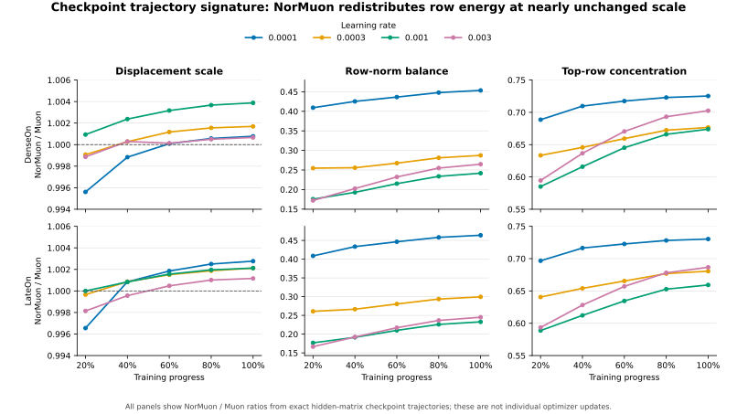

This is a specific descriptive signal: NorMuon redistributes trajectory displacement across neurons
without primarily changing its aggregate magnitude. It does not yet prove that row normalization
caused a retrieval difference. That claim requires individual common-state updates on identical
batches, matched global and per-layer update budgets, and a downstream change in margins or rankings.

AdamW also prevents an overly simple interpretation. In the overlapping observed displacement
range, DenseOn Muon `1e-4` at the final stage has displacement/weight 0.007359 and row CV 0.1972; the
nearest AdamW point (`3e-5`, stage 2) has 0.008040 and 0.0951, while NorMuon `1e-4` has 0.007365 and
0.0894. LateOn shows the same ordering: 0.007895/0.2012 for Muon, 0.008193/0.1011 for the nearest
AdamW point, and 0.007917/0.0933 for NorMuon. These are post-hoc checkpoint matches, not a fair
causal comparison, but they rule out presenting Muon's expected advantage as neuron-wise row
balancing. Muon's mechanism should instead be tested in singular-spectrum conditioning; row
balancing is the specific NorMuon hypothesis.

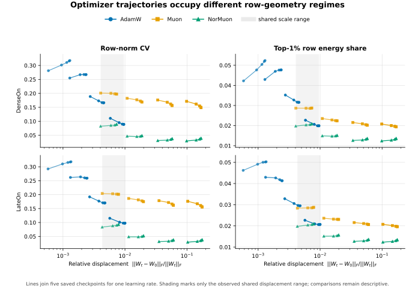

The exact checkpoint, run, and matched-pair tables, their content-addressed manifest, and regeneration
commands are in [`reports/weight-space`](../reports/weight-space/README.md). A follow-on common-state
and representation-space protocol is frozen in the [`NAACL paper plan`](naacl-paper-plan.md); it
separates cold-start optimizer transforms from state-warmed transforms and adds a hybrid AdamW
control with Muon's exact parameter routing. The protocol ledger discloses that 98 of 1,680 partial
BEIR units had already been observed when its 20-anchor completion grid was locked, so this is not
presented as a preregistration made before all outcome inspection.

A narrower exact-spectrum tier was subsequently locked at 110/1,680 valid BEIR units and before any
formal common-state output existed. It selects attention-input and MLP-expansion matrices at layers
0, 10, and 21 by architecture position, then computes all three counterfactual update spectra at all
20 anchors in both model families: 360 exact spectra total. The checked-in ledger also discloses
that the completed weight trajectories and exploratory representation smoke tests were already
visible. This subset defines the representative singular-value curves without choosing favorable
layers after inspecting the common-state spectra.

A separate coordinate diagnostic was frozen at 336/1,680 strict BEIR units and before any
common-state or basis-sensitivity output existed. ModernBERT's RoPE means that an arbitrary
orthogonal head rotation is not function preserving. The frozen protocol therefore rotates each
split-half rotary coordinate pair by a seeded SO(2) angle, applies the same angles to query and key,
and leaves value rows unchanged. These rotations commute with RoPE and preserve post-RoPE attention
logits; a float64 calibration checks both model rope bases and multiple position pairs before the
optimizer replay runs. Across all 20 common-state anchors, layers 0/10/21, three rotation seeds, and
all three optimizers, the diagnostic inverse-maps the transformed update and measures direction,
norm, predicted-descent, and selected-head spectrum error. Its 540 full-tensor and 3,240 head rows
are an appendix test of implementation-level basis dependence, not a retrieval-quality result.

## From update geometry to retrieval geometry

<!-- MECHANISM:BEGIN -->

The formal mechanism tier evaluates every optimizer transform at the same frozen weights and on the same ordered eight-gradient history. The values below are generated only after the complete 20-anchor matrix, 540 basis comparisons, 360 exact spectra, both 122-job representation tiers, and the 1,680-unit retrieval matrix pass their content-hash audits.

### Retrieval time to an AdamW reference

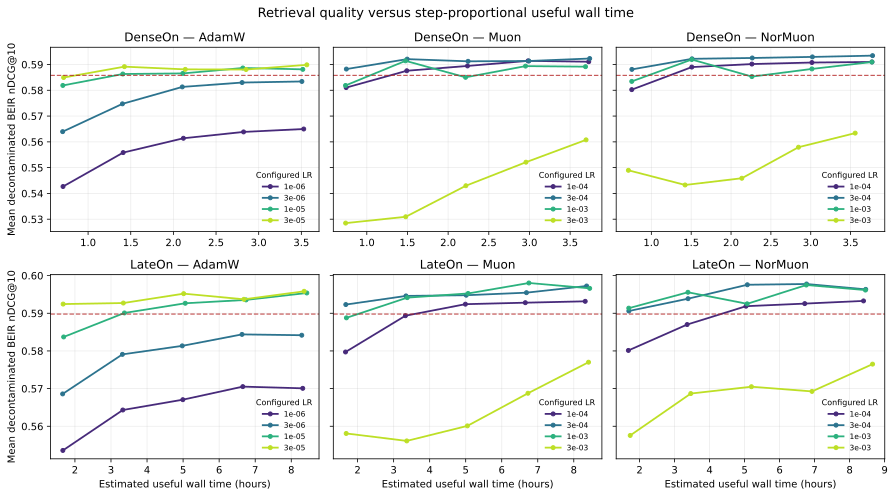

| Family | Optimizer | AdamW reference | LR points reaching | fastest hours | median hours | right-censored |
| --- | ---: | ---: | ---: | ---: | ---: | ---: |
| DenseOn | AdamW | 0.5858 | 2/4 | 1.407 | 1.416 | 2 |
| DenseOn | Muon | 0.5858 | 3/4 | 0.749 | 1.476 | 1 |
| DenseOn | NorMuon | 0.5858 | 3/4 | 0.756 | 1.507 | 1 |
| LateOn | AdamW | 0.5898 | 2/4 | 1.673 | 2.523 | 2 |
| LateOn | Muon | 0.5898 | 3/4 | 1.673 | 3.377 | 1 |
| LateOn | NorMuon | 0.5898 | 3/4 | 1.692 | 1.693 | 1 |

The reference is the within-family median final nDCG@10 of the four AdamW learning-rate points. Passage is observed only at the five saved checkpoints; no interpolation is used, and non-reaching points remain right-censored. Checkpoint time is a step-proportional estimate from audited useful terminal wall time. The rule was locked after 160/1,680 discovery units were visible, so this is exploratory rather than a preregistration or a substitute for the three-seed confirmation.

### Same-state optimizer fingerprints

| Family | Operator | row CV / AdamW | top-1% row energy / AdamW | stable rank / AdamW | spectral norm / AdamW | cosine with AdamW |
| --- | ---: | ---: | ---: | ---: | ---: | ---: |
| DenseOn | Muon | 2.855 | 1.586 | 28.916 | 0.015 | 0.470 |
| DenseOn | NorMuon | 0.711 | 0.979 | 22.021 | 0.018 | 0.480 |
| LateOn | Muon | 2.989 | 1.603 | 31.965 | 0.014 | 0.442 |
| LateOn | NorMuon | 0.667 | 0.974 | 23.996 | 0.017 | 0.452 |

Each cell is the median over ten frozen anchors. Ratios use raw optimizer directions but are scale-invariant except for the explicitly reported spectral-norm ratio; the exact-spectrum intervention below uses per-tensor Frobenius-matched directions. Weight decay is excluded from this comparison.

### Function-preserving basis sensitivity

| Family | Operator | mapped cosine | relative direction error | absolute norm-ratio error | predicted-descent error | Q/K spectrum error |
| --- | ---: | ---: | ---: | ---: | ---: | ---: |
| DenseOn | AdamW | 0.96940 | 0.24738 | 0.00022 | 0.00488 | 0.02540 |
| DenseOn | Muon | 0.99946 | 0.03277 | 0.00007 | 0.00034 | 0.00148 |
| DenseOn | NorMuon | 0.99832 | 0.05793 | 0.00007 | 0.00360 | 0.00946 |
| LateOn | AdamW | 0.96906 | 0.24878 | 0.00025 | 0.00242 | 0.02389 |
| LateOn | Muon | 0.99943 | 0.03374 | 0.00005 | 0.00025 | 0.00150 |
| LateOn | NorMuon | 0.99760 | 0.06935 | 0.00005 | 0.00228 | 0.01079 |

Each row is the median over 90 fixed comparisons: ten common-state anchors, three QKV layers, and three seeded RoPE-commuting rotations. Query and key share each split-half plane rotation, value rows are unchanged, and every direction is inverse-mapped before comparison. The transform preserves attention logits, so this table measures implementation-level coordinate dependence rather than retrieval quality; bfloat16 Newton--Schulz rounding is retained as part of the Muon runtime.

### Exact update spectra

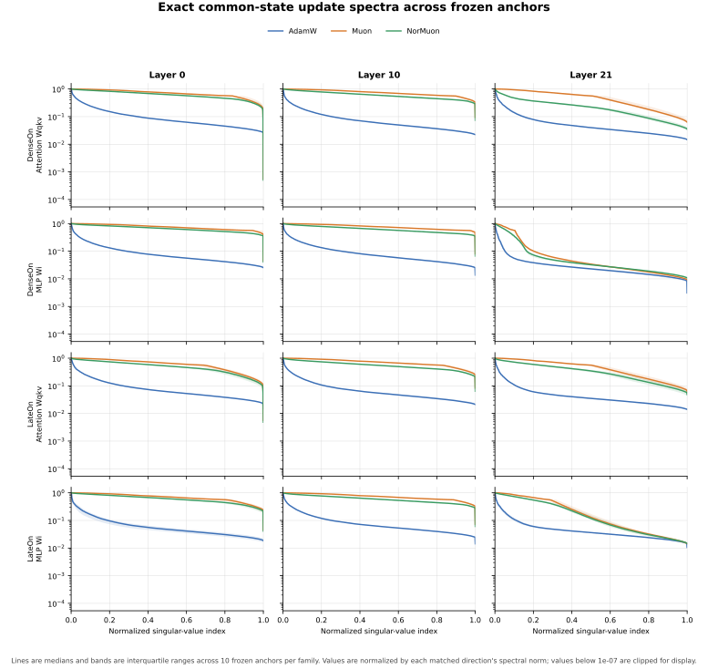

| Family | Operator | stable rank / rank | entropy rank / rank | condition number |
| --- | ---: | ---: | ---: | ---: |
| DenseOn | AdamW | 0.0195 | 0.6984 | 61.26 |
| DenseOn | Muon | 0.5772 | 0.9698 | 16.72 |
| DenseOn | NorMuon | 0.4153 | 0.9603 | 23.82 |
| LateOn | AdamW | 0.0178 | 0.6711 | 68.14 |
| LateOn | Muon | 0.5037 | 0.9386 | 20.76 |
| LateOn | NorMuon | 0.3385 | 0.9334 | 23.98 |

The six matrices were fixed by early/middle/final depth and attention/MLP role before formal spectra existed. Values are medians over 60 exact spectra per family/operator; the figure shows the full normalized curves and interquartile bands.

### Representation and score geometry

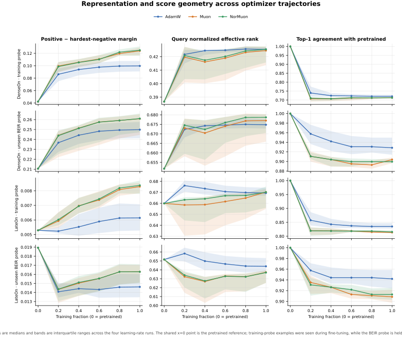

| Family | Optimizer | training margin | unseen margin | unseen query rank | pretrained top-1 agreement | Late document-token coverage | mean BEIR nDCG@10 |
| --- | ---: | ---: | ---: | ---: | ---: | ---: | ---: |
| DenseOn | AdamW | 0.0997 | 0.2499 | 0.6748 | 0.9286 | — | 0.5858 |
| DenseOn | Muon | 0.1240 | 0.2609 | 0.6770 | 0.9040 | — | 0.5901 |
| DenseOn | NorMuon | 0.1250 | 0.2611 | 0.6787 | 0.8996 | — | 0.5910 |
| LateOn | AdamW | 0.0061 | 0.0146 | 0.6439 | 0.9420 | 0.1702 | 0.5898 |
| LateOn | Muon | 0.0083 | 0.0163 | 0.6372 | 0.9085 | 0.1751 | 0.5949 |
| LateOn | NorMuon | 0.0084 | 0.0163 | 0.6369 | 0.9129 | 0.1744 | 0.5947 |

Rows are final-stage medians across all four frozen learning rates, not test-selected winners. Training and unseen probes remain separate; the latter contains 224 fixed examples balanced over all 14 decontaminated tasks.

### Late-interaction token utilization

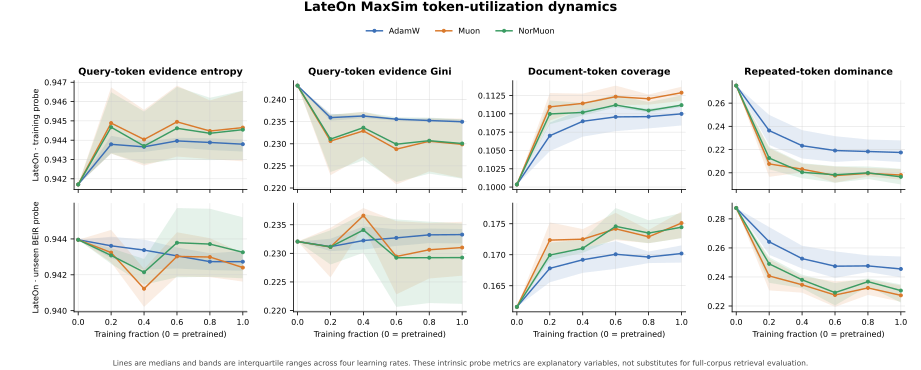

This panel reports the four prespecified MaxSim evidence summaries on both probe tiers. It is kept separate from the shared DenseOn/LateOn figure so a LateOn-only signal cannot change the cross-architecture metric definition after results are visible.

### Descriptive temporal bridge

| Family | Predictor change | Outcome change | Transitions | Spearman ρ |
| --- | ---: | ---: | ---: | ---: |
| DenseOn | weight-delta row CV | unseen margin | 48 | -0.067 |
| DenseOn | unseen margin | mean BEIR nDCG@10 | 48 | 0.531 |
| DenseOn | unseen query effective rank | mean BEIR nDCG@10 | 48 | -0.027 |
| LateOn | weight-delta row CV | unseen margin | 48 | -0.439 |
| LateOn | unseen margin | mean BEIR nDCG@10 | 48 | 0.188 |
| LateOn | unseen query effective rank | mean BEIR nDCG@10 | 48 | -0.219 |
| LateOn | document-token coverage | mean BEIR nDCG@10 | 48 | 0.305 |
| DenseOn | trailing training loss (post-hoc) | mean BEIR nDCG@10 | 48 | -0.684 |
| LateOn | trailing training loss (post-hoc) | mean BEIR nDCG@10 | 48 | -0.496 |

The first seven geometry associations were fixed in the renderer and use within-run first differences across all optimizers. The final two training-loss rows are explicitly post-hoc diagnostics added after 1,456/1,680 discovery units were visible. All nine are one-seed observational summaries, not a causal mediation analysis. The same-state fingerprints identify what each update rule does; causal claims about later retrieval still require matched short branches or optimizer-switch interventions.

<!-- MECHANISM:END -->

## The non-obvious result: local steps lose, trajectories win

Flattened singular values and balanced rows are definition-level fingerprints, not an explanation
for retrieval quality. The sharper result appears only when the same-state intervention is compared
with complete training trajectories. This comparison was declared **post hoc** after all 1,680
discovery BEIR units and the mechanism analyses were complete, but before any confirmatory-seed or
shared-start-branch result existed.

At relative scale `1e-3`, every virtual step uses the same frozen weights and gradient history and
matches each tensor's update-to-weight Frobenius ratio. The local column below is the challenger's
mean unseen-margin effect minus AdamW's. Long-horizon columns compare final-stage medians over all
four frozen learning rates. Positive values favor the challenger.

| Family | Challenger | Local margin Δ vs AdamW | Final unseen-margin Δ | Final BEIR Δ | Reversal |
| --- | --- | ---: | ---: | ---: | --- |
| DenseOn | Muon | -3.034e-4 | +0.0110 | +0.0043 | yes |
| DenseOn | NorMuon | -3.671e-4 | +0.0112 | +0.0052 | yes |
| LateOn | Muon | -3.976e-4 | +0.0017 | +0.0051 | yes |
| LateOn | NorMuon | -4.527e-4 | +0.0017 | +0.0049 | yes |

All four comparisons reverse sign. Muon-family directions therefore do not win because a
Frobenius-matched step produces a larger immediate retrieval margin. Their native trajectories must
change later gradients or accumulate functionally useful changes that the local intervention does
not reproduce.

An independent validation set exposes the other half of the mechanism. It selects one recipe per
family and optimizer without looking at BEIR; the within-optimizer best discovery BEIR point below
is a descriptive oracle and is never substituted into confirmation.

| Family | Optimizer | Validation-selected LR | BEIR-oracle LR | Selected BEIR | Oracle BEIR | Regret | Drift excess |
| --- | --- | ---: | ---: | ---: | ---: | ---: | ---: |
| DenseOn | AdamW | 3e-5 | 3e-5 | 0.5899 | 0.5899 | +0.0000 | +0.0000 |
| DenseOn | Muon | 3e-3 | 3e-4 | 0.5608 | 0.5923 | +0.0315 | +0.0591 |
| DenseOn | NorMuon | 3e-3 | 3e-4 | 0.5634 | 0.5934 | +0.0300 | +0.0469 |
| LateOn | AdamW | 3e-5 | 3e-5 | 0.5958 | 0.5958 | +0.0000 | +0.0000 |
| LateOn | Muon | 1e-3 | 3e-4 | 0.5966 | 0.5972 | +0.0006 | +0.0105 |
| LateOn | NorMuon | 1e-3 | 3e-4 | 0.5962 | 0.5963 | +0.0002 | +0.0113 |

DenseOn is the decisive mismatch. Validation prefers the aggressive `3e-3` Muon-family recipes,
whose validation margins are much larger, but they lose about 0.03 mean zero-shot BEIR and nearly
double unseen score drift relative to the `3e-4` within-optimizer oracle. LateOn's mismatch is much
smaller. Muon therefore appears to alter an **acquisition–preservation frontier**: moderate spectral
reweighting can accumulate useful margins, while excessive strength optimizes the adaptation domain
at the cost of the pretrained retrieval function.

This is not yet a causal spectral explanation. The frozen shared-start branches must determine
whether the long-horizon reversal survives matched accumulated update budgets. To factor the local
effect, an explicitly post-hoc intervention now crosses AdamW/Muon singular-vector bases with their
singular-value spectra, follows four interior points of the Adam-to-Muon log-spectrum path, and
transplants the head, middle, and tail bands separately at all 20 anchors. Every tensor is rematched
to the same Frobenius budget before scoring. These results will identify which matrix component
changes the immediate retriever function, but only agreement with the already-frozen short branches
can support a long-horizon mechanism claim. The complete source-bound reversal tables and current
claim boundary are in
[`reports/local-global-reversal`](../reports/local-global-reversal/README.md).

<!-- OUTCOMES:BEGIN -->

Hybrid-routing, scale-matched intervention, shared-start branch, and three-seed confirmation tables
will be inserted here only after all four strict reports pass their declared coverage and hash gates.

<!-- OUTCOMES:END -->

## Limitations

- This is one epoch on one pretrained backbone family; it does not establish a universal optimizer
  ranking.
- Muon and NorMuon necessarily use AdamW for non-matrix parameters, so the comparison is between
  practical optimizer recipes rather than mathematically pure single-optimizer systems.
- Four learning rates expose learning-rate sensitivity and reduce dependence on a single operating
  point, but they neither establish optimizer robustness nor guarantee that every optimizer's global
  optimum is inside the sweep.
- PyLate 1.6 uses Late Interaction Kernels 0.4.5's reduced-precision KD backward. An adversarial
  masking test returned the exact expected score and zero gradients for masked query/document tokens,
  but random bfloat16 near-ties differed from eager PyTorch by up to 0.00252 in score and could choose
  a different sparse MaxSim argmax. Every LateOn run uses the same pinned kernel and hardware, so this
  is controlled within the study, but cross-backend bitwise equivalence is not claimed.
- Every configuration in the 24-run discovery grid uses the same training/data seed (42). This
  controls the sweep but does not quantify grid-wide variance; the validation-frozen recipes receive
  three independent negative-resampling/order seeds in the separate confirmatory stage.
- Seed 42 fixes data selection, negative choices, Trainer sampling, and model RNG state, but the
  high-throughput FlashAttention/TF32 CUDA path is not configured for bitwise deterministic replay.
- No in-batch negatives makes the groups controlled and memory predictable, but the absolute scores are
  not directly comparable to recipes that use large cross-device negative pools.
- Omitting the paper's knowledge-distillation and DenseOn Matryoshka auxiliary objectives isolates the
  optimizer comparison, but it also means these scores are not a reproduction of the released models'
  full supervised training recipe.
- Approximate PLAID retrieval can introduce a small difference from exhaustive late-interaction scoring;
  index settings are held constant for every checkpoint.

## Reproduction and audit trail

All code, configs, pinned revisions, tests, and commands are in the
[project repository](https://github.com/qcznlp/embedding-optimizer-study). The repository is currently
private at the user's request and is structured for a later public release. The
[W&B project](https://wandb.ai/stevezenguom/embedding-optimizer-study) contains training curves and
resolved run configurations. Local evaluation artifacts are reduced by `embed-optim-aggregate`, which
also checks expected matrix coverage before the results section is generated.

Checkpoint resumes can make an SDK run contain repeated optimizer steps even when the local Trainer
state is correct. For the final dashboard, `embed-optim-sync-wandb` therefore publishes one immutable,
content-addressed canonical history from every completed Trainer state. It then reads back every
remote row and requires the normalized history hash to match locally, rather than trusting the hash
stored in the remote summary, and it verifies exactly one current run for every matrix identity. The
9,384 local loss records become 9,408 dashboard rows because each
of the 24 runs adds an explicit step-3,907 terminal/system record. The content-verified discovery
matrix carries the `canonical-current` tag; earlier content-addressed revisions remain available for
provenance. Raw resume segments are kept for system telemetry, and no source run is deleted.

During training, the CPU-only `embed-optim-watch-checkpoints` sidecar waits for each atomic checkpoint
payload, performs the same deep model/optimizer/scheduler/argument/RNG audit, rejects unchanged model
weights, and records progress in an atomic JSON state file. This makes checkpoint acceptance
observable before the final evaluation gate without consuming GPU capacity. For a formal matrix it
also enforces the frozen Python/package/CUDA-build runtime before reading checkpoint payloads, so a
development environment cannot silently become the optimizer-state verifier.

The `embed-optim-supervise` wrapper separately protects the top-level multi-day matrix process. It
can adopt an already-running matrix without interrupting its children, then recomputes completion from
terminal artifacts and relaunches only unfinished configurations after any orchestrator exit. Its
sequential-family mode preserves the LateOn-first priority while letting both four-GPU pools work on
that family. The companion `embed-optim-supervise-evaluation` process remains CPU-only until all 24
training markers are structurally complete, then relaunches the resumable evaluator after worker or
coordinator failures. Every attempt ends in a strict aggregation audit, and the supervisor exits only
after that gate proves all 1,680 checkpoint-task results plus the training, data, and runtime
contracts. It then idempotently publishes all 24 canonical W&B histories and renders the final
Markdown results; failures in those finalization steps retry without relaunching GPU scoring.
Formal evaluation handoff explicitly uses the same Python 3.12 /
PyTorch 2.9.1+cu129 interpreter as
training for both its coordinator and workers; the repository's development/CI environment is not
substituted for that runtime. `configs/formal_runtime.json` freezes the complete package/CUDA-build
contract, and `embed-optim-verify-runtime` fails before work if the selected interpreter differs.
The formal matrix, every direct training worker, and the evaluation coordinator all invoke this gate
automatically; smoke and CI matrices omit the formal-runtime declaration.

## References

- Loshchilov and Hutter, [Decoupled Weight Decay Regularization](https://arxiv.org/abs/1711.05101),
  2017.
- Jordan et al., [Muon: An optimizer for hidden layers in neural networks](https://kellerjordan.github.io/posts/muon/),
  2024.
- Sourty et al., [DenseOn with the LateOn](https://arxiv.org/abs/2607.27178), 2026.
- Li et al., [NorMuon: Making Muon more efficient and scalable](https://arxiv.org/abs/2510.05491),
  2025.
- Thakur et al., [BEIR: A Heterogenous Benchmark for Zero-shot Evaluation of Information Retrieval
  Models](https://arxiv.org/abs/2104.08663), 2021.
- Muennighoff et al., [MTEB: Massive Text Embedding Benchmark](https://arxiv.org/abs/2210.07316),
  2022.
- Chaffin and Sourty,
  [PyLate: Flexible Training and Retrieval for Late Interaction Models](https://arxiv.org/abs/2508.03555),
  2025.
- LightOn,
  [FastPLAID: High-Performance Engine for Multi-Vector Search](https://github.com/lightonai/fast-plaid),
  2025.
- LightOn, [DenseOn and LateOn release blog](https://huggingface.co/blog/lightonai/denseon-lateon),
  2026.
- NVIDIA, [Analyzing Xid Errors with the Xid Catalog](https://docs.nvidia.com/deploy/xid-errors/analyzing-xid-catalog.html),
  2026.
