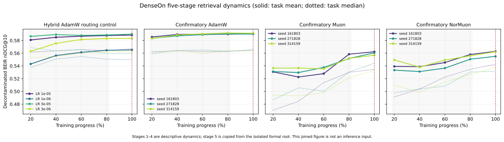

# Can Muon train a better dense retriever?

> A controlled DenseOn study of AdamW, Muon, and NorMuon, from one-step update geometry to
> five-stage decontaminated BEIR dynamics.

**Study status:** the original DenseOn discovery sweep is complete. The generated
[completion outcome](#audited-completion-status) records the audited state and claimability of the
Dense-only hybrid-routing controls, three-seed confirmation, shared-start branches, and frozen
spectrum-versus-basis intervention under the post-hoc scope amendment.

## What changed, and why

This project originally included both DenseOn and LateOn. After the complete discovery sweep and
exploratory mechanism outputs were visible, the project owner asked us to stop new late-interaction
work because it was much slower and less relevant to the intended audience. That is a
**user-directed, post-hoc scope change**, not a scientific exclusion chosen before results.

All existing LateOn artifacts remain available for audit. They are not deleted, treated as a
replication, pooled into uncertainty estimates, or used in the primary conclusion. Every new
training run, evaluation, causal intervention, and paper claim is DenseOn-only. The machine-readable
decision is [dense_scope_amendment.json](../configs/dense_scope_amendment.json).

The new NAACL story is in [the Dense-only paper plan](naacl-dense-paper-plan.md). The
[original two-family plan](naacl-paper-plan.md) remains byte-for-byte frozen so that the earlier
claim protocol can still be audited.

## The question

Muon approximately orthogonalizes momentum updates for hidden weight matrices. NorMuon adds a
row-wise historical normalizer and restores the matrix-level update norm. Those operator properties
are interesting, but they are not a retrieval result. The study asks a narrower question:

> When an Adam-pretrained dense encoder is adapted with a contrastive retrieval loss, can a
> matrix-aware optimizer improve zero-shot rankings, and what optimization process explains any
> improvement?

The evidence is organized to separate four things that are often conflated:

1. the update prescribed by each optimizer at the same weights;
2. the per-query distribution of the immediate functional change;
3. the trajectory created by repeatedly changing both weights and future gradients;
4. the final retrieval ranking on unseen corpora.

## Experimental contract

### Base model

The active model is
[lightonai/DenseOn-unsupervised](https://huggingface.co/lightonai/DenseOn-unsupervised), pinned to
revision 0edbd55684eb782bce55ee74c95b25c97cbe7f43. It has completed pretraining but no supervised
retrieval fine-tuning.

### Training data

The public source contains roughly 1.22 million query rows. Only 1,046,024 query IDs have all
required mined-score records. We deterministically select 500,000 groups with proportional
largest-remainder allocation over the seven sources:

| Source | Scorable queries | Selected |
| --- | ---: | ---: |
| FiQA | 5,500 | 2,629 |
| HotpotQA | 85,000 | 40,630 |
| MS MARCO | 502,939 | 240,405 |
| NQ | 152,145 | 72,725 |
| FEVER | 109,810 | 52,489 |
| SQuADv2 | 130,217 | 62,244 |
| TriviaQA | 60,413 | 28,878 |
| **Total** | **1,046,024** | **500,000** |

Each query has one positive and seven seeded random hard negatives. Candidate documents must score
below 0.95 times the positive score; seven are sampled without replacement from the first ten
eligible candidates. Selection and negative sampling use seed 42 plus stable BLAKE2-derived
per-example seeds.

The accepted materialization has:

- dataset fingerprint 8a489098f9729d86;
- canonical row-ledger SHA-256
  735ef35b7195f3dae3172496b5bc534d39f2b7594d216c685eaebb37134fc347;
- fixed training-view fingerprint cc0598ffd4f5454f.

Every run verifies these identities before training. No in-batch or cross-device negatives are used;
the loss always sees an explicit batch-by-eight logit matrix.

### Objective and sequence length

DenseOn uses cosine InfoNCE with temperature 0.02. Query and document truncation limits are both
8,192 tokens, following the DenseOn supervised setting; dynamic padding avoids paying that cost for
short batches. To isolate the optimizer, we omit cross-encoder distillation and the Matryoshka
auxiliary objective.

### Optimizers

| Optimizer | Swept hidden-matrix LR | Auxiliary LR | Main settings |
| --- | --- | ---: | --- |
| AdamW | 1e-6, 3e-6, 1e-5, 3e-5 | same as hidden | beta=(0.9, 0.999), wd=0.01 |
| Muon | 1e-4, 3e-4, 1e-3, 3e-3 | AdamW 3e-6 | momentum=0.95, 5 NS steps, wd=0.01 |
| NorMuon | 1e-4, 3e-4, 1e-3, 3e-3 | AdamW 3e-6 | momentum=0.95, beta2=0.95, 5 NS steps |

Muon and NorMuon act only on the 88 two-dimensional Transformer hidden matrices, covering
110,297,088 parameters. Embeddings, the pooling projection, normalization parameters, and biases
remain on auxiliary AdamW. The all-AdamW baseline uses the swept rate for the same hidden and
projection weights, with the same decay/no-decay routing.

NorMuon is pinned to upstream commit c6989a8354730695d9f5a9faa6c55eeb24865209. Numerical tests
compare its update, momentum buffer, row-wise second moment, and norm restoration with the reference.

### Training schedule

All runs use one epoch, nominal global batch 128, four GPUs, bfloat16 autocast, TF32,
FlashAttention-2, non-reentrant gradient checkpointing, gradient clipping at 1.0, 10% warmup, and
linear decay. Four gradient-accumulation steps turn per-GPU microbatches of eight into the global
batch. The last optimizer step contains the remaining 32 examples; no example is duplicated or
dropped.

Complete resumable checkpoints are retained at 20%, 40%, 60%, 80%, and 100% of the 3,907 optimizer
steps. A checkpoint counts only if the model, optimizer, scheduler, trainer state, four rank-local RNG
archives, schedule, and dataset identities all pass the deep audit.

## Evaluation

Every discovery checkpoint is evaluated on 14 pinned decontaminated BEIR tasks:

ArguAna, ClimateFEVER, DBPedia, FEVER, FiQA, HotpotQA, MS MARCO, NFCorpus, NQ, Quora, SCIDOCS,
SciFact, TREC-COVID, and Touche2020.

The exact inputs are frozen below. Every task uses MTEB's standard `default` subset. Corpus counts
come from the pinned Hub snapshots and also determine longest-processing-time-first scheduling.

| Task | Hugging Face dataset | Revision | Split | Corpus rows |
| --- | --- | --- | --- | ---: |
| ArguAna | `lightonai/arguana-decontaminated` | `c19c66cb43fb9b090cc55e81c10d9b5dc70b47a7` | test | 8,546 |
| ClimateFEVER | `lightonai/climate-fever-decontaminated` | `1e73a88ba467a00e22ae814873edc3a9bb63b441` | test | 5,117,453 |
| DBPedia | `lightonai/dbpedia-entity-decontaminated` | `7689f39462841132f3345798c946481418a8b77c` | test | 1,678,309 |
| FEVER | `lightonai/fever-decontaminated` | `c39d8922d4bd04bc690a4331800018c1c44d41bd` | test | 5,117,452 |
| FiQA2018 | `lightonai/fiqa-decontaminated` | `6d053f042b0a58763f0463d4591521725c8eb1b9` | test | 47,617 |
| HotpotQA | `lightonai/hotpotqa-decontaminated` | `2a3899c49545c56f84d5e884a1723c34ed96ae61` | test | 2,314,813 |
| MSMARCO | `lightonai/msmarco-decontaminated` | `7e98709a5db3f95bbd50a7b9b53f3a2c5d69f837` | dev | 4,036,967 |
| NFCorpus | `lightonai/nfcorpus-decontaminated` | `de914702862784c9d5c937cf4736bf37bc7bbac9` | test | 912 |
| NQ | `lightonai/nq-decontaminated` | `8d4418d0bab92c5887e0f330fe9bea1e692e173f` | test | 305,674 |
| QuoraRetrieval | `lightonai/quora-decontaminated` | `a303966cc5dc0dcfb77761202d10e02c2fc67be2` | test | 413,157 |
| SCIDOCS | `lightonai/scidocs-decontaminated` | `a5f62cf5006386ed1f069b79c56fbbe18e4e778a` | test | 5,833 |
| SciFact | `lightonai/scifact-decontaminated` | `0729fa34af49875724d18ace64ce07f3e1dc0587` | test | 858 |
| TRECCOVID | `lightonai/trec-covid-decontaminated` | `9e28c1e95c3e04a8f12ea2053822d80312f15794` | test | 99,522 |
| Touche2020 | `lightonai/webis-touche2020-decontaminated` | `84c6c1ff39a87ee1e1d4356fc6f43df6d49431b3` | test | 378,223 |
| **Total** |  |  |  | **19,525,336** |

MS MARCO uses dev; all others use test. The primary score is the unweighted mean task nDCG@10. The
five checkpoints expose the complete observed training curve. We also report four-learning-rate
dispersion, trajectory AUC over 20%–100%, paired task deltas, training throughput, useful wall time,
optimizer-state size, and peak allocated memory.

Best-LR discovery comparisons are exploratory because the same 14 tasks select and evaluate the
configuration. The final comparison therefore uses three new data-order/negative-sampling seeds with
recipes fixed by a query-disjoint validation probe. Its hierarchical bootstrap resamples seeds and
tasks. The headline interval retains the Bonferroni correction over all six comparisons frozen
before the post-hoc Dense-only scope amendment; narrowing the displayed model family does not make
the statistical gate easier.

The original five-way checkpoint requirement is also applied to the 4 routing-matched hybrid runs
and 9 full-length confirmatory runs. Their missing 20%–80% evaluations are frozen as a 728-unit
extension in `configs/dense_retrieval_dynamics_extension.json`, with separate result roots from the
formal final-stage evaluation. The descriptive artifact joins those 728 rows to the existing 182
stage-5 units and is defined as 13 runs × 5 stages = 65 trajectory rows and 910 task units; the
complete Dense design has 1,750 BEIR units including discovery. This extension is descriptive and
does not change model
selection or inference: hybrid routing and three-seed contrasts still read only stage 5. The
shared-start 50K controls have five query-disjoint and unseen-probe stages instead of full BEIR.

## Extended full-length retrieval dynamics

<!-- DENSE-RETRIEVAL-DYNAMICS:BEGIN -->

The completed full-length extension contains **13 runs × 5 stages = 65 trajectory rows and 910 decontaminated BEIR task units**. Stages 1–4 come from isolated dynamics roots; stage 5 is joined from the pre-existing formal roots.

[Download the source-bound 65-row CSV](../reports/dense-retrieval-dynamics/five_stage_retrieval_dynamics.csv)

| Series | Runs | 20% | 40% | 60% | 80% | 100% |
| --- | --- | ---: | ---: | ---: | ---: | ---: |
| Hybrid AdamW | 4 | 0.5684 | 0.5765 | 0.5794 | 0.5810 | 0.5817 |
| Confirmatory AdamW | 3 | 0.5840 | 0.5884 | 0.5897 | 0.5907 | 0.5905 |
| Confirmatory Muon | 3 | 0.5328 | 0.5296 | 0.5337 | 0.5540 | 0.5599 |
| Confirmatory NorMuon | 3 | 0.5407 | 0.5360 | 0.5437 | 0.5548 | 0.5601 |

**Inference boundary:** these joined curves are descriptive training dynamics only. The hybrid-routing and confirmatory comparisons continue to read only their disjoint, pre-existing stage-5 result roots; neither the CSV nor either figure is an inference input.

<!-- DENSE-RETRIEVAL-DYNAMICS:END -->

## Discovery results

<!-- RESULTS:BEGIN -->

All 840 planned task/checkpoint evaluations completed. Scores below are the unweighted mean nDCG@10 across the 14 tasks.

### Final quality and learning-rate robustness

| Family | Optimizer | Same-suite BEIR-best LR | Exploratory BEIR-best final | 4-LR mean | 4-LR median | SD | Range | 4-LR trajectory AUC |
| --- | --- | ---: | ---: | ---: | ---: | ---: | ---: | ---: |
| dense | adamw | 3e-5 | 0.5899 | 0.5816 | 0.5858 | 0.0099 | 0.5650–0.5899 | 0.5779 |
| dense | muon | 3e-4 | 0.5923 | 0.5833 | 0.5901 | 0.0131 | 0.5608–0.5923 | 0.5776 |
| dense | normuon | 3e-4 | 0.5934 | 0.5847 | 0.5910 | 0.0123 | 0.5634–0.5934 | 0.5800 |

- **Dense:** best same-suite BEIR-selected final score is normuon at 3e-4 (0.5934); the highest four-LR mean is normuon (0.5847); the highest mean observed-window AUC is normuon (0.5800). Same-suite BEIR-selected paired muon beats AdamW on 10/14 tasks, mean Δ=+0.0024 (95% CI [+0.0006, +0.0047]); normuon beats AdamW on 11/14 tasks, mean Δ=+0.0036 (95% CI [+0.0015, +0.0059]).

### Five-checkpoint dynamics for every learning-rate run

Each panel below shows all four LR configurations rather than an optimizer-level average; every curve contains the formal 20%, 40%, 60%, 80%, and 100% checkpoints.

### Dynamics after selecting each optimizer by final nDCG@10 on this same BEIR suite

| Family | Optimizer | 20% | 40% | 60% | 80% | 100% | AUC |
| --- | --- | ---: | ---: | ---: | ---: | ---: | ---: |
| dense | adamw | 0.5850 | 0.5892 | 0.5881 | 0.5880 | 0.5899 | 0.5882 |
| dense | muon | 0.5882 | 0.5921 | 0.5912 | 0.5913 | 0.5923 | 0.5912 |
| dense | normuon | 0.5881 | 0.5922 | 0.5925 | 0.5929 | 0.5934 | 0.5921 |

### Paired effects after same-suite BEIR selection

| Family | Comparison | W/T/L | Mean Δ | Paired bootstrap 95% CI | Sign p | Holm p |
| --- | --- | ---: | ---: | ---: | ---: | ---: |
| dense | muon − AdamW | 10/0/4 | +0.0024 | [+0.0006, +0.0047] | 0.1796 | 0.438 |
| dense | normuon − AdamW | 11/0/3 | +0.0036 | [+0.0015, +0.0059] | 0.05737 | 0.2295 |

### Per-task final scores after same-suite BEIR selection

#### Dense same-suite BEIR-selected discovery task scores

| Task | AdamW | Muon | NorMuon | Muon − AdamW | NorMuon − AdamW |
| --- | --- | ---: | ---: | ---: | ---: |
| ArguAna | 0.5600 | 0.5620 | 0.5617 | +0.0020 | +0.0017 |
| ClimateFEVER | 0.4059 | 0.4104 | 0.4140 | +0.0045 | +0.0082 |
| DBPedia | 0.2776 | 0.2790 | 0.2811 | +0.0015 | +0.0035 |
| FEVER | 0.9205 | 0.9225 | 0.9235 | +0.0020 | +0.0030 |
| FiQA2018 | 0.5421 | 0.5447 | 0.5490 | +0.0026 | +0.0069 |
| HotpotQA | 0.6750 | 0.6787 | 0.6777 | +0.0037 | +0.0027 |
| MSMARCO | 0.5680 | 0.5712 | 0.5707 | +0.0032 | +0.0028 |
| NFCorpus | 0.2874 | 0.2840 | 0.2862 | -0.0034 | -0.0012 |
| NQ | 0.9254 | 0.9396 | 0.9396 | +0.0142 | +0.0142 |
| QuoraRetrieval | 0.9118 | 0.9131 | 0.9132 | +0.0013 | +0.0014 |
| SCIDOCS | 0.1477 | 0.1470 | 0.1484 | -0.0008 | +0.0006 |
| SciFact | 0.8804 | 0.8792 | 0.8792 | -0.0012 | -0.0012 |
| TRECCOVID | 0.8304 | 0.8301 | 0.8297 | -0.0004 | -0.0008 |
| Touche2020 | 0.3259 | 0.3309 | 0.3342 | +0.0050 | +0.0083 |

The best-LR comparisons are selected on this same benchmark suite and should therefore be read as controlled exploratory results, not as an unbiased model-selection estimate. Paired intervals use 20,000 deterministic task-level bootstrap resamples; the sign-test p-value is exact after excluding ties, and Holm p controls the original four-comparison discovery family. BEIR tasks are heterogeneous and not independent draws, so these are descriptive uncertainty summaries rather than population inference. The four-LR mean, spread, and complete per-task rows are included to expose sensitivity rather than reporting only the winning point. Trajectory AUC is the normalized trapezoidal mean nDCG@10 over the observed 20%–100% checkpoint window; it measures early-to-late quality, not time before the first checkpoint.

<!-- RESULTS:END -->

<!-- TASK-DELTA-STABILITY:BEGIN -->

### Exploratory task-effect stability across checkpoints

| Family | Comparison | Stages | Same direction | Pearson r | Spearman rho |
| --- | --- | --- | ---: | ---: | ---: |
| DenseOn | Muon − AdamW | 20%→40% | 10/14 | 0.645 | 0.543 |
| DenseOn | Muon − AdamW | 40%→60% | 10/14 | 0.709 | 0.640 |
| DenseOn | Muon − AdamW | 60%→80% | 11/14 | 0.651 | 0.648 |
| DenseOn | Muon − AdamW | 80%→100% | 12/14 | 0.811 | 0.855 |
| DenseOn | NorMuon − AdamW | 20%→40% | 6/14 | 0.324 | 0.345 |
| DenseOn | NorMuon − AdamW | 40%→60% | 8/14 | 0.463 | 0.451 |
| DenseOn | NorMuon − AdamW | 60%→80% | 11/14 | 0.753 | 0.662 |
| DenseOn | NorMuon − AdamW | 80%→100% | 9/14 | 0.743 | 0.714 |

This DenseOn-only post-hoc diagnostic applies each optimizer's learning-rate run selected by final nDCG@10 on this same BEIR suite at every checkpoint and correlates its 14 paired task deltas against AdamW across adjacent stages. It is a filtered exploratory view of the already audited discovery matrix. It does not alter run selection, the primary aggregate, or the frozen Dense confirmatory family, and it carries no causal interpretation.

<!-- TASK-DELTA-STABILITY:END -->

## Systems results

<!-- SYSTEMS:BEGIN -->

Every run used 4 × NVIDIA L20Z. Values are medians over the four learning-rate configurations for that optimizer and family; CUDA memory is the maximum per rank, not the sum across ranks.

| Family | Optimizer | Median hours | Samples/s | Throughput vs AdamW | Peak allocated GiB | Optimizer state GiB | Checkpoint GiB |
| --- | --- | ---: | ---: | ---: | ---: | ---: | ---: |
| dense | adamw | 3.52 | 39.43 | 1.00× | 7.41 | 1.11 | 1.67 |
| dense | muon | 3.71 | 37.41 | 0.95× | 6.98 | 0.70 | 1.26 |
| dense | normuon | 3.77 | 36.86 | 0.93× | 6.97 | 0.70 | 1.26 |

The recorded wall time includes training and five full checkpoint writes. Peak CUDA memory comes from PyTorch allocator counters inside each training process, so the independent utilization guard process is excluded. For checkpoint-resumed runs, throughput is recomputed from the sum of non-overlapping useful training segments rather than Trainer's resume-local runtime; the segment adjustment and original Trainer fields remain in the audit table. Exact per-run measurements are in `reports/dense-discovery/system_metrics.csv`.

<!-- SYSTEMS:END -->

## What the optimization analysis actually says

Spectral flattening is part of Muon's construction; observing it is not a new contribution. The
retrieval-specific evidence begins where the obvious operator property stops.

### 1. Local matched steps lose while the one-seed grid median reverses

At ten common DenseOn states, we apply AdamW, Muon, and NorMuon to the same eight-gradient history.
After matching every hidden tensor to AdamW's Frobenius norm and taking a relative 1e-3 virtual step,
the mean positive-margin gains are:

| Operator | Mean immediate margin gain | Difference from AdamW |
| --- | ---: | ---: |
| AdamW | +0.000865 | — |
| Muon | +0.000562 | -0.000303 |
| NorMuon | +0.000498 | -0.000367 |

Across the four frozen learning-rate sweep points in the single discovery seed, however, median
final BEIR is +0.00435 for Muon and +0.00521 for NorMuon relative to AdamW. The sign reverses from
the matched local intervention to this one-seed grid aggregate. A “better immediate descent
direction” cannot explain that discovery ordering.

### 2. The optimizers enter different directions, not better-aligned gradients

At the same state, the parameter-weighted cosine between AdamW and Muon directions has median 0.470;
Muon and NorMuon remain much closer at 0.972. Median cosine with the common final gradient is 0.401
for AdamW, 0.258 for Muon, and 0.244 for NorMuon.

The AdamW–Muon cosine falls from 0.537 at the pretrained state to about 0.490 along the AdamW
trajectory and 0.463 along the Muon trajectory. This is post-hoc evidence for optimizer-induced state
feedback: committing a Muon-family step changes the state on which future gradients and updates are
computed. It is not yet causal proof that this feedback improves retrieval.

### 3. DenseOn shows tail redistribution, not uniform dominance

The same-state Muon step has a worse mean margin effect, yet improves the fixed p05 margin and p95/p99
loss quantiles at all ten anchors. A symmetric cross-tail check changes the interpretation. On
AdamW's selected worst 5% queries, Muon has a -0.1366 loss-change advantage, but on Muon's own worst
tail it has a +0.0203 disadvantage. Tail-set Jaccard overlap is only 0.279. NorMuon shows the same
pattern with Jaccard 0.270.

Muon therefore moves which queries are fragile; it does not uniformly suppress one shared adverse
tail. This query-level redistribution is specific to the retrieval function and cannot be read from
the optimizer definition alone.

### 4. Flatter spectra alone do not explain the one-seed discovery contrast

For exact selected matrices, the median normalized stable-rank statistic is about 0.0195 for AdamW,
0.5772 for Muon, and 0.4153 for NorMuon. Yet across DenseOn anchors, the magnitude of spectral
flattening has little or no association with tail protection. Representation effective-rank levels
track BEIR over checkpoints, but within-run first differences are weak and inconsistent.

Those negative results matter: “Muon flattens the spectrum” is an operator fingerprint, not a
mechanistic explanation of the observed four-learning-rate-median discovery contrast.

### 5. Learning a new objective can damage pretrained rankings

Query-disjoint validation selects the largest tested Muon-family rate, 3e-3, because it optimizes the
training-style objective. The discovery-BEIR oracle lies at 3e-4. The validation-selected rates lose
0.0315 mean BEIR for Muon and 0.0300 for NorMuon relative to their own discovery oracle, while
roughly doubling score drift from the pretrained ranker.

The emerging trade-off is acquisition versus preservation: strong matrix-aware adaptation can learn
the narrow contrastive objective while eroding zero-shot ranking structure.

<!-- MECHANISM:BEGIN -->

Under the disclosed post-hoc DenseOn scope, the formal mechanism tier evaluates every optimizer transform at the same frozen weights and on the same ordered eight-gradient history. The complete historical source artifacts still pass their content-hash and cardinality audits before the renderer selects the active DenseOn slice: 10 common-state anchors, 270 basis comparisons, 180 exact spectra, 60 bridge checkpoints, and 840 retrieval evaluation units.

### Retrieval time to an AdamW reference

| Family | Optimizer | AdamW reference | LR points reaching | fastest hours | median hours | right-censored |
| --- | ---: | ---: | ---: | ---: | ---: | ---: |
| DenseOn | AdamW | 0.5858 | 2/4 | 1.407 | 1.416 | 2 |
| DenseOn | Muon | 0.5858 | 3/4 | 0.749 | 1.476 | 1 |
| DenseOn | NorMuon | 0.5858 | 3/4 | 0.756 | 1.507 | 1 |

The reference is the DenseOn median final nDCG@10 of the four AdamW learning-rate points. Passage is observed only at the five saved checkpoints; no interpolation is used, and non-reaching points remain right-censored. Checkpoint time is a step-proportional estimate from audited useful terminal wall time. This one-seed discovery analysis remains exploratory rather than a substitute for the validation-frozen three-seed confirmation.

### Same-state optimizer fingerprints

| Family | Operator | row CV / AdamW | top-1% row energy / AdamW | stable rank / AdamW | spectral norm / AdamW | cosine with AdamW |
| --- | ---: | ---: | ---: | ---: | ---: | ---: |
| DenseOn | Muon | 2.855 | 1.586 | 28.916 | 0.015 | 0.470 |
| DenseOn | NorMuon | 0.711 | 0.979 | 22.021 | 0.018 | 0.480 |

Each cell is the median over ten frozen DenseOn anchors. Ratios use raw optimizer directions but are scale-invariant except for the explicitly reported spectral-norm ratio; the exact-spectrum intervention uses per-tensor Frobenius-matched directions. Weight decay is excluded from this comparison.

### Function-preserving basis sensitivity

| Family | Operator | mapped cosine | relative direction error | absolute norm-ratio error | predicted-descent error | Q/K spectrum error |
| --- | ---: | ---: | ---: | ---: | ---: | ---: |
| DenseOn | AdamW | 0.96940 | 0.24738 | 0.00022 | 0.00488 | 0.02540 |
| DenseOn | Muon | 0.99946 | 0.03277 | 0.00007 | 0.00034 | 0.00148 |
| DenseOn | NorMuon | 0.99832 | 0.05793 | 0.00007 | 0.00360 | 0.00946 |

Each row is the median over 90 fixed comparisons: ten common-state anchors, three QKV layers, and three seeded RoPE-commuting rotations. Query and key share each split-half plane rotation, value rows are unchanged, and every direction is inverse-mapped before comparison. The transform preserves attention logits, so this table measures implementation-level coordinate dependence rather than retrieval quality; bfloat16 Newton--Schulz rounding is retained as part of the Muon runtime.

### Exact update spectra

| Family | Operator | stable rank / rank | entropy rank / rank | condition number |
| --- | ---: | ---: | ---: | ---: |
| DenseOn | AdamW | 0.0195 | 0.6984 | 61.26 |
| DenseOn | Muon | 0.5772 | 0.9698 | 16.72 |
| DenseOn | NorMuon | 0.4153 | 0.9603 | 23.82 |

The six matrices were fixed by early/middle/final depth and attention/MLP role before formal spectra existed. Values are medians over 60 exact spectra per optimizer on the active DenseOn anchors.

### Representation and score geometry

| Family | Optimizer | training margin | unseen margin | unseen query rank | pretrained top-1 agreement | mean BEIR nDCG@10 |
| --- | ---: | ---: | ---: | ---: | ---: | ---: |
| DenseOn | AdamW | 0.0997 | 0.2499 | 0.6748 | 0.9286 | 0.5858 |
| DenseOn | Muon | 0.1240 | 0.2609 | 0.6770 | 0.9040 | 0.5901 |
| DenseOn | NorMuon | 0.1250 | 0.2611 | 0.6787 | 0.8996 | 0.5910 |

Rows are final-stage medians across all four frozen learning rates, not test-selected winners. Training and unseen probes remain separate; the latter contains 224 fixed examples balanced over all 14 decontaminated tasks.

### Descriptive temporal bridge

| Family | Predictor change | Outcome change | Transitions | Spearman ρ |
| --- | ---: | ---: | ---: | ---: |
| DenseOn | weight-delta row CV | unseen margin | 48 | -0.067 |
| DenseOn | unseen margin | mean BEIR nDCG@10 | 48 | 0.531 |
| DenseOn | unseen query effective rank | mean BEIR nDCG@10 | 48 | -0.027 |
| DenseOn | trailing training loss (post-hoc) | mean BEIR nDCG@10 | 48 | -0.684 |

The first three geometry associations were fixed in the renderer and use within-run first differences across all optimizers. The final training-loss row is an explicitly post-hoc diagnostic. All four are one-seed observational summaries, not a causal mediation analysis. Same-state fingerprints identify what each update rule does; causal claims about accumulated retrieval behavior still require the matched shared-start branches and fixed-state spectral interventions.

### Frozen causal-chain numerical tests

Overall frozen chain: **claimable negative**. Temporal: **claimable negative**; dose/band/forward bridge: **claimable negative**.

#### Shared-start temporal decision

| Criterion | Decision | Audited numerical evidence |
| --- | --- | --- |
| treatment_shift | pass | muon=3/3/normuon=3/3 |
| outcome_shift | fail | muon=0/3/normuon=1/3 |
| held_out_prediction | fail | validation loss p95=-0.237277 (decision gap -2.372766e-01); unseen margin p05=-0.688154 (decision gap -6.881539e-01) |
| negative_control | pass | validation loss p95 primary=-0.237277, update/weight=-2.46124/-0.900387, decision gaps=+2.223960e+00/+6.631100e-01; unseen margin p05 primary=-0.688154, update/weight=-3.55619/-0.832549, decision gaps=+2.868040e+00/+1.443956e-01 |
| coefficient_behavior | fail | validation loss p95 muon abs(beta)=0.182353 to 5.20136 (gap -5.019009e+00); normuon abs(beta)=0.131624 to 5.58902 (gap -5.457397e+00); unseen margin p05 muon abs(beta)=0.00439217 to 0.620675 (gap -6.162827e-01); normuon abs(beta)=0.00213449 to 0.656986 (gap -6.548516e-01) |

The decision is all-required: failure of any row is a complete negative result.

#### Six randomized paired contrasts

| Seed | Challenger | Δ early tail energy | Δ final loss p95 | Δ final margin p05 |
| --- | --- | --- | --- | --- |
| 314159 | muon | +0.0654264 | -0.219279 | -0.000634968 |
| 314159 | normuon | +0.0693881 | -0.190004 | +0.00197853 |
| 271828 | muon | +0.0648547 | -0.175235 | -0.00626683 |
| 271828 | normuon | +0.0689617 | -0.0713824 | -0.00400244 |
| 161803 | muon | +0.0652134 | -0.152545 | -0.0062747 |
| 161803 | normuon | +0.0693794 | -0.133485 | -0.00437956 |

#### All 16 temporal predictor estimates

| Outcome | Predictor | Kind | Label RMSE | Predictor RMSE | Relative improvement | Muon β label→with (shrink) | NorMuon β label→with (shrink) |
| --- | --- | --- | --- | --- | --- | --- | --- |
| validation loss p95 | update_tail_energy_fraction | mechanism | 0.0591928 | 0.0732379 | -0.237277 | -0.182353→+5.20136 (-27.5236) | -0.131624→+5.58902 (-41.4621) |
| validation loss p95 | update_stable_rank_fraction | mechanism | 0.0591928 | 0.0949013 | -0.603257 | -0.182353→+11.0792 (-59.7569) | -0.131624→+10.0387 (-75.2683) |
| validation loss p95 | update_entropy_rank_fraction | mechanism | 0.0591928 | 0.119163 | -1.01314 | -0.182353→-2.53666 (-12.9107) | -0.131624→-2.50893 (-18.0614) |
| validation loss p95 | update_head_energy_fraction | mechanism | 0.0591928 | 0.228798 | -2.8653 | -0.182353→+10.0127 (-53.9085) | -0.131624→+10.0604 (-75.433) |
| validation loss p95 | update_middle_energy_fraction | mechanism | 0.0591928 | 0.156252 | -1.63972 | -0.182353→+10.9809 (-59.2177) | -0.131624→+10.8482 (-81.4184) |
| validation loss p95 | update_row_norm_cv | mechanism | 0.0591928 | 0.189106 | -2.19475 | -0.182353→-1.50232 (-7.23855) | -0.131624→+0.342982 (-1.60577) |
| validation loss p95 | update_frobenius_norm | negative_control | 0.0591928 | 0.20488 | -2.46124 | -0.182353→+2.13117 (-10.6871) | -0.131624→+2.1721 (-15.5023) |
| validation loss p95 | weight_frobenius_norm | negative_control | 0.0591928 | 0.112489 | -0.900387 | -0.182353→-26.6727 (-145.27) | -0.131624→-26.5591 (-200.781) |
| unseen margin p05 | update_tail_energy_fraction | mechanism | 0.00418127 | 0.00705863 | -0.688154 | -0.00439217→-0.620675 (-140.314) | -0.00213449→-0.656986 (-306.795) |
| unseen margin p05 | update_stable_rank_fraction | mechanism | 0.00418127 | 0.00439751 | -0.0517169 | -0.00439217→-0.857507 (-194.235) | -0.00213449→-0.772584 (-360.953) |
| unseen margin p05 | update_entropy_rank_fraction | mechanism | 0.00418127 | 0.0100382 | -1.40075 | -0.00439217→-0.749561 (-169.659) | -0.00213449→-0.754586 (-352.52) |
| unseen margin p05 | update_head_energy_fraction | mechanism | 0.00418127 | 0.0216978 | -4.18929 | -0.00439217→-0.925568 (-209.731) | -0.00213449→-0.923034 (-431.438) |
| unseen margin p05 | update_middle_energy_fraction | mechanism | 0.00418127 | 0.0135655 | -2.24436 | -0.00439217→-0.826049 (-187.073) | -0.00213449→-0.810293 (-378.619) |
| unseen margin p05 | update_row_norm_cv | mechanism | 0.00418127 | 0.0135373 | -2.23761 | -0.00439217→+0.0529153 (-11.0476) | -0.00213449→-0.0227398 (-9.6535) |
| unseen margin p05 | update_frobenius_norm | negative_control | 0.00418127 | 0.0190507 | -3.55619 | -0.00439217→-0.0708411 (-15.129) | -0.00213449→-0.068302 (-30.9992) |
| unseen margin p05 | weight_frobenius_norm | negative_control | 0.00418127 | 0.00766238 | -0.832549 | -0.00439217→+0.159818 (-35.387) | -0.00213449→+0.161686 (-74.7492) |

#### Fixed-state dose, band, and basis tests

| Criterion | Supporting anchors | Threshold | Decision |
| --- | --- | --- | --- |
| loss_dose_monotone | 0/10 | 8 | fail |
| margin_dose_monotone | 0/10 | 8 | fail |
| tail_band_best_both_metrics | 0/10 | 8 | fail |
| basis_swap_negative_control | 2/10 | 8 | fail |

#### All 10 fixed-state anchors

| Anchor | Loss dose λ=0/.25/.5/.75/1 | Margin dose λ=0/.25/.5/.75/1 | Loss band H/M/T | Margin band H/M/T | Dose L/M | Tail | Basis | All | Decision gaps L/M/T/B |
| --- | --- | --- | --- | --- | --- | --- | --- | --- | --- |
| dense/pretrained | 0/+0.112292/+0.14693/+0.172892/+0.212387 | 0/-0.00390625/-0.00751953/-0.0078125/-0.00976562 | +0.191247/+0.11791/+0.0939777 | -0.0078125/-0.00390625/-0.00390625 | fail/fail | fail | pass | fail | -1.122915e-01/-3.906250e-03/+0.000000e+00/+1.953125e-03 |
| dense/adamw-lr1e-5/checkpoint-782 | 0/+0.0858068/+0.0804761/+0.0924003/+0.140346 | 0/-0.00390625/-0.00390625/-0.00390625/-0.00585938 | +0.119569/+0.096515/+0.0948403 | -0.00556641/-0.00390625/-0.00390625 | fail/fail | fail | pass | fail | -8.580683e-02/-3.906250e-03/+0.000000e+00/+1.953125e-03 |
| dense/adamw-lr1e-5/checkpoint-2345 | 0/+0.0761643/+0.134485/+0.151421/+0.1428 | 0/-0.00390625/-0.00556641/-0.0078125/-0.0078125 | +0.158669/+0.0746775/+0.0928111 | -0.0078125/-0.00390625/-0.00390625 | fail/fail | fail | fail | fail | -7.616431e-02/-3.906250e-03/-1.813361e-02/+0.000000e+00 |
| dense/adamw-lr1e-5/checkpoint-3907 | 0/+0.104283/+0.105001/+0.136804/+0.164926 | 0/-0.00390625/-0.00390625/-0.0078125/-0.0078125 | +0.159435/+0.0841789/+0.0616835 | -0.0078125/-0.00390625/-0.00390625 | fail/fail | fail | fail | fail | -1.042826e-01/-3.906250e-03/+0.000000e+00/+0.000000e+00 |
| dense/muon-lr1e-3/checkpoint-782 | 0/+0.109402/+0.120257/+0.114413/+0.119132 | 0/-0.00390625/-0.00390625/-0.00390625/-0.00751953 | +0.0958187/+0.0795917/+0.0513318 | -0.00390625/-0.00390625/-0.00390625 | fail/fail | fail | fail | fail | -1.094018e-01/-3.906250e-03/+0.000000e+00/-2.929688e-04 |
| dense/muon-lr1e-3/checkpoint-2345 | 0/+0.0713319/+0.110023/+0.112523/+0.138461 | 0/-0.00390625/-0.00390625/-0.00390625/-0.00585938 | +0.100107/+0.0651468/+0.0390793 | -0.00390625/-0.00390625/-0.00390625 | fail/fail | fail | fail | fail | -7.133193e-02/-3.906250e-03/+0.000000e+00/-1.717831e-03 |
| dense/muon-lr1e-3/checkpoint-3907 | 0/+0.0843915/+0.0584801/+0.0836865/+0.10606 | 0/-0.00390625/-0.00390625/-0.00390625/-0.00390625 | +0.072524/+0.0593137/+0.0773411 | -0.00390625/-0.00390625/-0.00390625 | fail/fail | fail | fail | fail | -8.439147e-02/-3.906250e-03/-1.802733e-02/-3.709111e-03 |
| dense/normuon-lr1e-3/checkpoint-782 | 0/+0.103577/+0.114531/+0.123545/+0.162345 | 0/-0.00390625/-0.00722656/-0.0078125/-0.0078125 | +0.159967/+0.0918381/+0.0725006 | -0.0078125/-0.00390625/-0.00390625 | fail/fail | fail | fail | fail | -1.035775e-01/-3.906250e-03/+0.000000e+00/+0.000000e+00 |
| dense/normuon-lr1e-3/checkpoint-2345 | 0/+0.0457112/+0.0982143/+0.129308/+0.12299 | 0/-0.00390625/-0.00390625/-0.00390625/-0.0078125 | +0.116788/+0.0890134/+0.0695362 | -0.00390625/-0.00390625/-0.00390625 | fail/fail | fail | fail | fail | -5.250309e-02/-3.906250e-03/+0.000000e+00/+0.000000e+00 |
| dense/normuon-lr1e-3/checkpoint-3907 | 0/+0.0832271/+0.0965899/+0.0978884/+0.106444 | 0/-0.00390625/-0.00390625/-0.0078125/-0.0078125 | +0.126736/+0.0805851/+0.0723554 | -0.0078125/-0.00390625/-0.00390625 | fail/fail | fail | fail | fail | -8.322711e-02/-3.906250e-03/+0.000000e+00/+0.000000e+00 |

#### Held-run retrieval bridge (84 rows)

| Predictor | Kind | RMSE | Improvement | Matched control |
| --- | --- | --- | --- | --- |
| baseline | baseline | 0.0110162 | 0 | — |
| spectrum_loss | spectrum | 0.0111671 | -0.000150847 | basis_loss |
| spectrum_margin | spectrum | 0.0110875 | -7.12409e-05 | basis_margin |
| basis_loss | basis_negative_control | 0.0110172 | -9.78894e-07 | — |
| basis_margin | basis_negative_control | 0.0110502 | -3.39735e-05 | — |

| Spectrum predictor | ΔRMSE | Matched basis | Basis ΔRMSE | Baseline gap | Control gap | Decision |
| --- | --- | --- | --- | --- | --- | --- |
| spectrum_loss | -0.000150847 | basis_loss | -9.78894e-07 | -1.508471e-04 | -1.498682e-04 | fail |
| spectrum_margin | -7.12409e-05 | basis_margin | -3.39735e-05 | -7.124088e-05 | -3.726742e-05 | fail |

#### All 84 held-run predictions

| Held-out run | Task | Transition | Observed | Baseline | Spectrum loss | Spectrum margin | Basis loss | Basis margin |
| --- | --- | --- | --- | --- | --- | --- | --- | --- |
| adamw-lr1e-5 | ArguAna | stage1-to-2 | -0.011 | -0.0112363 | -0.0113595 | -0.0111639 | -0.0111671 | -0.0110593 |
| adamw-lr1e-5 | ArguAna | stage3-to-4 | -0.00692 | -0.0165838 | -0.015692 | -0.0179416 | -0.0168258 | -0.0192137 |
| adamw-lr1e-5 | ClimateFEVER | stage1-to-2 | +0.02956 | +0.0356363 | +0.0376499 | +0.0350165 | +0.0351608 | +0.0350584 |
| adamw-lr1e-5 | ClimateFEVER | stage3-to-4 | +0.00641 | +0.0302888 | +0.0317688 | +0.029722 | +0.029489 | +0.028791 |
| adamw-lr1e-5 | DBPedia | stage1-to-2 | +0.00745 | +0.00961875 | +0.0113418 | +0.0082327 | +0.00888256 | +0.00649346 |
| adamw-lr1e-5 | DBPedia | stage3-to-4 | +0.0031 | +0.00427125 | +0.00622021 | +0.00293817 | +0.00374946 | +0.00116954 |
| adamw-lr1e-5 | FEVER | stage1-to-2 | +0.00857 | +0.00548125 | +0.00463995 | +0.00587499 | +0.00569012 | +0.0059412 |
| adamw-lr1e-5 | FEVER | stage3-to-4 | +0.00393 | +0.00013375 | -0.000501231 | +0.000975975 | +0.000263973 | +0.00118338 |
| adamw-lr1e-5 | FiQA2018 | stage1-to-2 | -0.0041 | +0.0163962 | +0.0162757 | +0.0170372 | +0.016316 | +0.0173279 |
| adamw-lr1e-5 | FiQA2018 | stage3-to-4 | +0.00514 | +0.0110488 | +0.0110032 | +0.0118415 | +0.0110038 | +0.0123814 |
| adamw-lr1e-5 | HotpotQA | stage1-to-2 | +0.00529 | +0.00639875 | +0.00626554 | +0.00550709 | +0.00639559 | +0.00332063 |
| adamw-lr1e-5 | HotpotQA | stage3-to-4 | +0.00011 | +0.00105125 | +0.00130269 | +0.000706944 | +0.000976807 | +0.000827172 |
| adamw-lr1e-5 | MSMARCO | stage1-to-2 | +0.01656 | +0.00518125 | +0.00853173 | +0.00409183 | +0.00443829 | +0.00328249 |
| adamw-lr1e-5 | MSMARCO | stage3-to-4 | +0.00208 | -0.00016625 | +0.0067044 | -0.00238923 | -0.00183723 | -0.003551 |
| adamw-lr1e-5 | NFCorpus | stage1-to-2 | +0.0018 | +0.00711375 | +0.00955025 | +0.0071367 | +0.00621309 | +0.00639434 |
| adamw-lr1e-5 | NFCorpus | stage3-to-4 | -0.00162 | +0.00176625 | +0.00593401 | +0.000309572 | +0.000557851 | -0.00128828 |
| adamw-lr1e-5 | NQ | stage1-to-2 | -0.01656 | +0.00674625 | -0.0012359 | +0.00775798 | +0.00915676 | +0.00805533 |
| adamw-lr1e-5 | NQ | stage3-to-4 | +0.0142 | +0.00139875 | -0.00481485 | +0.00196906 | +0.00341734 | +0.00141054 |
| adamw-lr1e-5 | QuoraRetrieval | stage1-to-2 | -0.00177 | +0.00156375 | +0.00129426 | +0.00222941 | +0.00163409 | +0.00268414 |
| adamw-lr1e-5 | QuoraRetrieval | stage3-to-4 | -0.00066 | -0.00378375 | -0.003614 | -0.00365839 | -0.00383925 | -0.00452674 |
| adamw-lr1e-5 | SCIDOCS | stage1-to-2 | +0.00228 | +8.125e-05 | -0.000164537 | +0.000499714 | +1.45267e-05 | +0.000494024 |
| adamw-lr1e-5 | SCIDOCS | stage3-to-4 | +0.00244 | -0.00526625 | -0.00659294 | -0.00449818 | -0.00505845 | -0.0042638 |
| adamw-lr1e-5 | SciFact | stage1-to-2 | -0.0104 | -0.00342125 | -0.00226106 | -0.00394212 | -0.00387484 | -0.00489544 |
| adamw-lr1e-5 | SciFact | stage3-to-4 | +0.00536 | -0.00876875 | -0.00810855 | -0.00913778 | -0.00903637 | -0.0100307 |
| adamw-lr1e-5 | TRECCOVID | stage1-to-2 | +0.01977 | +0.0137237 | +0.0167514 | +0.0126343 | +0.0127033 | +0.0119193 |
| adamw-lr1e-5 | TRECCOVID | stage3-to-4 | -0.00084 | +0.00837625 | +0.0100687 | +0.00763643 | +0.0082183 | +0.0082937 |
| adamw-lr1e-5 | Touche2020 | stage1-to-2 | +0.01465 | +0.0328862 | +0.0355676 | +0.0323407 | +0.0319421 | +0.0304922 |
| adamw-lr1e-5 | Touche2020 | stage3-to-4 | -0.00325 | +0.0275388 | +0.0288226 | +0.0267495 | +0.0272757 | +0.025923 |
| muon-lr1e-3 | ArguAna | stage1-to-2 | -0.01739 | -0.00953875 | -0.00953385 | -0.00938562 | -0.00954026 | -0.0095409 |
| muon-lr1e-3 | ArguAna | stage3-to-4 | -0.01019 | -0.0134513 | -0.0135595 | -0.0136347 | -0.013455 | -0.0134792 |
| muon-lr1e-3 | ClimateFEVER | stage1-to-2 | +0.04431 | +0.0270788 | +0.0268511 | +0.0267319 | +0.0270487 | +0.0270208 |
| muon-lr1e-3 | ClimateFEVER | stage3-to-4 | +0.02302 | +0.0231663 | +0.0223688 | +0.0229677 | +0.0231374 | +0.0231512 |
| muon-lr1e-3 | DBPedia | stage1-to-2 | +0.01544 | +0.00750375 | +0.00717946 | +0.00736902 | +0.00747728 | +0.00742427 |
| muon-lr1e-3 | DBPedia | stage3-to-4 | +0.0007 | +0.00359125 | +0.0031447 | +0.00330177 | +0.00356863 | +0.00352895 |
| muon-lr1e-3 | FEVER | stage1-to-2 | +0.00428 | +0.00632875 | +0.00680979 | +0.00689094 | +0.00633896 | +0.00637601 |
| muon-lr1e-3 | FEVER | stage3-to-4 | +0.00196 | +0.00241625 | +0.00214689 | +0.00246008 | +0.00239347 | +0.00237758 |
| muon-lr1e-3 | FiQA2018 | stage1-to-2 | +0.01882 | +0.0116337 | +0.0115046 | +0.0112869 | +0.0116249 | +0.0115435 |
| muon-lr1e-3 | FiQA2018 | stage3-to-4 | -0.0016 | +0.00772125 | +0.00791558 | +0.0083711 | +0.0077298 | +0.00781147 |
| muon-lr1e-3 | HotpotQA | stage1-to-2 | +0.00654 | +0.00516625 | +0.00519523 | +0.00530423 | +0.00516627 | +0.00517914 |
| muon-lr1e-3 | HotpotQA | stage3-to-4 | +0.00092 | +0.00125375 | +0.00129791 | +0.00105517 | +0.00125434 | +0.00122368 |
| muon-lr1e-3 | MSMARCO | stage1-to-2 | +0.00224 | +0.00745875 | +0.00748076 | +0.00752855 | +0.00748466 | +0.00750708 |
| muon-lr1e-3 | MSMARCO | stage3-to-4 | +0.00442 | +0.00354625 | +0.00029768 | +0.00227957 | +0.00341559 | +0.00338407 |
| muon-lr1e-3 | NFCorpus | stage1-to-2 | +0.01054 | +0.00274875 | +0.00188288 | +0.00237919 | +0.00271068 | +0.00271545 |
| muon-lr1e-3 | NFCorpus | stage3-to-4 | +0.00423 | -0.00116375 | -0.00215986 | -0.00150626 | -0.00118667 | -0.00119705 |
| muon-lr1e-3 | NQ | stage1-to-2 | +0.00908 | +0.00383625 | +0.00546594 | +0.00382272 | +0.00394302 | +0.00391358 |
| muon-lr1e-3 | NQ | stage3-to-4 | -0.00267 | -7.625e-05 | +0.00319691 | +0.00114931 | +8.40367e-05 | +9.55984e-05 |
| muon-lr1e-3 | QuoraRetrieval | stage1-to-2 | -0.0002 | +0.00049875 | +0.000501363 | +0.000894284 | +0.0004984 | +0.000546008 |
| muon-lr1e-3 | QuoraRetrieval | stage3-to-4 | -0.00084 | -0.00341375 | -0.00340546 | -0.00402139 | -0.00341426 | -0.00352975 |
| muon-lr1e-3 | SCIDOCS | stage1-to-2 | -0.00965 | +0.00258375 | +0.00237553 | +0.00258537 | +0.00259178 | +0.00261168 |
| muon-lr1e-3 | SCIDOCS | stage3-to-4 | +0.00149 | -0.00132875 | -0.00125103 | -0.00105767 | -0.0013363 | -0.00131801 |
| muon-lr1e-3 | SciFact | stage1-to-2 | -0.01381 | -0.00461375 | -0.00495469 | -0.00489998 | -0.00464258 | -0.00468034 |
| muon-lr1e-3 | SciFact | stage3-to-4 | +0.01067 | -0.00852625 | -0.00865664 | -0.00860363 | -0.0085347 | -0.00854129 |
| muon-lr1e-3 | TRECCOVID | stage1-to-2 | +0.03216 | +0.0117687 | +0.011497 | +0.0117401 | +0.0117428 | +0.0117516 |
| muon-lr1e-3 | TRECCOVID | stage3-to-4 | -0.00828 | +0.00785625 | +0.00732296 | +0.00755162 | +0.00782096 | +0.0078047 |
| muon-lr1e-3 | Touche2020 | stage1-to-2 | +0.03127 | +0.0179513 | +0.018067 | +0.0176726 | +0.0179591 | +0.017904 |
| muon-lr1e-3 | Touche2020 | stage3-to-4 | +0.037 | +0.0140388 | +0.0144383 | +0.0141811 | +0.0140439 | +0.0140302 |
| normuon-lr1e-3 | ArguAna | stage1-to-2 | -0.02659 | -0.0094925 | -0.00949336 | -0.00917963 | -0.00944865 | -0.00892902 |
| normuon-lr1e-3 | ArguAna | stage3-to-4 | -0.00147 | -0.0132575 | -0.0132586 | -0.0119049 | -0.0132169 | -0.0122718 |
| normuon-lr1e-3 | ClimateFEVER | stage1-to-2 | +0.05218 | +0.0277075 | +0.0277101 | +0.0275207 | +0.0278237 | +0.0278633 |
| normuon-lr1e-3 | ClimateFEVER | stage3-to-4 | +0.01234 | +0.0239425 | +0.0239345 | +0.024529 | +0.0242672 | +0.0241944 |
| normuon-lr1e-3 | DBPedia | stage1-to-2 | +0.01333 | +0.008555 | +0.00854883 | +0.0104667 | +0.00894278 | +0.0105862 |
| normuon-lr1e-3 | DBPedia | stage3-to-4 | -0.00169 | +0.00479 | +0.00478861 | +0.00560965 | +0.00491995 | +0.00544958 |
| normuon-lr1e-3 | FEVER | stage1-to-2 | +0.00479 | +0.0065675 | +0.00657213 | +0.00548137 | +0.00614462 | +0.00423639 |
| normuon-lr1e-3 | FEVER | stage3-to-4 | +0.0002 | +0.0028025 | +0.00280152 | +0.00355553 | +0.00285046 | +0.00399208 |
| normuon-lr1e-3 | FiQA2018 | stage1-to-2 | +0.04251 | +0.0064475 | +0.00644768 | +0.00562785 | +0.00652648 | +0.00558407 |
| normuon-lr1e-3 | FiQA2018 | stage3-to-4 | -0.00484 | +0.0026825 | +0.00268248 | +0.00223639 | +0.00269667 | +0.00158902 |
| normuon-lr1e-3 | HotpotQA | stage1-to-2 | +0.00799 | +0.0050975 | +0.00509678 | +0.00581009 | +0.00516096 | +0.00639483 |
| normuon-lr1e-3 | HotpotQA | stage3-to-4 | -0.00055 | +0.0013325 | +0.00133237 | +0.00215215 | +0.00133418 | +0.00256285 |
| normuon-lr1e-3 | MSMARCO | stage1-to-2 | +0.00166 | +0.0082075 | +0.00820806 | +0.00803738 | +0.00809693 | +0.00826137 |
| normuon-lr1e-3 | MSMARCO | stage3-to-4 | +0.00171 | +0.0044425 | +0.00442759 | +0.00644464 | +0.00545032 | +0.00679399 |
| normuon-lr1e-3 | NFCorpus | stage1-to-2 | +0.00216 | +0.00562 | +0.00561213 | +0.006216 | +0.00634369 | +0.00706002 |
| normuon-lr1e-3 | NFCorpus | stage3-to-4 | +0.00083 | +0.001855 | +0.00185222 | +0.0016254 | +0.00219372 | +0.00241266 |
| normuon-lr1e-3 | NQ | stage1-to-2 | +0.00988 | +0.002895 | +0.0028967 | +0.0043737 | +0.00284477 | +0.00594539 |
| normuon-lr1e-3 | NQ | stage3-to-4 | 0 | -0.00087 | -0.000854382 | -0.00181575 | -0.00178318 | -0.000332724 |
| normuon-lr1e-3 | QuoraRetrieval | stage1-to-2 | -0.00211 | +0.001015 | +0.00101484 | -0.000737318 | +0.00104615 | -0.000337655 |
| normuon-lr1e-3 | QuoraRetrieval | stage3-to-4 | -0.00129 | -0.00275 | -0.00274958 | -0.00252992 | -0.00280039 | -0.0030281 |
| normuon-lr1e-3 | SCIDOCS | stage1-to-2 | -0.00192 | +0.0010225 | +0.00102496 | +0.000535943 | +0.00120282 | +0.000892913 |
| normuon-lr1e-3 | SCIDOCS | stage3-to-4 | -0.00029 | -0.0027425 | -0.00273887 | -0.00325523 | -0.00302672 | -0.00310214 |
| normuon-lr1e-3 | SciFact | stage1-to-2 | -0.02685 | -0.0001625 | -0.000166004 | +0.000383538 | -3.22127e-05 | +0.000523292 |
| normuon-lr1e-3 | SciFact | stage3-to-4 | +0.00561 | -0.0039275 | -0.00392719 | -0.00407382 | -0.00384424 | -0.00379791 |
| normuon-lr1e-3 | TRECCOVID | stage1-to-2 | +0.01492 | +0.012585 | +0.0125801 | +0.0133309 | +0.0127958 | +0.0129446 |
| normuon-lr1e-3 | TRECCOVID | stage3-to-4 | +0.0054 | +0.00882 | +0.008814 | +0.0098062 | +0.00895504 | +0.00878651 |
| normuon-lr1e-3 | Touche2020 | stage1-to-2 | +0.02676 | +0.0218 | +0.0217901 | +0.0228623 | +0.0224503 | +0.0235254 |
| normuon-lr1e-3 | Touche2020 | stage3-to-4 | +0.02582 | +0.018035 | +0.0180284 | +0.0184716 | +0.0184295 | +0.018715 |

> Temporal boundary: The shared-start randomization identifies optimizer-level accumulated effects. The post-treatment spectral predictor analysis is a small-sample, falsifiable causal-chain triangulation, not a formally identified causal mediation estimate.

> Dose/bridge boundary: The transplant randomizes spectral components at fixed weights and can identify immediate functional effects. Its task-aligned forward prediction is out-of-run evidence for a causal-chain bridge, but it is not a trained spectral-operator intervention and cannot by itself identify formal mediation of final BEIR gains.

<!-- MECHANISM:END -->

## Causal and confirmatory completion design

### Routing-matched AdamW

The Muon-family recipes route hidden matrices to one optimizer and all other parameters to auxiliary
AdamW at 3e-6. Four hybrid AdamW controls use the same routing and two learning rates—one for hidden
matrices and 3e-6 for auxiliary parameters—so that a gain cannot be attributed merely to freezing the
auxiliary learning rate. Because hybrid AdamW and Muon use independently swept hidden-matrix
learning-rate ranges, this is a matched-routing comparison of separately tuned recipes, not an
identification of orthogonalization or update scale alone.

### Shared-start accumulation

All nine DenseOn short branches start from the same 60% AdamW checkpoint. They use a fixed
50,000-example subset, three independent order seeds, the three optimizer operators, and a common
global hidden-update-to-weight target of 5e-4. Five checkpoints expose whether a locally weaker
Muon-family direction catches and passes AdamW as feedback accumulates.

The prospective endpoint requires improvement in both query-disjoint loss p95 and unseen margin p05;
a mean-only win is insufficient.

### Three-seed confirmation

Recipes are selected without BEIR using the frozen validation probe, then retrained with seeds
314159, 271828, and 161803. All five checkpoints are evaluated on all 14 decontaminated tasks for
the descriptive trajectory, while only the independently rooted final checkpoint enters formal
confirmation. The
hierarchical seed-by-task bootstrap reports nominal and Bonferroni familywise intervals for AdamW,
Muon, and NorMuon contrasts. The correction still covers the original six prespecified comparisons,
although only the three DenseOn rows are reported. If a familywise interval crosses zero, the
headline is inconclusive.

The three seeds do not select different queries or positives. Each view contains the same 500,000
ordered query/positive groups, bound by the shared identity SHA-256
`e2f95eefc78c8362bc5c57d90c704756fcea2f2375301f074213205df20ae790`; only the seven negatives per
group are resampled, without replacement, from the same ten-candidate pools. The pairwise fractions
of groups whose seven-negative tuple changes are 0.991580 (314159 versus 271828), 0.991684 (314159
versus 161803), and 0.991772 (271828 versus 161803). The three materialized dataset fingerprints are
`9d966b7fc5642163`, `3e876a77982f6e63`, and `c82e3781917f30a0`, respectively. A full read-only audit
recomputes every dataset-file hash, row-ledger hash, query/positive identity, distinct non-positive
negative constraint, and pairwise-change floor before a run is accepted. Thus seed uncertainty here
measures data order and hard-negative sampling, not a change in the underlying query population.

### Spectrum-versus-basis transplant

At ten frozen common states, each Muon-family update is decomposed as U diag(s) V-transpose. We
construct Adam basis/Muon spectrum, Muon basis/Adam spectrum, and head/middle/tail band transfers,
then Frobenius-match the interventions before measuring margins and tail losses. This is a post-hoc
causal decomposition whose design was frozen before its outputs existed.

### Falsifiable mechanism bridge

The optimizer's familiar spectral signature is not itself a retrieval contribution. We therefore
freeze two downstream tests before any short-branch or transplant output exists. First, exact
spectra of all 45 adjacent short-branch displacements ask whether early tail singular-value energy
predicts final loss p95 and unseen-margin p05 across a held-out seed better than optimizer labels;
stable/entropy rank, band energy, and row imbalance are reported in full, while total update and
weight norms are negative controls. Second, the transplant must exhibit a 0/.25/.5/.75/1 dose
response, prespecified tail-band localization, and spectrum-over-basis specificity at at least eight
of ten anchors. Its task-level immediate effects must then improve leave-one-run-out prediction of
84 same-task, next-checkpoint BEIR changes, and each passing spectrum predictor must improve over
both the task-transition baseline and its matched basis predictor.

These tests can finish successfully while rejecting the hypothesis. In that case the report will
say that Muon changes local update geometry but the tested spectral behavior does **not** explain
the retrieval outcome. We call this falsifiable causal-chain triangulation, not formal causal
mediation; the dated rules and negative controls are bound in
`configs/causal_chain_analysis.json`.

## Audited completion status

The marker-owned block below is regenerated from the scoped, content-audited outcome manifest.

<!-- OUTCOMES:BEGIN -->

## Causal controls and confirmation

The tables in this section are generated only after all frozen routing, local-step, shared-start, and confirmatory manifests pass their cardinality and content-hash contracts. They separate four questions that a single optimizer leaderboard cannot.

### Does AdamW parameter routing explain the result?

| Family | LR | AdamW | hybrid AdamW | difference | task W/T/L |
| --- | ---: | ---: | ---: | ---: | ---: |
| DenseOn | 1e-06 | 0.5650 | 0.5652 | 0.0002 | 9/1/4 |
| DenseOn | 3e-06 | 0.5834 | 0.5831 | -0.0003 | 5/2/7 |
| DenseOn | 1e-05 | 0.5881 | 0.5885 | 0.0004 | 7/2/5 |
| DenseOn | 3e-05 | 0.5899 | 0.5899 | 0.0001 | 7/1/6 |

All four native AdamW learning rates are retained. The paired difference isolates Muon-style hidden/auxiliary parameter routing; it does not isolate orthogonalization.

### Do matched optimizer directions have immediate functional effects?

| Family | Direction source | Applied sign | delta loss | delta margin | delta MRR | delta top-1 | anchors lowering loss |
| --- | ---: | ---: | ---: | ---: | ---: | ---: | ---: |
| DenseOn | AdamW | descent | -0.0135 | 0.0009 | 0.0032 | 0.0049 | 0.90 |
| DenseOn | AdamW | sign reversal | 0.0232 | -0.0014 | -0.0040 | -0.0049 | 0.00 |
| DenseOn | Muon | descent | -0.0099 | 0.0006 | 0.0025 | 0.0031 | 0.90 |
| DenseOn | Muon | sign reversal | 0.0109 | -0.0008 | -0.0024 | -0.0045 | 0.10 |
| DenseOn | NorMuon | descent | -0.0091 | 0.0005 | 0.0037 | 0.0054 | 0.90 |
| DenseOn | NorMuon | sign reversal | 0.0088 | -0.0006 | -0.0021 | -0.0031 | 0.10 |

Every row uses the common relative scale 0.001 at fixed weights with per-tensor Frobenius matching; the sign-reversal row is the directionality control. These are immediate virtual-step effects, not claims that one step reproduces a native trajectory.

### Do direction effects accumulate from a shared checkpoint?

| Family | Final-stage contrast | delta loss (W/T/L) | delta margin (W/T/L) | delta MRR (W/T/L) | delta top-1 (W/T/L) |
| --- | ---: | ---: | ---: | ---: | ---: |
| DenseOn | Muon - AdamW | -0.0681 (3/0/0) | 0.0024 (3/0/0) | 0.0161 (3/0/0) | 0.0229 (3/0/0) |
| DenseOn | NorMuon - AdamW | -0.0484 (3/0/0) | 0.0017 (3/0/0) | 0.0098 (3/0/0) | 0.0133 (3/0/0) |
| DenseOn | NorMuon - Muon | 0.0196 (1/0/2) | -0.0007 (1/0/2) | -0.0063 (0/0/3) | -0.0095 (0/0/3) |

These are final-stage means over three independently ordered 50K-query branches starting from the same 60% AdamW checkpoint and calibrated to the same hidden update-to-weight target. They use frozen probes rather than a second full BEIR run.

### Does the tail signature survive accumulation?

| Family | Challenger | delta on AdamW tail | delta on challenger tail | tail Jaccard | post-hoc regime |
| --- | ---: | ---: | ---: | ---: | ---: |
| DenseOn | Muon | -0.1366 | 0.0203 | 0.2787 | tail redistribution |
| DenseOn | NorMuon | -0.1402 | 0.0110 | 0.2698 | tail redistribution |

The fixed-state cross-tail identity diagnostic is post hoc: it distinguishes severity suppression on a shared fragile-query set from redistribution to a new worst set. The separately frozen three-seed endpoint rule tests whether the loss-tail and unseen-margin signs persist after shared-start accumulation:

| Family | Challenger | validation loss p95 delta | loss seed wins | unseen margin p05 delta | margin seed wins | decision |
| --- | ---: | ---: | ---: | ---: | ---: | ---: |
| DenseOn | Muon | -0.1752 | 3/3 | -0.0063 | 0/3 | mixed |
| DenseOn | NorMuon | -0.1335 | 3/3 | -0.0040 | 1/3 | mixed |

This accumulated persistence test is prospective relative to the branch outcomes, but it does not establish that tail stability mediates a full-training BEIR gain.

### Post-hoc spectrum-versus-basis causal decomposition

| Family | Immediate metric | spectrum main effect | basis main effect | interaction |
| --- | ---: | ---: | ---: | ---: |
| DenseOn | contrastive loss | -0.0000 | 0.0044 | -0.0104 |
| DenseOn | positive margin | -0.0000 | -0.0003 | 0.0006 |

The 2x2 transplant holds the checkpoint and evaluation examples fixed while swapping singular values and singular vectors. It therefore causally decomposes the immediate functional difference at these fixed states, but it is a post-hoc explanatory intervention rather than a confirmatory retrieval analysis. Its query-tail readout is:

| Family | Condition | loss p95 delta | margin p05 delta | delta on AdamW tail | delta on condition tail | tail Jaccard |
| --- | ---: | ---: | ---: | ---: | ---: | ---: |
| DenseOn | Muon native | 0.1114 | -0.0074 | -0.1143 | 0.0268 | 0.3333 |
| DenseOn | Adam basis + Muon spectrum | 0.1394 | -0.0078 | -0.1237 | 0.0245 | 0.2632 |
| DenseOn | Muon basis + Adam spectrum | 0.1450 | -0.0078 | -0.1431 | 0.0460 | 0.2316 |

These fixed-state contrasts can attribute an immediate effect to spectrum versus basis; they cannot show that either component causes the full-training BEIR outcome.

### Does the validation-frozen recipe replicate?

| Family | Contrast | mean delta nDCG@10 | hierarchical 95% CI | familywise 95% CI | seed W/T/L | task W/T/L |
| --- | ---: | ---: | ---: | ---: | ---: | ---: |
| DenseOn | Muon - AdamW | -0.0306 | [-0.0426, -0.0181] | [-0.0464, -0.0138] | 0/0/3 | 2/0/12 |
| DenseOn | NorMuon - AdamW | -0.0304 | [-0.0413, -0.0182] | [-0.0446, -0.0138] | 0/0/3 | 2/0/12 |
| DenseOn | NorMuon - Muon | 0.0002 | [-0.0087, 0.0061] | [-0.0126, 0.0084] | 2/0/1 | 8/0/6 |

Recipes were selected on the query-disjoint validation set before these runs. Intervals independently resample seeds and tasks; aggregate MTEB files do not support a query-level significance claim. The nominal interval is shown beside a Bonferroni familywise 95% interval over all six comparisons prespecified before the post-hoc Dense-only scope amendment. Only the familywise interval determines positive, negative, or inconclusive headline language; every contrast and all win counts remain visible.

### Frozen causal-chain numerical tests

Overall frozen chain: **claimable negative**. Temporal: **claimable negative**; dose/band/forward bridge: **claimable negative**.

#### Shared-start temporal decision

| Criterion | Decision | Audited numerical evidence |
| --- | --- | --- |
| treatment_shift | pass | muon=3/3/normuon=3/3 |
| outcome_shift | fail | muon=0/3/normuon=1/3 |
| held_out_prediction | fail | validation loss p95=-0.237277 (decision gap -2.372766e-01); unseen margin p05=-0.688154 (decision gap -6.881539e-01) |
| negative_control | pass | validation loss p95 primary=-0.237277, update/weight=-2.46124/-0.900387, decision gaps=+2.223960e+00/+6.631100e-01; unseen margin p05 primary=-0.688154, update/weight=-3.55619/-0.832549, decision gaps=+2.868040e+00/+1.443956e-01 |
| coefficient_behavior | fail | validation loss p95 muon abs(beta)=0.182353 to 5.20136 (gap -5.019009e+00); normuon abs(beta)=0.131624 to 5.58902 (gap -5.457397e+00); unseen margin p05 muon abs(beta)=0.00439217 to 0.620675 (gap -6.162827e-01); normuon abs(beta)=0.00213449 to 0.656986 (gap -6.548516e-01) |

The decision is all-required: failure of any row is a complete negative result.

#### Fixed-state dose, band, and basis tests

| Criterion | Supporting anchors | Threshold | Decision |
| --- | --- | --- | --- |
| loss_dose_monotone | 0/10 | 8 | fail |
| margin_dose_monotone | 0/10 | 8 | fail |
| tail_band_best_both_metrics | 0/10 | 8 | fail |
| basis_swap_negative_control | 2/10 | 8 | fail |

#### Held-run retrieval bridge (84 rows)

| Predictor | Kind | RMSE | Improvement | Matched control |
| --- | --- | --- | --- | --- |
| baseline | baseline | 0.0110162 | 0 | — |
| spectrum_loss | spectrum | 0.0111671 | -0.000150847 | basis_loss |
| spectrum_margin | spectrum | 0.0110875 | -7.12409e-05 | basis_margin |
| basis_loss | basis_negative_control | 0.0110172 | -9.78894e-07 | — |
| basis_margin | basis_negative_control | 0.0110502 | -3.39735e-05 | — |

| Spectrum predictor | ΔRMSE | Matched basis | Basis ΔRMSE | Baseline gap | Control gap | Decision |
| --- | --- | --- | --- | --- | --- | --- |
| spectrum_loss | -0.000150847 | basis_loss | -9.78894e-07 | -1.508471e-04 | -1.498682e-04 | fail |
| spectrum_margin | -7.12409e-05 | basis_margin | -3.39735e-05 | -7.124088e-05 | -3.726742e-05 | fail |

> Temporal boundary: The shared-start randomization identifies optimizer-level accumulated effects. The post-treatment spectral predictor analysis is a small-sample, falsifiable causal-chain triangulation, not a formally identified causal mediation estimate.

> Dose/bridge boundary: The transplant randomizes spectral components at fixed weights and can identify immediate functional effects. Its task-aligned forward prediction is out-of-run evidence for a causal-chain bridge, but it is not a trained spectral-operator intervention and cannot by itself identify formal mediation of final BEIR gains.

## Conclusion

On the validation-frozen three-seed DenseOn retrieval comparison, Muon versus AdamW was negative (mean delta nDCG@10 -0.0306; familywise 95% CI [-0.0464, -0.0138]), while NorMuon versus AdamW was negative (mean delta nDCG@10 -0.0304; familywise 95% CI [-0.0446, -0.0138]). Across DenseOn's four frozen learning rates, routing-matched hybrid AdamW minus native AdamW averaged +0.0001 nDCG@10, with 3 positive, 1 negative, and 0 zero learning-rate points. This is descriptive evidence about parameter routing as an alternative explanation; it does not by itself identify the matrix rule or prove that routing accounts for the confirmatory Muon-family contrast. The frozen shared-start tail endpoint for DenseOn concluded Muon: mixed; NorMuon: mixed. The frozen temporal spectral bridge was a claimable negative, the fixed-state dose/band chain was a claimable negative, and their joint spectral-component account was a claimable negative. This explains only the tested chain: it does not identify formal mediation or establish a universal optimizer ranking.

<!-- OUTCOMES:END -->

## Weight-space audit trail

The complete trajectory tables and figures are retained for reproducibility:

- [matched Muon/NorMuon trajectory figure](../reports/weight-space/optimizer_pair_contrast_trajectory.svg);
- [all-optimizer geometry phase figure](../reports/weight-space/optimizer_geometry_phase.svg);
- [weight-space report and exact definitions](../reports/weight-space/README.md).

NorMuon and Muon end at nearly identical pretrained-reference displacement scales, while NorMuon has
substantially lower row-norm CV and top-1%-row energy concentration. This is useful separation of
their operators, but it is not causal retrieval evidence.

## Engineering and fault recovery

The first formal Muon implementation used PyTorch's native bfloat16 Newton–Schulz addmm path. During
long distributed runs it produced repeated asynchronous CUDA/cuBLAS failures and NVIDIA Xid 13/43
events across multiple physical GPUs. ECC counters stayed clean, and controlled replays moved the
failure across devices, which argued against one bad card.

Two alternatives completed synchronized stress tests on all eight devices: FP32/TF32 addmm and an
algebraically equivalent bfloat16 decomposition using matrix multiplication plus elementwise
combinations. We selected the latter to preserve Muon's bfloat16 representation, polynomial,
coefficients, momentum, learning-rate adjustment, and update norm. Only the operation decomposition
changed. It is recorded as unfused-bfloat16-v1.

All native-addmm Muon histories were quarantined. Every accepted Muon and NorMuon run restarted from
the pinned base state and records the new implementation ID. No pre- and post-mitigation history is
mixed. Resumption uses only deep-validated checkpoints, and useful-time ledgers exclude repeated work,
initialization, pauses, and failed segments.

This engineering result is practical rather than algorithmic: changing algebraically equivalent
bfloat16 operations can change rounding, so the accepted implementation is fully pinned and covered
by numerical and distributed stress tests.

## Reproduce the DenseOn study

The repository is currently private during completion. Credentials are never stored in source.

### Install

~~~bash
git clone https://github.com/qcznlp/embedding-optimizer-study.git
cd embedding-optimizer-study
uv venv --python 3.12 .venv-formal
uv pip sync --python .venv-formal/bin/python --no-config \
  --require-hashes --torch-backend cu129 requirements-formal.lock
uv pip install --python .venv-formal/bin/python --no-config --no-deps \
  --require-hashes --no-build-isolation-package flash-attn \
  -r requirements-formal-flash.txt
uv pip install --python .venv-formal/bin/python --no-config --no-deps -e .
.venv-formal/bin/embed-optim-verify-runtime --spec configs/formal_runtime.json
~~~

The portable `uv.lock` remains the faster developer/CI environment; it is intentionally distinct
from this hash-locked CUDA 12.9 reconstruction and is not used for formal training or evaluation.

### Prepare and audit the shared 500K data

~~~bash
embed-optim-prepare
embed-optim-prepare --audit-only
~~~

### Run the 12-run DenseOn discovery sweep

~~~bash
embed-optim-matrix \
  --matrix configs/experiment.yaml \
  --families dense \
  --gpus-a 0,1,2,3 \
  --gpus-b 4,5,6,7
~~~

The historical matrix still contains archival LateOn definitions. The explicit family flag is
mandatory for the active Dense-only study.

### Evaluate all five discovery checkpoints

~~~bash
embed-optim-evaluate \
  --matrix configs/experiment.yaml \
  --families dense \
  --scope-amendment configs/dense_scope_amendment.json \
  --stages 1 2 3 4 5 \
  --gpus-a 0,1,2,3,4,5,6,7 \
  --gpus-b 4,5,6,7
~~~

### Run the frozen Dense completion queue

After generating the confirmatory and short-branch matrices, the two resumable queues can run on
independent four-GPU pools:

~~~bash
embed-optim-family-training-queue --pool a --gpus 0,1,2,3 --port 30110
embed-optim-family-training-queue --pool b --gpus 4,5,6,7 --port 30120
~~~

After both ledgers are complete, the Dense completion pipeline audits training, evaluates hybrid and
confirmatory checkpoints, runs the short-branch probes, extracts and audits the 45 exact temporal
spectra, performs the spectral transplant, and runs both frozen mechanism-bridge analyses:

~~~bash
embed-optim-dense-completion \
  --scope-amendment configs/dense_scope_amendment.json \
  --training-plan configs/dense_training_queue.json \
  --training-ledgers \
    logs/dense-only-runtime/training-queue-a.json \
    logs/dense-only-runtime/training-queue-b.json \
  --workdir "$PWD" \
  --gpus 0,1,2,3,4,5,6,7 \
  --gpus-b 4,5,6,7 \
  --include-validation \
  --resume
~~~

All commands are resumable and content-addressed. Do not edit the frozen queue or scope files during
an active run. Each pool is protected by an exclusive lease and writes `complete=false` before it
waits or resumes. Existing terminal runs are skipped only after the same uncached deep checkpoint
payload audit used by the downstream watcher. Failed completed artifacts are preserved under
`.invalid-completed-runs/` before a clean rerun, while a 24-hour process-group watchdog prevents a
stalled matrix command from holding a pool indefinitely.

If completion is launched before the queues exit, add their exact process IDs as
`--wait-pids POOL_A_PID POOL_B_PID`. That wait does not replace the ledger gate: completion requires
exactly two unique, complete Dense-only ledgers for pools `a` and `b`, verifies their nine jobs and
shared frozen-plan hash, and hashes both ledger contents. To recover after interruption, finish or
repair both queues first and rerun this same command with `--resume`. Resume reconstructs the current
plan, scope, ledger-content, source, and step-command contract and reruns orchestration from step 1;
it never accepts a previously completed prefix. Individual evaluation units are reused only when
their own content-addressed checkpoint/runtime/result audits pass. This full rerun also upgrades
legacy completion ledgers instead of grandfathering them into the stricter contract.

The same completion ledger evaluates and audits the additional 224 hybrid and 504 confirmatory
stage-1–4 units, then builds and re-audits the 65-row trajectory CSV plus PDF/SVG figures under
`reports/dense-retrieval-dynamics/`. Its read-only audit reconstructs all 910 joined task units and
rejects changed checkpoints, result provenance, figures, tables, or manifests.

### Render the Dense paper and blog

After the Dense completion ledger passes, use the canonical resume-safe finalizer. It regenerates all
scoped blog blocks and reports before running the paper, test, build, and distribution gates:

~~~bash
embed-optim-dense-finalize \
  --scope-amendment configs/dense_scope_amendment.json \
  --completion-ledger logs/dense-completion-pipeline/pipeline-ledger.json \
  --workdir "$PWD" \
  --include-wandb \
  --resume
~~~

Use `--wait-pid COMPLETION_PID` only when the exact completion process is still running. After a
failure, rerun the finalizer with `--resume` only once the completion ledger is clean and complete;
even an already-complete finalization ledger is accepted only after its current completion-ledger,
training-plan, pool-ledger, scope, and step-contract provenance is revalidated, after which the full
canonical finalization orchestration is rerun from the beginning.
If the completion ledger predates those bindings, upgrade it with completion `--resume` before
retrying the finalizer.
Publication completion also requires live W&B access and all 34 frozen Dense source runs to be
finished and provenance-consistent; an offline or partial pass cannot produce a complete release.

Its reporting sequence begins with fresh temporal-predictor and temporal short-branch audits. The
scoped discovery aggregate then regenerates `RESULTS` and `SYSTEMS` before the dose/band fresh audit
binds itself to that coverage; retrieval dynamics next regenerates `TASK-DELTA-STABILITY`. The later
renderers consume and audit those blocks:

~~~bash
embed-optim-temporal-short-branch-predictors \
  --protocol configs/short_branch_protocol.json \
  --analysis-protocol configs/causal_chain_analysis.json \
  --families dense \
  --scope-amendment configs/dense_scope_amendment.json \
  --experiment-matrix configs/experiment.yaml \
  --output-csv reports/short-branch/temporal_mechanism_predictors.csv \
  --manifest reports/short-branch/temporal_mechanism_predictors.manifest.json \
  --cache-dir reports/short-branch/temporal-predictor-cache \
  --audit

embed-optim-temporal-short-branch \
  --protocol configs/causal_chain_analysis.json \
  --scope-amendment configs/dense_scope_amendment.json \
  --predictor-csv reports/short-branch/temporal_mechanism_predictors.csv \
  --predictor-manifest reports/short-branch/temporal_mechanism_predictors.manifest.json \
  --outcome-csv reports/tail-stability/short_branch_checkpoint_tail.csv \
  --outcome-manifest reports/tail-stability/summary_manifest.json \
  --output-dir reports/temporal-short-branch \
  --audit

embed-optim-aggregate \
  --families dense \
  --scope-amendment configs/dense_scope_amendment.json \
  --strict

embed-optim-dose-band-analysis \
  --protocol configs/causal_chain_analysis.json \
  --audit

embed-optim-summarize-retrieval-dynamics \
  --families dense \
  --scope-amendment configs/dense_scope_amendment.json

embed-optim-render-mechanism-report \
  --families dense \
  --scope-amendment configs/dense_scope_amendment.json

embed-optim-render-outcome-report \
  --families dense \
  --scope-amendment configs/dense_scope_amendment.json

embed-optim-render-paper-results \
  --families dense \
  --scope-amendment configs/dense_scope_amendment.json

embed-optim-audit-paper \
  --families dense \
  --scope-amendment configs/dense_scope_amendment.json \
  --strict

pytest -q
ruff check src tests scripts/eval
ruff format --check src tests scripts/eval
make -C paper release
embed-optim-audit-paper \
  --strict \
  --families dense \
  --scope-amendment configs/dense_scope_amendment.json
embed-optim-audit-wandb-dense-sources \
  --repository "$PWD" \
  --scope-amendment configs/dense_scope_amendment.json \
  --experiment-matrix configs/experiment.yaml \
  --hybrid-matrix configs/hybrid_adamw.yaml \
  --training-plan configs/dense_training_queue.json \
  --receipt reports/wandb/dense_source_provenance_audit.json
embed-optim-sync-wandb \
  --families dense \
  --scope-amendment configs/dense_scope_amendment.json
uv build
embed-optim-audit-distribution
~~~

This ordering is deliberate: the first W&B step is a read-only audit of the 12 discovery, 4 hybrid,
9 confirmatory, and 9 shared-start source runs. It checks their exact full configs, Git provenance,
finished state, required tags/group, and normalized histories before any remote update. The next
step synchronizes and reads back the 12 canonical discovery histories, and only then does the release
build package the secret-free, self-hashed 34-run audit receipt.

## Limitations

- The scope reduction occurred after discovery and exploratory mechanism results were visible.
- Discovery best-LR estimates use the evaluation suite for selection and are not confirmatory.
- The formal confirmation covers one DenseOn base checkpoint, one epoch, one dataset construction,
  and three new sampling seeds; it is not evidence for all dense retrievers.
- The 14 BEIR tasks are heterogeneous benchmarks rather than independent population draws.
- Common-state virtual steps identify immediate direction effects, not full optimization paths.
- Weight-space and representation correlations are descriptive unless an intervention changes the
  retrieval function as predicted.
- The five retained checkpoints give a coarse trajectory, not a per-step path length.
- Runtime conclusions are specific to the pinned hardware/software stack.

## Current defensible conclusion

<!-- FINAL-CONCLUSION:BEGIN -->

On the validation-frozen three-seed DenseOn retrieval comparison, Muon versus AdamW was negative (mean delta nDCG@10 -0.0306; familywise 95% CI [-0.0464, -0.0138]), while NorMuon versus AdamW was negative (mean delta nDCG@10 -0.0304; familywise 95% CI [-0.0446, -0.0138]). Across DenseOn's four frozen learning rates, routing-matched hybrid AdamW minus native AdamW averaged +0.0001 nDCG@10, with 3 positive, 1 negative, and 0 zero learning-rate points. This is descriptive evidence about parameter routing as an alternative explanation; it does not by itself identify the matrix rule or prove that routing accounts for the confirmatory Muon-family contrast. The frozen shared-start tail endpoint for DenseOn concluded Muon: mixed; NorMuon: mixed. The frozen temporal spectral bridge was a claimable negative, the fixed-state dose/band chain was a claimable negative, and their joint spectral-component account was a claimable negative. This explains only the tested chain: it does not identify formal mediation or establish a universal optimizer ranking.

<!-- FINAL-CONCLUSION:END -->
