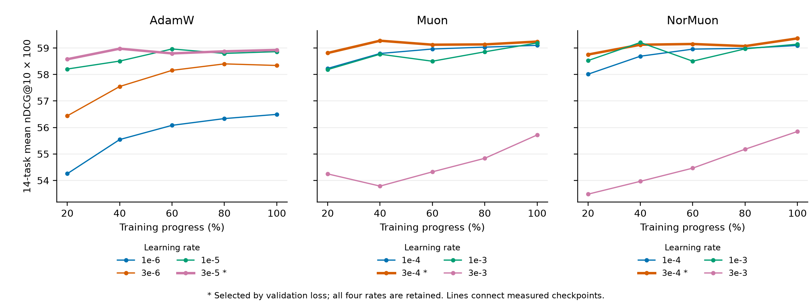

# Complete DenseOn retrieval trajectories

All **12 corrected runs × five retained checkpoints × 14 decontaminated BEIR tasks**
are complete: **60 checkpoint outcomes and 840 task scores**. The zero-update
baseline separately completed all fourteen tasks. No historical results or missing
stage estimates enter this readout.



Read the [generated all-rate and selected-configuration tables](descriptive/summary.md)
for the complete numeric picture. The [raw score table](tables/all_task_scores.csv)
retains every task, learning rate and stage, including the poorly performing
highest-rate Muon and NorMuon runs. Lines connect measured checkpoints; they do
not measure intervening steps. Selection stars come from final validation loss,
not BEIR test results.

## What has become observable

This complete readout adds the last six original pool-A step-3126 outcomes to the
previously accepted 54 states. Every previous complete record is exactly unchanged.
The curves and generated table describe retrieval over the retained 20–100% range;
the normalized trapezoidal area does not impute initialization or use wall time.

For the validation-selected configurations, the measured Muon and NorMuon curves
are above the selected AdamW curve at all five retained stages. Both have a retained
40% point above selected AdamW's final score. This is descriptive evidence, not a
new significance test or evidence of 60% deployable training-cost savings: choosing
these configurations used full-horizon validation. Learning-rate cells are not
independent training seeds.

All six existing [endpoint comparisons](../dense-v3-final-inference-v1/README.md)
are reproduced unchanged. Four-rate primary comparisons remain inconclusive.
The secondary selected NorMuon–AdamW interval remains positive; selected
Muon–AdamW and NorMuon–Muon remain inconclusive. The new curves do not turn
those comparisons into different statistical findings. More useful embedding
dimensions, held-out predictive support and mechanism remain unestablished.

## Actual execution and checks

- Original pool B completed its 420 cells at **2026-09-12 08:59:47 UTC**;
  original pool A completed its 420 cells at **10:47:25 UTC**. Their native
  completion records and the final 854-row observer record are in
  [observations/](observations/). These records do not supply unobserved
  coordinator OS exit codes.
- The unchanged native checkpoint reader returned zero and recorded all sixty
  complete outcomes at **10:51:01 UTC**. Its local
  [bundle](actual/complete-checkpoint-readback.json) includes original score bytes,
  checkpoint metadata, source identities and 840 original successful worker records.
- The unchanged complete-trajectory adapter returned zero at **10:52:10 UTC**.
  Its [readout](tables/readout.json) binds eight CSVs, all 840 scores, 60 run-stage
  means, 15 optimizer-stage means and 24 area/normalized-mean values. Five original
  statistical functions execute without modification; the actual endpoint task
  effects, intervals and decisions are unchanged.
- A fresh process using the copied source and copied input bundles returned zero
  at **11:08:45 UTC**. Its [readout](actual/source-relocated/readout.json) reproduces
  all eight CSVs byte-for-byte. This is same-host source relocation and raw-score
  reconstruction, not second-host model execution.
- The final plot was produced at **10:55:10 UTC** and visually inspected. Its
  [data](figures/figure_data.csv) is byte-identical to the preserved
  [first layout](first-layout/figure_data.csv). Only figure height, legend position
  and margins changed. The PDF embeds a CID TrueType font, not Type 3.

Actual original commands/results are retained in [commands-first.json](commands-first.json).
Later copied-source and descriptive-table commands/results are retained in
[commands-replay.json](commands-replay.json). The local preservation and numerical
crosscheck receipt is [verification.json](verification.json). The earlier
[124-case candidate preparation](../engineering-archive/dense-v3-complete-trajectory-candidate-v1/README.md)
remains unchanged historical evidence, not additional training experiments.

## Reproduce the numerical readout

Use an absolute path to this complete directory and a new output directory:

```bash
CUDA_VISIBLE_DEVICES='' OPENBLAS_NUM_THREADS=1 OMP_NUM_THREADS=1 \
  /usr/bin/python -B /absolute/path/to/dense-v3-complete-trajectories-v1/source/complete_trajectory.py \
  --repository /absolute/path/to/dense-v3-complete-trajectories-v1/source-original \
  --bundle /absolute/path/to/dense-v3-complete-trajectories-v1/actual/complete-checkpoint-readback.json \
  --bundle-sha256 4795dca63d36f62b38d7c76e62b3ba9982eb3d6a7b3d20b7a610e057fbce0c50 \
  --prior-bundle /absolute/path/to/dense-v3-complete-trajectories-v1/inputs/prior-54-readback.json \
  --endpoint-readout /absolute/path/to/dense-v3-complete-trajectories-v1/inputs/accepted-endpoint-readout.json \
  --output /absolute/path/to/new-trajectory-tables
```

NumPy 2.5.2 was used for both actual numerical calls; Matplotlib 3.11.1 rendered
the figure. The renderer and descriptive-table generator each accept `--readout`,
`--readout-sha256`, and `--output`. For the unchanged archived `tables/readout.json`,
the external SHA-256 is
`dd48e622c9cd1f28f8e93cab670349fc937e8e64aa50b98947104151dbda42c2`.
Replayed readouts have different provenance paths/timestamps and therefore a new
digest even when every CSV is byte-identical.

## Scope and remaining work

This is a **complete retrieval data readout**, not completion of the paper or
the separate formal source/runtime/publication consumer. No original gate was
weakened or labelled passed; the native reader's old descriptive scope flags remain
unchanged. No model, training, functional recovery, continuation branch or scheduler
was launched by this readout. The manuscript and its pending results are unchanged.

At this archive milestone the newest six checkpoint outcomes and complete-trajectory
tables/figures are local; the preceding 54 outcomes already have independently
verified HF backups. The complete native bundle embeds source text and **must not
be uploaded as a data-only artifact**. Future data backups must select raw result
files, receipts, tables and figures explicitly. Source/code publication retains its
separate authority boundary. The full NAACL/reproducibility goal remains active.
