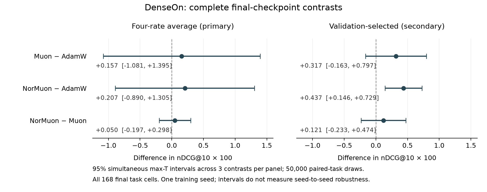

# DenseOn final-checkpoint optimizer contrasts

All twelve corrected v3 final checkpoints have complete fourteen-task BEIR
results. This readout computes the **predeclared endpoint estimands and intervals**
on all 168 final cells. It does not complete the separate 840-cell trajectory
campaign, functional analysis, crossed continuation or manuscript release.

## What the results support

Values are differences in nDCG@10 multiplied by 100. The intervals are simultaneous
over the three contrasts **within each predeclared family**, not over both families
together. These are paired-task intervals, not training-seed confidence intervals.

| Estimand | Contrast | Difference | Simultaneous 95% interval | Interpretation |
| --- | --- | ---: | --- | --- |
| Four-rate average, primary | Muon − AdamW | +0.157 | [−1.081, +1.395] | Inconclusive |
| Four-rate average, primary | NorMuon − AdamW | +0.207 | [−0.890, +1.305] | Inconclusive |
| Four-rate average, primary | NorMuon − Muon | +0.050 | [−0.197, +0.298] | Inconclusive |
| Validation-selected, secondary | Muon − AdamW | +0.317 | [−0.163, +0.797] | Inconclusive |
| Validation-selected, secondary | NorMuon − AdamW | +0.437 | [+0.146, +0.729] | Positive |
| Validation-selected, secondary | NorMuon − Muon | +0.121 | [−0.233, +0.474] | Inconclusive |



The primary endpoint does **not establish an optimizer-family advantage averaged
over the declared rate grids**. The secondary endpoint supports a modest NorMuon
advantage over the validation-selected AdamW configuration on this model/data/seed
and task collection. Muon's point estimate is positive, but its interval crosses
zero. NorMuon-versus-Muon remains inconclusive: one comparison being positive
and another inconclusive is not evidence that those two treatments differ.

Inconclusive does not mean equal, equivalent or proven ineffective. Four learning
rates are not four independent training seeds, and a positive secondary contrast
does not replace an inconclusive primary result. No rate was chosen using BEIR.
This finding does not by itself explain the observed weight spectra or prove
more retrieval-useful embedding dimensions. The frozen functional/held-dose
analysis and crossed continuation remain required for that part of the story.

## Exact measurement and calculation

- Every final task score is reconstructed from the native MTEB JSON at the pinned
  decontaminated BEIR revisions. All 660 files of the prior immutable recovered
  snapshot are authenticated before reading these inputs. No intermediate task
  score is filled in, and no task or high-rate run is dropped.
- The primary estimand averages the four rates equally **within each task**, then
  contrasts optimizers over the fourteen paired tasks. Optimizer macro scores
  are AdamW 58.1566, Muon 58.3135 and NorMuon 58.3638.
- The secondary selector reads the complete original validation metrics first:
  minimum mean loss, exact ties resolved by lower rate. Choices remain AdamW
  3e-5, Muon 3e-4 and NorMuon 3e-4. It never reads BEIR to select a recipe.
- The original source-bound `_task_effects` and `paired_max_t_intervals` function
  AST nodes execute unchanged. Their original source files are retained under
  [source-original/](source-original/); no project import, trained model or
  whole-grid admission is simulated. The latter consumer still requires all
  840 cells and has not been called or weakened here.
- Both families retain 50,000 common paired-task bootstrap draws, seed 20260903,
  fixed observed across-task standard errors, and the 95th linear quantile of
  the largest absolute centered statistic over the three contrasts. Nominal
  intervals are retained for context and do not determine support.
- The existing independent scalar algorithm reproduces all 48 interval numeric
  fields and six decisions; largest discrepancy is 1.735e-18 in raw-scale units.
  Exact-rational task-mean reconstruction checks all 84 task/optimizer means.
  These are numerical checks of the same measurement, not additional runs.

## Actual outputs and reproducibility

The first actual call returned zero at **2026-09-10 17:55:40 UTC**. Its
[readout](tables/readout.json), SHA-256
`592c902f94b8f190f3165f4075dfddc1e8c3f52add760805da639b541d27716f`,
binds six numeric/text outputs and the original function/source identities.
The standalone figure call returned zero and preserves every interval, including
the inconclusive ones. The PNG was visually inspected; both PDF fonts are
embedded CID TrueType, with no Type 3 fonts.

A fresh process using only the six relocated original source files returned
zero at **17:58:33 UTC**. It reads the actual anonymously recovered inputs and
repeats both original and scalar calculations. All five CSVs and the generated
Markdown reproduce byte-for-byte. This is same-host source relocation, not a
physical second-host or independent-training replication. Commands, actual tool
exits and the separate relocated receipt are retained in [commands.json](commands.json)
and [source-relocated-readout.json](source-relocated-readout.json).

After [restoring the immutable endpoint snapshot](../../docs/evaluation-analysis-restoration.md),
run from this repository root, supplying a new absolute output directory:

```bash
CUDA_VISIBLE_DEVICES='' OPENBLAS_NUM_THREADS=1 OMP_NUM_THREADS=1 MKL_NUM_THREADS=1 \
  /usr/bin/python -B reports/dense-v3-final-inference-v1/source/run_endpoint_inference.py \
  --repository /absolute/path/to/repo/reports/dense-v3-final-inference-v1/source-original \
  --evaluation-root /absolute/path/to/recovered/immutable/prefix \
  --output /absolute/path/to/new-endpoint-readout
```

NumPy 2.5.2 was used for the actual draws; the renderer used Matplotlib 3.11.1.
The full program is [run_endpoint_inference.py](source/run_endpoint_inference.py).
Read [tables/summary.md](tables/summary.md) for generated numbers,
[primary task effects](tables/primary_task_effects.csv) and
[secondary task effects](tables/secondary_task_effects.csv) for all paired inputs,
and [figure_data.csv](figures/figure_data.csv) for all six plotted intervals.
The numeric/text source is authoritative; a rendered figure is not independent
statistical evidence. No manuscript include or public source release was installed.

The [plan](plan.md) was written after endpoint scores were visible, explicitly
reusing existing frozen inference definitions; it is not a new preregistration.
The [dated observer snapshot](observations.json) has eight exact live primary
workers, **172 / 840** accepted task cells, and the functional coordinator live
with **0 / 61** states awaiting an available leased GPU. Those queues are unchanged.
The former handoff is retained at [before/CURRENT_EXPERIMENT.md](before/CURRENT_EXPERIMENT.md).
[verification.json](verification.json) records the final bounded artifact and
preservation checks. The full NAACL/reproducibility goal remains active.
